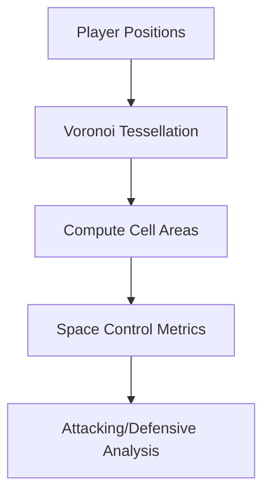

# Performance Analysis and Game Tactics

## Overview

Raw tracking data — millions of $(x, y, t)$ player positions — becomes meaningful only when we extract structured insights from it. Performance analysis transforms spatiotemporal trajectories into metrics that coaches, athletes, and analysts can act upon. Game tactics analysis goes further, modeling the strategic and decision-making patterns that underly team success.

This lesson covers the mathematical foundations of sports performance metrics, formation and spatial analysis, passing network models, and the role of AI in generating tactical insights.

---

## From Trajectories to Metrics

### Player Speed and Acceleration

From position sequences, we compute velocity via finite differences:

$$
\mathbf{v}_i(t) = \frac{\mathbf{p}_i(t + \Delta t) - \mathbf{p}_i(t)}{\Delta t}
$$

Higher-order derivatives (acceleration, jerk) reveal explosive movements and sudden decelerations associated with injury risk:

$$
\mathbf{a}_i(t) = \frac{\mathbf{v}_i(t + \Delta t) - \mathbf{v}_i(t)}{\Delta t}
$$

### Work Rate Metrics

**Distance covered** integrates speed over time:

$$
D_i = \int_{t_0}^{t_1} \|\mathbf{v}_i(t)\| \, dt \approx \sum_t \|\mathbf{v}_i(t)\| \Delta t
$$

**High-intensity running distance** (above 5.5 m/s for soccer) correlates strongly with match outcome and is a key workload metric for training prescription.

### Heatmaps

Player activity density visualized as 2D histograms:

```python
import numpy as np
import matplotlib.pyplot as plt

def player_heatmap(positions, field_bounds, resolution=50):
    """
    Compute spatial density heatmap for a player's positions.
    positions: N x 2 array of (x, y) coordinates
    field_bounds: (x_min, x_max, y_min, y_max)
    resolution: grid resolution
    """
    x_min, x_max, y_min, y_max = field_bounds
    heatmap, _, _ = np.histogram2d(
        positions[:, 0], positions[:, 1],
        bins=[resolution, resolution],
        range=[[x_min, x_max], [y_min, y_max]]
    )
    # Apply Gaussian smoothing for visualization
    from scipy.ndimage import gaussian_filter
    return gaussian_filter(heatmap, sigma=2)
```

---

## Formation Analysis

### Voronoi Diagrams for Space Control

Given player positions, the **Voronoi diagram** partitions the field into regions where each point is closest to a particular player:



Voronoi area inversely correlates with pressure — a player with small Voronoi region faces high defensive pressure, while a large region indicates spatial freedom.

### Geometric Center of Mass

Team formations can be summarized by the **centroid** (mean position) and **spread** (standard deviation):

$$
\mathbf{c}_{team} = \frac{1}{n} \sum_{i=1}^{n} \mathbf{p}_i
$$

$$
\sigma_{team} = \sqrt{\frac{1}{n} \sum_{i=1}^{n} \|\mathbf{p}_i - \mathbf{c}_{team}\|^2}
$$

Comparing geometric metrics between teams reveals structural differences in playing styles (compact vs expansive, high vs low block).

### Shape Recognition with Graph Neural Networks

GNNs model formations as graphs where nodes are players and edges represent spatial relationships:

$$
\mathbf{h}_i^{(k+1)} = \sigma\left( \mathbf{W}^{(k)} \mathbf{h}_i^{(k)} + \sum_{j \in \mathcal{N}(i)} \mathbf{A}_{ij}^{(k)} \mathbf{W}_e^{(k)} \mathbf{h}_j^{(k)} \right)
$$

where $\mathbf{h}_i^{(k)}$ is the feature vector for player $i$ at layer $k$, and $\mathbf{A}_{ij}$ encodes the adjacency structure.

Deep training on formations from thousands of matches enables GNN-based formation classifiers that identify defensive shapes (4-4-2, 5-3-2) and offensive structures automatically.

---

## Passing Networks and Ball Circulation

### Pass Detection

Ball possession sequences are reconstructed from tracking data:

1. Detect ball from multi-camera views via bounding box detection
2. Triangulate ball 3D position when visible in multiple cameras
3. Infer possession when ball is within a player's control radius

### Network Analysis

Passing relationships form a weighted graph:

| Metric | Formula | Interpretation |
|--------|---------|----------------|
| **Pass frequency** | $w_{ij} = \frac{\text{passes from } i \to j}{\text{total passes}}$ | Preferred combinations |
| **Betweenness centrality** | $bc_i = \sum_{s,t} \frac{\sigma_{st}(i)}{\sigma_{st}}$ | Key playmakers |
| **Clustering coefficient** | $cc_i = \frac{\text{triangles through } i}{\text{connected triples}}$ | Tendency to form triangles |
| **PageRank** | Recursive importance from incoming links | Central players in circulation |

### Expected Threat (xT) Model

xT quantifies the value of possessing the ball in each field zone by modeling goal probability:

$$
xT_{zone} = P(\text{goal} | \text{ball in zone}) - P(\text{goal} | \text{opponent has ball})
$$

Passes are evaluated by the xT difference between start and end zones:

$$
xT_{pass} = xT_{end} - xT_{start}
$$

This surfaces that "simple" passes to high-xT zones may be more valuable than speculative shots.

---

## Tactical Pattern Recognition

### Tructure Learning for Play Patterns

Hidden Markov Models (HMMs) capture the latent states underlying tactical sequences:

```python
from hmmlearn import hmm
import numpy as np

# Encode possession sequences as state transitions
# Each state represents a tactical "mode" (build-up, counter-attack, etc.)

# Example: sequence of [x, y] positions encoded as observations
observations = np.array([
    [player_positions],  # sequence of team formations
])

# Fit 5-state HMM for tactical pattern discovery
model = hmm.GaussianHMM(n_components=5, covariance_type='full')
model.fit(observations)

# Decode most likely state sequence
states = model.predict(observations)
```

### Counter-Press Detection

The counter-press (immediately winning ball back after losing possession) is a high-value tactical behavior. AI detects it by identifying:

1. **Loss event**: Possession change
2. **Immediate response**: Nearby players converging toward ball location
3. **Press intensity**: Speed of convergence, distance covered in first 5 seconds

$$
\text{Press Score} = \frac{1}{n_{press}} \sum_{i=1}^{n_{press}} \frac{d_i^{0\to t} - d_i^{ref}}{t}
$$

where $d_i^{0\to t}$ is the distance player $i$ traveled toward the ball in $t$ seconds, and $d_i^{ref}$ is a baseline expectation.

---

## Game Theory in Sports

### Nash Equilibrium in Penalty Kicks

In penalty kicks, kicker and goalkeeper each choose strategies (left/center/right). The payoff matrix:

|  | Goalkeeper Left | Goalkeeper Center | Goalkeeper Right |
|--|----------------|-------------------|-------------------|
| **Kick Left** | +1, -1 | 0, 0 | -1, +1 |
| **Kick Center** | -0.5, +0.5 | +1, -1 | -0.5, +0.5 |
| **Kick Right** | -1, +1 | 0, 0 | +1, -1 |

Nash equilibrium (mixed strategy) gives each player a best response against a randomized opponent. AI models learn equilibrium strategies from large datasets of penalty observations.

### Counter-Strategy Modeling

Reinforcement learning frameworks model the attacker-defender interaction:

$$
V(\pi_{att}, \pi_{def}) = \mathbb{E}\left[ \sum_{t=0}^{T} \gamma^t r_t \right]
$$

where $r_t$ depends on spatial advantage at each timestep. Optimal counter-strategies adapt to opponent tendencies learned from historical data.

---

## Code Example: Space Control Analysis

```python
import numpy as np
from scipy.spatial import Voronoi
from shapely.geometry import Polygon

def voronoi_space_control(positions, field_bounds, team_mask=None):
    """
    Compute space control metrics using Voronoi diagrams.
    positions: N x 2 array of player positions
    field_bounds: (x_min, x_max, y_min, y_max)
    team_mask: boolean array for team membership
    Returns: control ratio for each zone
    """
    # Add boundary points to avoid infinite Voronoi cells
    boundary_pts = [
        [field_bounds[0]-10, field_bounds[2]-10],
        [field_bounds[1]+10, field_bounds[2]-10],
        [field_bounds[0]-10, field_bounds[3]+10],
        [field_bounds[1]+10, field_bounds[3]+10],
    ]
    all_pts = np.vstack([positions, boundary_pts])

    # Compute Voronoi diagram
    vor = Voronoi(all_pts)

    # Compute area of each cell clipped to field
    field_poly = Polygon([
        [field_bounds[0], field_bounds[2]],
        [field_bounds[1], field_bounds[2]],
        [field_bounds[1], field_bounds[3]],
        [field_bounds[0], field_bounds[3]],
    ])

    team_areas = {}
    if team_mask is not None:
        team_areas['team1'] = 0.0
        team_areas['team2'] = 0.0

        for ridge_idx, region_idx in zip(vor.ridge_vertices, vor.point_region):
            if -1 in ridge_idx:  # Infinite region
                continue
            pt_idx = vor.point_region[region_idx]
            if pt_idx < len(positions):  # Not a boundary point
                cell_pts = vor.vertices[ridge_idx]
                try:
                    cell_poly = Polygon(cell_pts)
                    clipped = cell_poly.intersection(field_poly)
                    area = clipped.area

                    if team_mask[pt_idx]:
                        team_areas['team1'] += area
                    else:
                        team_areas['team2'] += area
                except:
                    continue

        total_area = team_areas['team1'] + team_areas['team2']
        return {k: v/total_area for k, v in team_areas.items()}

    return vor

# Analyze space control during a build-up phase
team1_pos = np.array([[...], [...]])  # Team A player positions
team2_pos = np.array([[...], [...]])  # Team B player positions
all_pos = np.vstack([team1_pos, team2_pos])
team_mask = np.array([True]*11 + [False]*11)

control = voronoi_space_control(all_pos, (0, 105, 0, 68), team_mask)
print(f"Team 1 field control: {control['team1']:.1%}")
```

---

## Summary

- Position data yields speed, acceleration, work rate metrics via differentiation
- Voronoi diagrams quantify space control and pressure
- Graph neural networks classify formations and model spatial relationships
- Passing networks with centrality metrics reveal playmaking structure
- Expected Threat (xT) models evaluate possessions by goal probability
- Game theory (Nash equilibrium) informs optimal strategy in adversarial settings

---

## What's Next

Lesson 04 addresses one of sports' most pressing concerns — **injury prediction and prevention** — using machine learning to detect risk factors before they cause tissue damage.