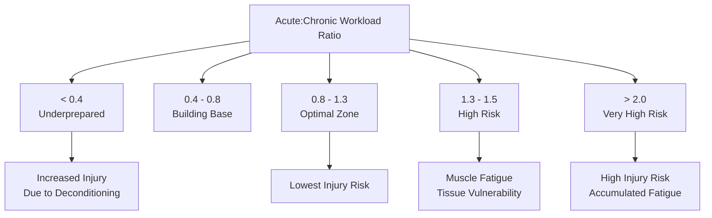
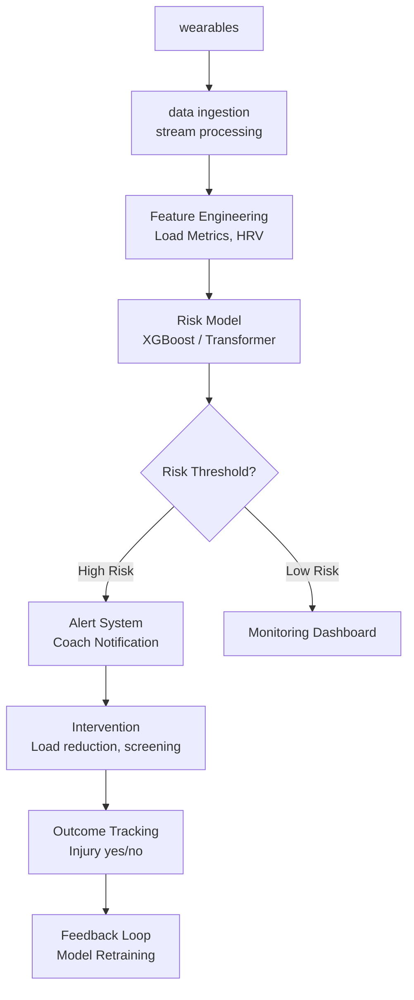

# Injury Prediction and Prevention

## Overview

Injury is the most significant disruptor of athletic careers and team performance. A single anterior cruciate ligament (ACL) rupture can cost a professional athlete a year of competition and millions in lost value. Yet most injuries are not truly random — they are preceded by warning signs that increasingly sophisticated AI models can detect.

Injury prediction combines time-series analysis of training loads, biomechanical motion analysis, and physiological monitoring to forecast injury risk days or weeks before it manifests. This lesson covers the mathematical frameworks underlying injury risk modeling, the sensors and features that feed these models, and the practical deployment challenges of injury prevention systems.

---

## The Injury Causation Problem

### Acute vs. Overuse Injuries

**Acute injuries** (muscle tears, ligament sprains) result from sudden force application exceeding tissue tolerance. They often have a clear mechanical trigger.

**Overuse injuries** (stress fractures, tendinopathies) develop from cumulative microtrauma exceeding the body's repair capacity. They have complex multi-factorial origins including training load, recovery, biomechanics, and nutrition.

### The Training Load-Injury Relationship

The **acute:chronic workload ratio (ACWR)** is the most studied injury predictor:

$$
\text{ACWR} = \frac{\text{Acute load (last 7 days)}}{\text{Chronic load (rolling 28 days average)}}
$$

Injury risk follows a U-shaped curve:
- Too low ACWR (~0.4): Deconditioned, tissue tolerance decreased
- Optimal ACWR (0.8–1.3): Adapted, prepared for training
- High ACWR (>1.5–2.0): Excessive fatigue, tissue vulnerability



### Banister's Impulse-Response Model

The classic training model describes fitness ($f$) and fatigue ($g$) as separate state variables:

$$
\frac{df}{dt} = k_1 \cdot w(t) - f(t) / \tau_1
$$
$$
\frac{dg}{dt} = k_2 \cdot w(t) - g(t) / \tau_2
$$

where $w(t)$ is training impulse, $\tau_1$ (~50 days) is fitness decay time constant, and $\tau_2$ (~10 days) is fatigue decay time constant. **Performance** $= f(t) - g(t)$.

When $g$ spikes relative to $f$, injury risk elevates.

---

## Feature Engineering for Injury Prediction

### External Load Metrics

GPS and accelerometer data yield:

| Metric | Formula | Injury Relevance |
|--------|---------|------------------|
| **PlayerLoad** | $\sqrt{a_x^2 + a_y^2 + a_z^2}$ | Cumulative mechanical stress |
| **HML** (High Metabolic Load) | Time above 80% max velocity | Neuromuscular fatigue |
| **HSR** (High-Speed Running) | Distance > 5.5 m/s | Sprint fatigue |
| **Deceleration events** | Rate change > -2 m/s² | Eccentric muscle stress |
| **Change of direction** | Angle > 45° at speed > 3 m/s | Knee ligament stress |

### Internal Load Metrics

Heart rate variability (HRV) and subjective wellness:
- **HRV**: SDNN, RMSSD over 5-minute morning recordings
- **Sleep quality**: Duration, disruption, REM proportion
- **Soreness问卷**: DOMS (Delayed Onset Muscle Soreness) ratings

### Biomechanical Markers

From pose estimation:
- **Vertical loading rate** (force-time curve slope during landing)
- **Peak knee valgus angle** (ACL injury risk factor)
- **Limb asymmetry index**: $\frac{|L - R|}{(L + R)/2} \times 100\%$

### Injury History Features

Previous injury is the strongest predictor of future injury:
- Time since return to sport (graduated return)
- Number of previous injuries in similar anatomical location
- Surgical history

---

## Machine Learning Models for Injury Risk

### Gradient Boosting for Injury Classification

XGBoost and LightGBM handle mixed feature types well:

```python
from xgboost import XGBClassifier
from sklearn.model_selection import cross_val_score

# Features: load metrics, HRV, wellness scores, injury history
X = feature_matrix  # shape: (n_athletes * n_weeks, n_features)

# Binary target: injury in next 7 days
y = injury_labels

model = XGBClassifier(
    n_estimators=200,
    max_depth=6,
    learning_rate=0.05,
    subsample=0.8,
    colsample_bytree=0.8,
    scale_pos_weight=10  # Unbalanced: injuries are rare
)

# Time-series cross-validation (respecting temporal ordering)
cv_scores = cross_val_score(
    model, X, y, cv=TimeSeriesSplit(n_splits=5), scoring='roc_auc'
)
print(f"Mean AUC: {cv_scores.mean():.3f} ± {cv_scores.std():.3f}")

# Train final model
model.fit(X, y)

# Predict next-week injury probability
risk_probabilities = model.predict_proba(X_new)[:, 1]
```

### Survival Analysis for Time-to-Injury

Cox Proportional Hazards model estimates time until injury:

$$
h(t | \mathbf{x}) = h_0(t) \cdot \exp(\mathbf{\beta}^T \mathbf{x})
$$

where $h_0(t)$ is baseline hazard, $\mathbf{x}$ is feature vector, and $\mathbf{\beta}$ are learned coefficients.

### Deep Learning for Sequence Modeling

Transformer architectures process athlete time-series:

```python
import torch
from torch import nn

class InjuryRiskTransformer(nn.Module):
    def __init__(self, input_dim=64, d_model=128, n_heads=8, n_layers=4):
        super().__init__()
        self.embedding = nn.Linear(input_dim, d_model)
        self.pos_encoder = PositionalEncoding(d_model)
        self.transformer = nn.TransformerEncoder(
            nn.TransformerEncoderLayer(d_model, n_heads, dim_feedforward=512),
            num_layers=n_layers
        )
        self.output = nn.Sequential(
            nn.Linear(d_model, 64),
            nn.ReLU(),
            nn.Linear(64, 1),
            nn.Sigmoid()
        )

    def forward(self, x):
        # x shape: (batch, seq_len, input_dim)
        x = self.embedding(x)
        x = self.pos_encoder(x)
        x = self.transformer(x)
        x = x.mean(dim=1)  # Global average pooling
        return self.output(x)

# Model injury risk from 28-day load sequences
model = InjuryRiskTransformer(input_dim=32)
optimizer = torch.optim.Adam(model.parameters(), lr=1e-4)

for epoch in range(100):
    # Sequence: 28 days x 32 features (load, HRV, sleep, etc.)
    sequences, labels = load_training_data()
    logits = model(sequences)
    loss = nn.BCELoss()(logits, labels)
    loss.backward()
    optimizer.step()
```

---

## Monitoring Dashboard Architecture



---

## Calibration and Uncertainty

Injury is inherently stochastic — even a 30% daily injury risk doesn't guarantee injury that day. Probabilistic outputs with **prediction intervals** help coaches make calibrated decisions:

```python
from sklearn.calibration import CalibratedClassifierCV

# Calibrate probability outputs
calibrated_model = CalibratedClassifierCV(
    base_estimator=xgb_model,
    method='isotonic',
    cv='prefit'
)
calibrated_model.fit(X_cal, y_cal)

# Predictions include uncertainty
predictions = calibrated_model.predict_proba(X_test)
print(f"Player risk: {predictions[0, 1]:.1%} "
      f"95% CI: [{ci_lower:.1%}, {ci_upper:.1%}]")
```

---

## Return-to-Sport Prediction

After injury, predicting when an athlete can safely return involves:

1. **Time since injury** (biological healing timelines)
2. **Functional testing** (hop symmetry, strength ratios)
3. **Sport-specific criteria** (movement quality under fatigue)

$$
P(\text{RTS}) = \sigma(\beta_0 + \beta_1 \cdot \text{symmetry} + \beta_2 \cdot \text{strength\_ratio} + \beta_3 \cdot \text{time})
$$

---

## Code Example: ACWR Dashboard

```python
import pandas as pd
import numpy as np
from datetime import datetime, timedelta

class ACWRCalculator:
    def __init__(self, athlete_id, lookback_days=28, acute_days=7):
        self.athlete_id = athlete_id
        self.acute_days = acute_days
        self.lookback_days = lookback_days

    def compute_rolling_loads(self, session_data):
        """
        session_data: DataFrame with columns [date, distance, player_load, hsr_distance]
        """
        session_data = session_data.sort_values('date')

        # Compute daily totals
        daily = session_data.groupby('date').agg({
            'distance': 'sum',
            'player_load': 'sum',
            'hsr_distance': 'sum'
        })

        # Rolling averages
        chronic_load = daily['player_load'].rolling(
            window=self.lookback_days, min_periods=21
        ).mean()

        acute_load = daily['player_load'].rolling(
            window=self.acute_days, min_periods=5
        ).mean()

        acwr = acute_load / chronic_load

        return pd.DataFrame({
            'date': daily.index,
            'acute_load': acute_load,
            'chronic_load': chronic_load,
            'acwr': acwr,
            'risk_zone': self._classify_risk(acwr)
        })

    def _classify_risk(self, acwr):
        if acwr < 0.8:
            return 'Underprepared'
        elif acwr <= 1.3:
            return 'Optimal'
        elif acwr <= 1.5:
            return 'High'
        else:
            return 'Very High'

# Generate weekly ACWR report
calculator = ACWRCalculator(athlete_id='A001')
report = calculator.compute_rolling_loads(session_df)
alert_zones = report[report['risk_zone'].isin(['High', 'Very High'])]
print(alert_zones)
```

---

## Summary

- Injury risk involves acute traumatic events and cumulative overuse processes
- ACWR (acute:chronic workload ratio) is the most validated load-based predictor
- Features include GPS metrics, HRV, biomechanics, and injury history
- Gradient boosting and deep learning models predict injury risk from mixed features
- Calibration and uncertainty quantification are essential for actionable predictions
- Return-to-sport decisions combine biological timelines with functional testing

---

## What's Next

Lesson 05 explores **broadcast analytics and virtual replay** — how AI transforms the viewing experience through automated camera work, real-time statistics, and immersive augmented reality overlays.