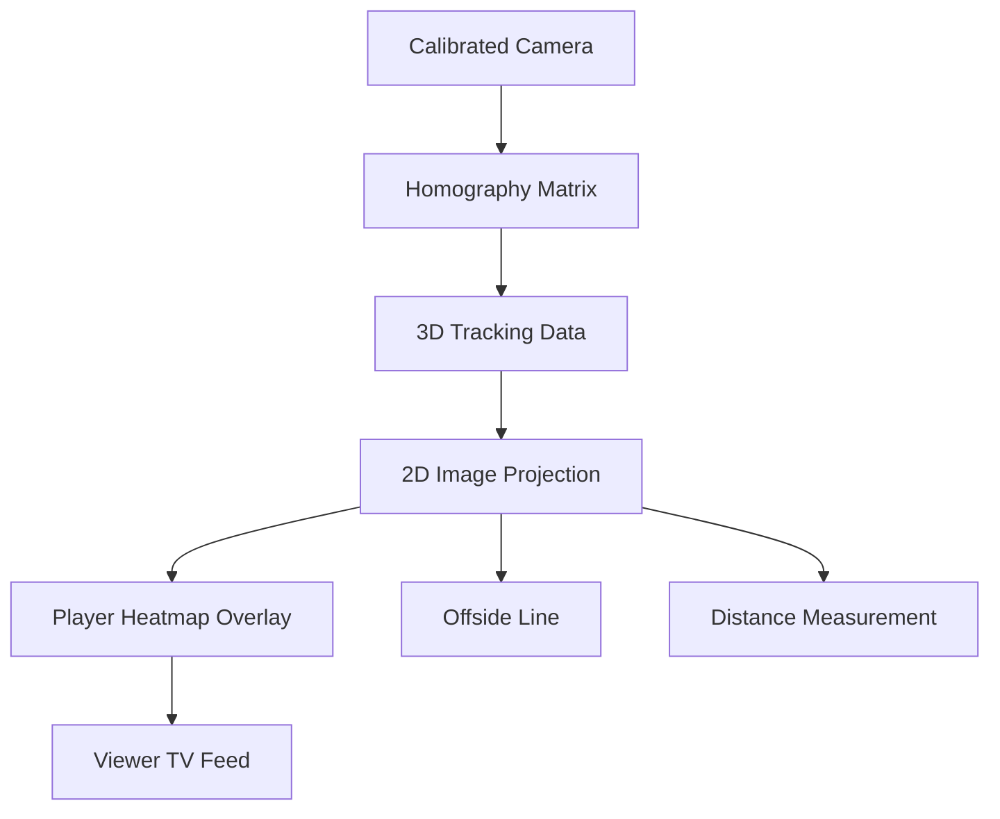

# Broadcast Analytics and Virtual Replay

## Overview

Modern sports broadcasting generates vast content — hours of multi-camera footage per game — that must be distilled into compelling narratives for millions of viewers. AI is transforming this process from labor-intensive manual editing to automated production pipelines that enhance viewer engagement, provide deeper tactical insights, and create new forms of fan interaction.

This lesson covers the AI systems powering broadcast augmentation: automated camera routing, real-time statistical overlays, virtual replay generation, and the emerging field of AI-generated highlight packages.

---

## Automated Camera Systems

### Ball Tracking for Camera Control

Broadcast cameras increasingly follow the ball automatically using **ball detection and trajectory prediction**:

```python
import torch
import numpy as np

class BallTracker:
    def __init__(self, model_path='ball_detection_model.pt'):
        self.model = torch.load(model_path)
        self.kalman_filter = self._init_kalman_filter()
    
    def _init_kalman_filter(self):
        # State: [x, y, vx, vy]
        state_dim = 4
        meas_dim = 2
        
        kf = cv2.KalmanFilter(state_dim, meas_dim)
        kf.transitionMatrix = np.array([
            [1, 0, 1, 0],
            [0, 1, 0, 1],
            [0, 0, 1, 0],
            [0, 0, 0, 1]
        ])
        kf.measurementMatrix = np.array([
            [1, 0, 0, 0],
            [0, 1, 0, 0]
        ])
        kf.processNoiseCov = np.eye(state_dim) * 1e-4
        kf.measurementNoiseCov = np.eye(meas_dim) * 1e-2
        return kf
    
    def track(self, frame):
        # Detect ball position in frame
        detections = self.model(frame)
        
        if detections:
            # Pick most confident detection
            best = max(detections, key=lambda d: d.confidence)
            measurement = np.array([[best.x], [best.y]])
            kf.correct(measurement)
        
        # Predict ball position for camera control
        prediction = kf.predict()
        return prediction[:2]  # [x, y] in frame coordinates
```

### Director AI: Automatic Replay Triggering

AI systems automatically trigger replays when notable events occur:

- Goals and near-misses
- Key tackles and defensive actions
- Significant injuries
- Tactical fouls and controversial calls

A **temporal action detection** model processes video streams:

$$
P(\text{event}_i | \mathbf{v}_{t:t+\tau}) = \text{sigmoid}(\text{MLP}(\text{Features}(\mathbf{v}_{t:t+\tau})))
$$

where $\mathbf{v}_{t:t+\tau}$ is a clip of $\tau$ frames around time $t$.

---

## Virtual Graphics Overlays

### Tracking Data Integration

Virtual overlays require precise spatial registration of tracking data to the broadcast view:



### Offside Line Technology

The offside rule requires knowing the positions of defender and attacker at the moment of pass. Camera calibration + tracking data enables precise virtual lines:

1. Calibrate each broadcast camera to the field plane via homography
2. Project all player positions to the calibrated 2D field
3. Identify the second-to-last defender's field coordinate
4. Draw a perpendicular line at that x-coordinate on the broadcast image

FIFA's Video Assistant Referee (VAR) uses this technology — the "offside line" viewers see on TV is an AI-rendered graphic based on tracking data, not a physical measurement.

### Expected Goal (xG) Visualization

Expected goals models estimate the probability of scoring from each shot attempt:

$$
xG(\mathbf{p}, \theta) = \sigma(w_0 + w_1 \cdot \text{distance} + w_2 \cdot \text{angle} + w_3 \cdot \text{body\_part})
$$

Broadcast overlays render xG values as colored dots on the field — red for high-xG chances, blue for low-xG — giving viewers immediate context for shot quality.

---

## Virtual Replay and Multi-Angle Synthesis

### 3D Scene Reconstruction

From multiple calibrated broadcast cameras, AI systems reconstruct a 3D representation of the play:

```python
class MultiViewReconstructor:
    def __init__(self, cameras):
        self.cameras = cameras  # List of calibrated camera parameters
    
    def triangulate_player(self, detections_by_camera):
        """
        detections_by_camera: dict of cam_id -> [(keypoints, confidence)]
        Returns: 3D position estimate
        """
        all_projs = []
        all_Ks = []
        
        for cam_id, dets in detections_by_camera.items():
            cam = self.cameras[cam_id]
            for keypoints in dets:
                # For body keypoints (e.g., head, feet), get 2D->3D
                for kp_name, (u, v) in keypoints.items():
                    # Solve DLT for this keypoint
                    A = []
                    for cam_j, det_j in detections_by_camera.items():
                        if kp_name in det_j:
                            cam_j_params = self.cameras[cam_j]
                            P_j = cam_j_params.K @ cam_j_params.RT
                            u_j, v_j = det_j[kp_name]
                            A.append(u_j * P_j[2,:] - P_j[0,:])
                            A.append(v_j * P_j[2,:] - P_j[1,:])
                    
                    if len(A) >= 2:
                        _, _, vt = np.linalg.svd(np.array(A))
                        X_3d = vt[-1][:3] / vt[-1][3]
                        all_projs.append(X_3d)
        
        return np.median(all_projs, axis=0) if all_projs else None
    
    def generate_replay_view(self, novel_camera_params, timestamp):
        """
        Synthesize a new camera angle for the replay.
        """
        # Render all players in 3D space
        # Project to novel camera view
        # Composite onto field texture
        pass
```

### Slow-Mo AI: Frame Interpolation

AI frame interpolation (like RIFE, Adobe Generative Fill) synthesizes intermediate frames between existing ones, producing smooth slow-motion from standard frame-rate footage. This is especially valuable for analyzing quick fouls or ball trajectory nuances.

---

## Automated Highlight Generation

### Event Detection Pipeline

AI highlight generation identifies key moments:


### Multimodal Highlight Scoring

A highlight's value combines visual, audio, and social signals:

$$
\text{Score}(\text{event}) = w_1 \cdot \text{xG}_{\text{event}} + w_2 \cdot \text{commentary\_excitement} + w_3 \cdot \text{social\_engagement}
$$

### Code: Highlight Detection

```python
import torch
from transformers import CLIPModel, CLIPProcessor

class HighlightDetector:
    def __init__(self):
        self.clip = CLIPModel.from_pretrained('openai/clip-vit-base-patch32')
        self.processor = CLIPProcessor.from_pretrained('openai/clip-vit-base-patch32')
        self.event_classifier = torch.load('event_classifier.pt')
        
        # Sports-specific concept embeddings
        self.concepts = {
            'goal_celebration': ['player running', 'crowd jumping', 'net bulging'],
            'tackle': ['players colliding', 'ground tackle', 'aerial challenge'],
            'save': ['goalkeeper diving', 'ball stopped', 'defender block']
        }
    
    def score_clip(self, frames, audio_features):
        """
        Score a 10-second clip for highlight potential.
        Returns: highlight_score in [0, 1]
        """
        # Visual scoring via concept matching
        inputs = self.processor(images=frames, return_tensors='pt')
        image_features = self.clip.get_image_features(**inputs)
        
        visual_scores = []
        for concept, prompts in self.concepts.items():
            text_features = self.clip.get_text_features(
                self.processor(text=prompts, return_tensors='pt')['input_ids']
            )
            similarity = cosine_similarity(image_features, text_features).mean()
            visual_scores.append(similarity)
        
        # Audio scoring
        audio_score = self._analyze_audio_excitement(audio_features)
        
        # Combine scores
        combined = (0.5 * max(visual_scores) + 0.3 * audio_score + 
                    0.2 * self.event_classifier(frames).item())
        
        return torch.sigmoid(torch.tensor(combined))
    
    def _analyze_audio_excitement(self, audio_features):
        # Detect volume spikes, crowd noise, commentator pitch
        spectral_energy = np.mean(audio_features['mel_spectrogram'][:, :10])
        return min(1.0, spectral_energy / 1000)
```

---

## Fan Engagement Applications

### Interactive 3D Player Stats

QR codes on broadcast overlays link to interactive 3D visualizations showing player movement patterns, heatmaps, and career statistics.

### Conversational Highlights

LLM-powered systems let fans query match events:

> "Show me all the times [player] made a pass under pressure in the final 15 minutes."

This requires semantic parsing of the query, retrieval of matching video segments, and synthesis of a response clip.

---

## Summary

- AI ball tracking enables automated camera control and replay triggering
- Camera calibration + tracking data allows precise virtual graphic overlays (offside lines, heatmaps)
- Multi-view 3D reconstruction enables novel virtual camera angles
- Frame interpolation AI produces smooth slow-motion from standard footage
- Multimodal highlight ranking combines visual, audio, and social signals
- Fan engagement through interactive and conversational interfaces is growing

---

## What's Next

Lesson 06 explores **digital twins and simulation** — creating virtual athlete models for training optimization, what-if scenario analysis, and personalized performance engineering.