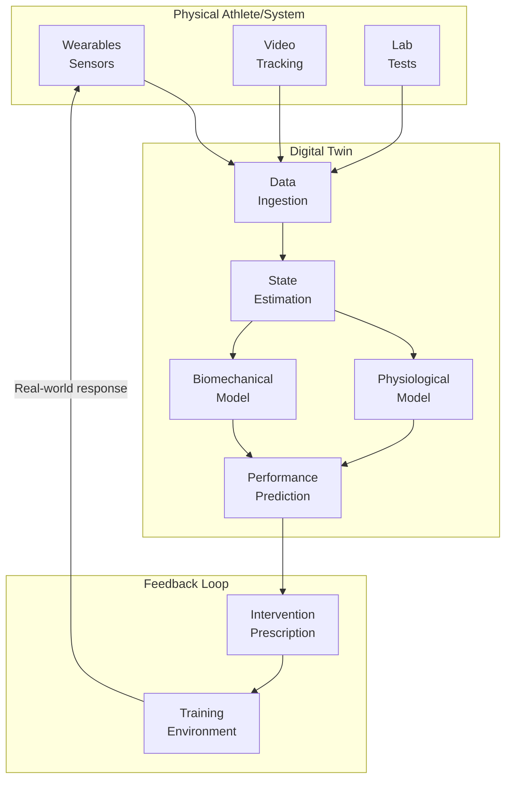

# Digital Twins and Simulation for Athlete Training

## Overview

A **digital twin** is a virtual replica of a physical entity — in sports, an individual athlete or an entire team — that updates in real-time with sensor data and simulates responses to training interventions, environmental changes, or tactical decisions. Digital twins enable what-if analysis that would be impossible or dangerous in the physical world: can this player tolerate 30% more sprint volume this week? How would our team perform against a deep-lying defense?

This lesson covers the architecture of sports digital twins, the biomechanical and physiological models that power them, simulation environments for tactical training, and the practical challenges of maintaining accurate virtual replicas.

---

## Digital Twin Architecture



### Twin Fidelity Levels

| Level | Description | Use Case |
|-------|-------------|----------|
| **Descriptive** | Historical data, no real-time sync | Post-hoc analysis |
| **Diagnostic** | Real-time sensor integration | Live monitoring |
| **Predictive** | Models predict future states | Injury risk, performance forecasting |
| **Prescriptive** | Recommends interventions | Training optimization, tactical decisions |

---

## Physiological Models

### Energy Systems Modeling

Athletes draw on three energy systems with different capacities and power outputs:

| System | Duration | Power | Recovery |
|--------|----------|-------|----------|
| **ATP-PC** | 0-8 sec | Very high | ~3 min |
| **Glycolytic** | 8 sec - 2 min | High | ~15 min |
| **Oxidative** | >2 min | Moderate | ~24 hrs |

The **critical power model** describes fatigue during high-intensity exercise:

$$
P(t) = W' \cdot \left(\frac{1}{t} - \frac{1}{CP}\right)
$$

where $W'$ is the finite work capacity above critical power (CP), and $P(t)$ is the power that can be sustained for time $t$.

### Muscle Force-Velocity Model

The force-velocity relationship in skeletal muscle:

$$
F(v) = F_0 - a \cdot v \quad \text{for} \quad v < v_{max}
$$

where $F_0$ is maximum isometric force, $a$ is the force-velocity slope, and $v_{max}$ is maximum shortening velocity.

This relationship determines sprint performance and is affected by training state, fatigue, and temperature.

### Code: Simple Physiological Digital Twin

```python
import numpy as np
from scipy.optimize import minimize

class AthleteDigitalTwin:
    """
    Simplified digital twin for predicting fatigue and performance.
    """
    def __init__(self, vo2max=60, w_prime=20, critical_power=250):
        """
        vo2max: ml/kg/min peak oxygen uptake
        w_prime: kJ work capacity above CP
        critical_power: W sustainable indefinitely
        """
        self.vo2max = vo2max
        self.w_prime = w_prime  # kJ
        self.cp = critical_power  # W
    
    def predict_time_to_exhaustion(self, power_output):
        """
        Using critical power model.
        """
        if power_output <= self.cp:
            return float('inf')  # Can sustain indefinitely
        
        # t = W' / (P - CP)
        t_seconds = (self.w_prime * 1000) / (power_output - self.cp)
        return t_seconds / 60  # Return minutes
    
    def estimate_recovery(self, initial_depletion, time_minutes):
        """
        Exponential recovery of W'.
        """
        tau_recovery = 15  # minutes (simplified)
        recovered_fraction = 1 - np.exp(-time_minutes / tau_recovery)
        return initial_depletion * (1 - recovered_fraction)
    
    def simulate_training_block(self, sessions):
        """
        Simulate a week of training sessions.
        sessions: list of {duration_min, intensity_w, rest_min}
        """
        w_prime_state = self.w_prime  # Start fully recovered
        
        results = []
        for session in sessions:
            # Calculate W' expenditure
            excess_power = max(0, session['intensity_w'] - self.cp)
            expenditure_kj = (excess_power * session['duration_min'] * 60) / 1000
            w_prime_state = max(0, w_prime_state - expenditure_kj)
            
            # Predict time limit at current W' state
            effective_power = self.cp + (w_prime_state * 1000 / (session['duration_min'] * 60))
            
            results.append({
                'session': session,
                'remaining_w_prime': w_prime_state,
                'effective_power': effective_power
            })
            
            # Recovery between sessions
            w_prime_state = min(self.w_prime, 
                                w_prime_state + self.estimate_recovery(
                                    self.w_prime - w_prime_state, 
                                    session['rest_min']
                                ))
        
        return results
```

---

## Biomechanical Simulation

### Musculoskeletal Models

Full biomechanical digital twins model individual muscles:

```python
import pybamm

class MusculoskeletalTwin:
    """
    Simplified muscle-tendon model for sprint performance simulation.
    """
    def __init__(self, muscle_names):
        self.muscles = {name: MuscleModel() for name in muscle_names}
    
    def simulate_sprint(self, technique, ground_reaction_forces):
        """
        technique: dict of joint angle trajectories
        ground_reaction_forces: measured GRF time series
        """
        joint_torques = {}
        for joint, angle_traj in technique.items():
            # Inverse dynamics
            angular_accel = np.gradient(angle_traj, axis=0)
            torque = self._compute_torque(joint, angular_accel, ground_reaction_forces)
            joint_torques[joint] = torque
        
        # Map torques to individual muscle forces
        muscle_forces = self._torque_to_muscle_forces(joint_torques)
        
        return muscle_forces
    
    def _torque_to_muscle_forces(self, joint_torques):
        # Moment arms (simplified)
        moment_arms = {
            'knee': {'hamstrings': 0.04, 'quadriceps': 0.05, 'gastrocnemius': 0.03},
            'ankle': {'soleus': 0.03, 'tibialis': 0.02}
        }
        
        forces = {}
        for joint, muscles in moment_arms.items():
            torque = joint_torques.get(joint, 0)
            for muscle, moment_arm in muscles.items():
                forces[muscle] = abs(torque / moment_arm) if moment_arm > 0 else 0
        
        return forces
```

### Motion Capture Integration

Lab-grade motion capture (Vicon, OptiTrack) combined with inverse dynamics yields joint-level forces and powers. These measurements train simpler models for field deployment with just IMU sensors.

---

## Environmental Digital Twins

### Altitude and Temperature Effects

Performance degrades at altitude due to reduced oxygen partial pressure:

$$
\dot{V}O_{2max}(altitude) = \dot{V}O_{2max}(sea\_level) \times (1 - 0.12 \times e^{0.0013 \cdot altitude\_m})
$$

Temperature affects both performance and injury risk:
- Cool muscles have reduced power output
- Hot conditions impair cognitive function and decision-making

### Surface and Equipment Effects

Turf hardness, ball pressure, and shoe-surface interaction all affect performance. Digital twins model these factors:

$$
\text{Performance modifier} = f(\text{surface\_hardness}, \text{ball\_pressure}, \text{shoe\_traction})
$$

---

## Simulation for Tactical Training

### What-If Scenario Analysis

Simulating "what if we played a high press instead of a low block?" requires a team-level model:

```python
class TeamTacticSimulator:
    """
    Agent-based simulation of team tactics.
    """
    def __init__(self, team_model, opponent_model):
        self.team = team_model
        self.opponent = opponent_model
    
    def simulate_match(self, tactic_a, tactic_b, n_simulations=100):
        """
        Run Monte Carlo simulations of match outcomes.
        """
        results = []
        for _ in range(n_simulations):
            match_result = self._run_simulation(tactic_a, tactic_b)
            results.append(match_result)
        
        return {
            'win_probability': np.mean([r['winner'] == 'team_a' for r in results]),
            'expected_goals_a': np.mean([r['xG_a'] for r in results]),
            'expected_goals_b': np.mean([r['xG_b'] for r in results]),
            'goal_distribution': self._goal_distribution(results)
        }
    
    def _run_simulation(self, tactic_a, tactic_b):
        # Simplified: use xG model with tactical modifiers
        base_xG_a = self.team.base_xG
        base_xG_b = self.opponent.base_xG
        
        # Apply tactic effects
        modifier = self._compute_tactic_modifier(tactic_a, tactic_b)
        
        return {
            'winner': 'team_a' if np.random.random() < modifier['win_prob'] else 'team_b',
            'xG_a': base_xG_a * modifier['xG_mod_a'],
            'xG_b': base_xG_b * modifier['xG_mod_b']
        }
```

### Training Load Optimization

Digital twins optimize training prescription by simulating outcomes:

```python
def optimize_training_load(current_fitness, injury_history, target_date):
    """
    Optimize training loads to peak performance at target_date.
    """
    from scipy.optimize import minimize
    
    def objective(weekly_loads):
        # Simulate fitness trajectory
        fitness = simulate_fitness_trajectory(weekly_loads, current_fitness)
        
        # Calculate injury risk penalty
        injury_risk = simulate_injury_risk(weekly_loads, injury_history)
        
        # Performance at target date
        performance = fitness[-1]
        
        return -(performance - 0.1 * injury_risk)  # Maximize performance, minimize risk
    
    # Optimize weekly loads subject to constraints
    result = minimize(
        objective,
        x0=[3000] * 12,  # Initial guess: 3000 AU/week for 12 weeks
        bounds=[(1000, 6000)] * 12,
        constraints=[
            {'type': 'ineq', 'fun': lambda x: 1.5 - compute_acwr(x)},  # ACWR < 1.5
            {'type': 'ineq', 'fun': lambda x: compute_acwr(x) - 0.5},  # ACWR > 0.5
        ]
    )
    
    return result.x
```

---

## Real-World Deployment

### Data Synchronization

The digital twin must stay synchronized with the physical athlete:

1. **Wearables**: GPS, accelerometer, heart rate — 10-100 Hz
2. **Video tracking**: Player positions — 25 Hz
3. **Lab assessments**: VO₂ max, force plates — weekly/monthly

Kalman filtering fuses these modalities into a consistent state estimate.

### Model Personalization

Generic models miss individual variation. **Bayesian optimization** tunes parameters:

$$
P(\theta | \text{data}) \propto P(\text{data} | \theta) P(\theta)
$$

where $\theta$ are the physiological model parameters (VO₂ max, CP, W') that we update as new data arrives.

---

## Code Example: Athlete State Estimation

```python
import numpy as np
from filterpy.kalman import KalmanFilter

class AthleteStateEstimator:
    """
    Kalman filter for fusing sensor data into athlete state estimate.
    State: [fitness, fatigue, soreness]
    """
    def __init__(self):
        self.kf = KalmanFilter(dim_x=3, dim_z=2)
        
        # State transition matrix (simple random walk with decay)
        self.kf.F = np.array([
            [1, 0, 0],      # Fitness persists
            [0, 0.9, 0],    # Fatigue decays
            [0, 0, 0.85]    # Soreness decays
        ])
        
        # Measurement matrix (we measure fatigue and soreness)
        self.kf.H = np.array([
            [0, 1, 0],
            [0, 0, 1]
        ])
        
        # Initial state covariance
        self.kf.P = np.eye(3) * 10
        
        # Measurement noise (from survey reliability)
        self.kf.R = np.array([
            [2, 0],
            [0, 2]
        ])
    
    def update(self, measured_fatigue, measured_soreness):
        """
        Update state estimate with survey measurements.
        """
        measurement = np.array([[measured_fatigue], [measured_soreness]])
        self.kf.predict()
        self.kf.update(measurement.flatten())
        
        return self.kf.x  # [fitness, fatigue, soreness]
    
    def predict_performance(self):
        """
        Predict performance as fitness - fatigue.
        """
        return self.kf.x[0] - 0.5 * self.kf.x[1]
```

---

## Summary

- Digital twins range from descriptive to prescriptive in capability
- Physiological models (critical power, energy systems) predict fatigue and recovery
- Biomechanical models simulate movement mechanics and injury risk
- Environmental factors (altitude, temperature) modulate performance predictions
- Agent-based simulations enable tactical what-if analysis
- Kalman filtering and Bayesian inference keep twin synchronized with reality

---

## What's Next

Lesson 07 covers **scouting and recruitment** — how AI evaluates prospective athletes, identifies undervalued talent, and helps teams build rosters that maximize win probability.