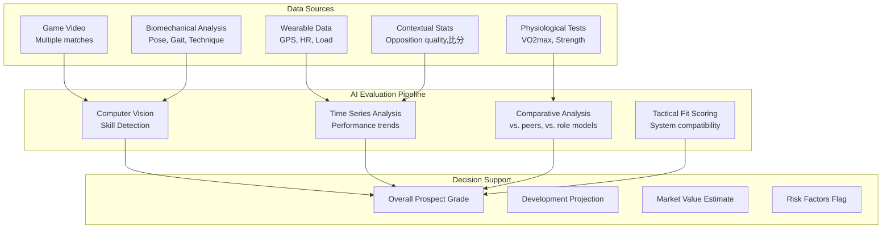

# AI for Scouting, Recruitment, and Team Building

## Overview

Scouting and recruitment sit at the intersection of talent evaluation and roster construction. A scout's job is to identify athletes who not only possess exceptional individual abilities but also fit the tactical system, team culture, and salary structure of the organization. AI transforms this traditionally intuition-driven process into a data science discipline — quantifying potential, projecting development trajectories, and optimizing roster composition under constraints.

This lesson covers player evaluation models, market value prediction, tactical fit assessment, and the algorithmic foundations of roster optimization.

---

## Player Evaluation Framework

### Traditional Scouting vs. AI-Augmented Scouting

Traditional scouting relies on live observation, highlight reels, and subjective expert judgment. While irreplaceable for evaluating intangibles like leadership and composure under pressure, human scouts suffer from:
- **Recency bias**: Overweighting recent performances
- **Halo effects**: Letting one outstanding attribute inflate overall rating
- **Limited sample**: Watching a few games per prospect
- **Inconsistent standards**: Wide variance between scouts

AI-augmented scouting addresses these weaknesses by processing comprehensive data from multiple games, applying consistent evaluation criteria, and surfacing patterns invisible to human observation.



---

## Technical Skill Detection

### Video-Based Skill Analysis

Modern scouting systems analyze hundreds of hours of game footage per prospect. Computer vision pipelines extract:

**Offensive Skills:**
- Dribbling efficiency: touches per possession, close control rate
- Passing accuracy: completion %, passes into dangerous areas
- Shooting technique: body position, follow-through, placement
- Movement off-ball: intelligent running, creating space

**Defensive Skills:**
- Tackling timing: success rate, foul timing
- Positioning: spatial awareness, compression of space
- Anticipation: interceptions, reading of play

```python
import torch
import torch.nn as nn

class SkillDetector(nn.Module):
    """
    Video-based technical skill detection using spatiotemporal features.
    """
    def __init__(self, num_skills=12):
        super().__init__()
        # 3D CNN for capturing motion patterns
        self.cnn = nn.Sequential(
            nn.Conv3d(3, 64, kernel_size=(3, 7, 7), stride=(1, 2, 2), padding=(1, 3, 3)),
            nn.BatchNorm3d(64),
            nn.ReLU(inplace=True),
            nn.MaxPool3d(kernel_size=(1, 2, 2)),

            nn.Conv3d(64, 128, kernel_size=(3, 5, 5), stride=(1, 2, 2), padding=(1, 2, 2)),
            nn.BatchNorm3d(128),
            nn.ReLU(inplace=True),
            nn.MaxPool3d(kernel_size=(1, 2, 2)),

            nn.Conv3d(128, 256, kernel_size=(3, 3, 3), stride=(1, 2, 2), padding=(1, 1, 1)),
            nn.BatchNorm3d(256),
            nn.ReLU(inplace=True),
            nn.AdaptiveAvgPool3d((1, 1, 1))
        )

        self.classifier = nn.Linear(256, num_skills)
        self.regressor = nn.Linear(256, 1)  # Overall rating

    def forward(self, x):
        # x: (batch, channels, time, height, width)
        features = self.cnn(x).squeeze(-1).squeeze(-1).squeeze(-1)
        skills = torch.sigmoid(self.classifier(features))
        rating = self.regressor(features)
        return skills, rating
```

### Movement Quality Assessment

Beyond discrete skills, AI assesses movement quality — how well a player moves relative to their position and the game state:

```python
def compute_movement_efficiency(player_positions, game_state):
    """
    Evaluate movement efficiency relative to tactical context.
    """
    # Compute expected position based on game state
    expected_pos = tactical_model.predict_expected_position(
        player_id=game_state.player_id,
        formation=game_state.formation,
        phase=game_state.phase  # attack, defend, transition
    )

    # Actual vs expected gives a measure of tactical intelligence
    deviation = np.linalg.norm(player_positions - expected_pos, axis=-1)

    # Lower deviation = better tactical intelligence
    # But very low deviation might indicate lack of initiative
    efficiency_score = 1 / (1 + np.mean(deviation))

    return efficiency_score
```

---

## Market Value Prediction

### Transfer Fee Modeling

Player market value depends on multiple factors — current performance, age, contract length, position scarcity, and reputational effects. A hedonic regression model:

$$\text{MarketValue} = \beta_0 + \beta_1 \text{Perf} + \beta_2 \text{Age} + \beta_3 \text{PosDemand} + \beta_4 \text{ContractLen} + \epsilon$$

Where:
- $\text{Perf}$ = expected performance metrics (goals, assists, key passes per 90)
- $\text{Age}$ = player age (typically quadratic — peak value around 25-27)
- $\text{PosDemand}$ = scarcity of player's position in transfer market
- $\text{ContractLen}$ = years remaining on contract

```python
import numpy as np
from sklearn.ensemble import GradientBoostingRegressor

class TransferFeeModel:
    """
    Predict transfer fees using gradient boosting with feature engineering.
    """
    def __init__(self):
        self.model = GradientBoostingRegressor(
            n_estimators=200,
            max_depth=4,
            learning_rate=0.1,
            subsample=0.8
        )

    def engineer_features(self, player_data):
        """
        Create features for market value prediction.
        """
        features = []

        # Performance features
        features.append(player_data['goals_per90'] * 150)  # Goals weighted heavily
        features.append(player_data['assists_per90'] * 80)
        features.append(player_data['key_passes_per90'] * 30)
        features.append(player_data['dribble_success_rate'] * 50)

        # Age curve (peak at 26)
        age = player_data['age']
        features.append(-0.5 * (age - 26) ** 2 + 50)

        # Contract leverage (shorter contract = higher leverage for buyer)
        contract_years = player_data['contract_years_remaining']
        features.append(100 / (1 + contract_years))

        # Position scarcity multiplier
        position_multipliers = {
            'ST': 1.3, 'CF': 1.3, 'CAM': 1.2,
            'CM': 1.0, 'CDM': 0.9, 'CB': 0.85,
            'FB': 0.8, 'WB': 0.85, 'GK': 0.6
        }
        features.append(position_multipliers.get(player_data['position'], 1.0) * 50)

        return np.array(features).reshape(1, -1)

    def fit(self, X, y):
        self.model.fit(X, y)

    def predict(self, player_data):
        features = self.engineer_features(player_data)
        return self.model.predict(features)[0]
```

### Expected Performance Projection

A key challenge is projecting how a player will perform in a different league or system. Transfer success often hinges on adaptation:

```python
class PerformanceProjector:
    """
    Project player performance across different leagues/systems.
    """
    def __init__(self, league_params, system_params):
        self.league_params = league_params      # e.g., Serie A vs Premier League
        self.system_params = system_params       # e.g., high-press vs low-block

    def project_performance(self, player_history, target_league, target_system):
        """
        Use counterfactual modeling to project performance.
        """
        # Find similar players who made the same league jump
        similar_players = self.find_similar_transfers(
            player_history, target_league
        )

        # Extract adaptation factors
        adaptation_factor = self.compute_adaptation(
            player_history, similar_players
        )

        # Base performance adjusted by adaptation
        base_performance = self.compute_base_performance(player_history)
        projected = base_performance * adaptation_factor

        return {
            'expected_goals_per90': projected['goals'] * 0.85,
            'expected_assists_per90': projected['assists'] * 0.90,
            'adaptation_confidence': self.compute_confidence(similar_players)
        }

    def compute_adaptation(self, player, similar_transfers):
        """
        Adaptation factor based on similar players' performance changes.
        """
        performance_changes = [
            self.compare_pre_post(similar_player)
            for similar_player in similar_transfers
        ]

        # Weight by how similar the player is to target
        return np.mean(performance_changes)
```

---

## Tactical Fit Assessment

### Formation Compatibility

A player's skill set must match the tactical system they're placed in. A player excelling in a possession-based system may struggle in a counter-attacking team, and vice versa.

```python
class TacticalFitScorer:
    """
    Assess how well a player fits a team's tactical system.
    """
    def __init__(self, team_tactical_profile):
        self.team_profile = team_tactical_profile

    def score_fit(self, player_skills, position_requirements):
        """
        Compute compatibility between player and team system.
        """
        scores = {}

        # Possession vs direct style match
        style_match = self.compute_style_match(
            player_skills['passing_range'],
            player_skills['dribbling'],
            self.team_profile['possession_priority']  # 0-1 scale
        )
        scores['style'] = style_match

        # Pressing intensity match
        press_match = self.compute_press_match(
            player_skills['work_rate'],
            player_skills['aggression'],
            self.team_profile['pressing_intensity']
        )
        scores['pressing'] = press_match

        # Spatial occupation match
        space_match = self.compute_space_match(
            player_skills['positioning'],
            player_skills['movement_intelligence'],
            self.team_profile['formation_shape']
        )
        scores['spatial'] = space_match

        return {
            'overall_fit': np.mean(list(scores.values())),
            'component_scores': scores,
            'potential_issues': self.identify_weaknesses(scores)
        }
```

### Team Chemistry Modeling

Individual talent doesn't guarantee team success. Graph neural networks model how players interact:

```python
import torch.nn as nn

class TeamChemistryGNN(nn.Module):
    """
    Model team chemistry using graph neural networks.
    Nodes = players, Edges = on-field interactions.
    """
    def __init__(self, node_features=64, edge_features=32, message_passes=3):
        super().__init__()

        self.node_encoder = nn.Linear(node_features, 64)
        self.edge_encoder = nn.Linear(edge_features, 32)

        self.message_layers = nn.ModuleList([
            MessagePassingLayer(64, 32)
            for _ in range(message_passes)
        ])

        self.chemistry_predictor = nn.Linear(64, 1)

    def forward(self, node_features, edge_index, edge_features):
        # Encode node and edge features
        x = self.node_encoder(node_features)
        e = self.edge_encoder(edge_features)

        # Message passing
        for layer in self.message_layers:
            x = layer(x, edge_index, e)

        # Predict chemistry from aggregated team state
        team_state = torch.mean(x, dim=0)
        chemistry = torch.sigmoid(self.chemistry_predictor(team_state))

        return chemistry
```

---

## Roster Optimization

### The Squad Building Problem

Building an optimal roster is a constrained optimization problem:

**Objective:** Maximize expected team performance

**Constraints:**
- Total salary budget $B$
- Minimum/maximum players per position
- Age distribution targets
- Cultural/language compatibility
- Contract expiry distribution (avoid cliff)

$$\max \sum_{i \in \text{roster}} w_i \cdot \text{Perf}_i$$
$$\text{s.t.} \sum_{i} \text{Salary}_i \leq B$$
$$\sum_{i \in \text{position}} 1 \geq \text{min}_{\text{position}}$$

```python
from scipy.optimize import milp, LinearConstraint, Bounds

class RosterOptimizer:
    """
    Optimize roster construction under budget and positional constraints.
    """
    def __init__(self, salary_budget, position_requirements):
        self.budget = salary_budget
        self.position_req = position_requirements

    def optimize(self, available_players):
        """
        Solve roster optimization as mixed-integer linear program.
        """
        n_players = len(available_players)

        # Decision variables: x[i] = 1 if player i is selected
        # Objective coefficients: expected performance contribution
        c = -np.array([p['expected_value'] for p in available_players])  # Minimize -perf

        # Constraints
        A_eq = []  # Equality constraints
        b_eq = []

        # Budget constraint
        budget_constraint = np.array([p['salary'] for p in available_players])
        A_ub = [budget_constraint]
        b_ub = [self.budget]

        # Position constraints
        for position, (min_req, max_req) in self.position_req.items():
            position_mask = [1 if p['position'] == position else 0
                           for p in available_players]
            A_ub.append(-np.array(position_mask))  # >= min (convert to <=)
            b_ub.append(-min_req)
            A_ub.append(np.array(position_mask))   # <= max
            b_ub.append(max_req)

        # Solve
        result = milp(c, constraints=[
            LinearConstraint(A_ub, -np.inf, b_ub)
        ], bounds=Bounds(0, 1), integrality=1)

        selected = result.x == 1
        return [available_players[i] for i in range(n_players) if selected[i]]
```

### Development Trajectory Modeling

Young players appreciate in value based on projected development. AI models growth curves:

```python
def model_development_trajectory(player_age, current_ability, position):
    """
    Model expected ability trajectory over time using growth curves.

    Uses Gompertz function for realistic saturation behavior:
    A(t) = A_max * exp(-exp(-k*(t - t0)))
    """
    # Parameters depend on position and playing time
    if position in ['CB', 'GK']:
        peak_age = 30
        development_span = 8  # years to reach peak
    else:
        peak_age = 27
        development_span = 5

    # Gompertz growth parameters
    a_max = current_ability * 1.4  # Expect ~40% improvement potential
    k = 4 / development_span
    t0 = peak_age - development_span

    t = np.arange(player_age, player_age + 5)  # 5-year projection
    trajectory = a_max * np.exp(-np.exp(-k * (t - t0)))

    return {
        'ages': t,
        'projected_abilities': trajectory,
        'peak_age': peak_age,
        'total_improvement': (trajectory[-1] - current_ability) / current_ability
    }
```

---

## Bias and Ethical Considerations

### Algorithmic Bias in Recruitment

AI systems can perpetuate or amplify existing biases if trained on historical data that reflects past discriminatory practices. Key concerns:

1. **Historical bias**: Models trained on transfer data from eras with less equal opportunity may undervalue certain demographics
2. **Measurement bias**: Systems optimized for traditional metrics may miss players from non-mainstream backgrounds or playing styles
3. **Confirmation bias**: Scouts may overweight algorithmic recommendations that confirm their existing views

Mitigations include:
- Regular bias audits of model predictions
- Diverse training data requirements
- Human-in-the-loop decision making
- Transparency about how recommendations are generated

---

## Summary

- AI transforms scouting from subjective observation to data-driven evaluation
- Computer vision extracts technical skills from video at scale
- Market value models combine performance, age, contract, and positional factors
- Tactical fit assessment ensures player-system compatibility
- Roster optimization treats squad building as a constrained optimization problem
- Development trajectory modeling projects young player growth
- Ethical safeguards prevent algorithmic bias from perpetuating discrimination

---

## What's Next

Lesson 08 explores **reinforcement learning for game strategy** — how AI agents learn optimal in-game decisions, from play calls to tactical adjustments, through self-play and environment simulation.