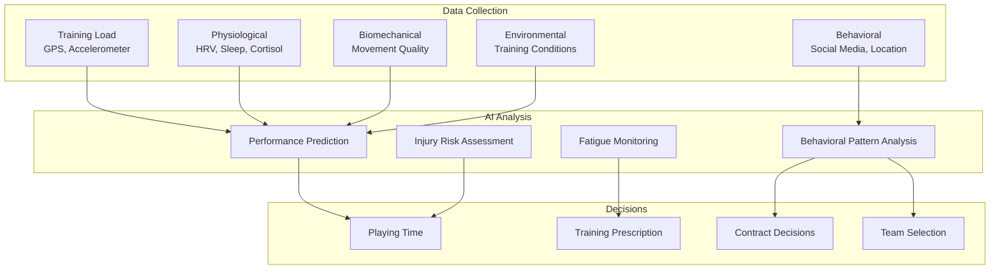

# Frontiers, Ethics, and Anti-Doping

## Overview

AI in sports science has progressed from experimental research to deployed systems transforming how athletes train, teams compete, and fans engage. As these technologies mature, important questions emerge: Where is the field heading? What ethical boundaries should guide deployment? How does AI interact with anti-doping efforts?

This lesson covers emerging frontiers in sports AI, the ethical landscape of surveillance and performance enhancement, anti-doping applications of AI, and the societal implications of increasingly data-driven sports.

---

## Emerging Frontiers

### Generative AI for Tactical Innovation

Large language models and diffusion models are being applied to tactical innovation — generating novel plays, training scenarios, and strategic variations that human coaches might never consider:

```python
class TacticalInnovationAI:
    """
    Generate novel tactical innovations using generative models.
    """
    def __init__(self):
        self.tactic_vae = load_tactic_vae()  # Variational autoencoder for tactics
        self.llm = load_large_language_model()

    def generate_novel_formation(self, constraints):
        """
        Generate novel formation within given constraints.
        """
        # Encode constraints
        constraint_embedding = self.encode_constraints(constraints)

        # Sample from latent space
        z = torch.randn(1, 64)
        combined = torch.cat([z, constraint_embedding], dim=-1)

        # Decode to formation
        formation = self.tactic_vae.decode(combined)

        # Validate and refine
        valid_formation = self.validate_formation(formation, constraints)

        return valid_formation

    def generate_play_variation(self, base_play, n_variations=5):
        """
        Generate variations of an existing play.
        """
        base_encoding = self.tactic_vae.encode(base_play)

        variations = []
        for _ in range(n_variations):
            # Add noise to encoding
            noisy = base_encoding + torch.randn_like(base_encoding) * 0.3
            variation = self.tactic_vae.decode(noisy)

            if self.is_legal_play(variation):
                variations.append(variation)

        return variations

    def describe_tactic(self, tactic):
        """
        Generate natural language description of a tactic.
        """
        prompt = f"""
        Describe this soccer tactic in detail:
        Formation: {tactic.formation}
        Player movements: {tactic.movements}
        Objective: {tactic.objective}
        Counter-strategy: {tactic.counter_strategy}

        Write a clear explanation suitable for coaching staff.
        """
        return self.llm.generate(prompt, max_tokens=200)
```

### Federated Learning for Privacy-Preserving Collaboration

Sports organizations are increasingly using federated learning to collaborate on model training without sharing raw athlete data:

```python
class FederatedSportsLearning:
    """
    Federated learning across sports organizations.
    """
    def __init__(self, organizations):
        self.organizations = organizations
        self.global_model = InjuryPredictionModel()

    def train_collaborative_model(self, rounds=10):
        """
        Train global model without sharing raw data.
        """
        for round in range(rounds):
            local_updates = []

            for org in self.organizations:
                # Each organization trains locally
                local_model = copy.deepcopy(self.global_model)
                local_model.train_on_local_data(org.sensitive_data)

                # Send gradient updates (not raw data)
                update = compute_model_update(
                    self.global_model,
                    local_model
                )
                local_updates.append(update)

            # Aggregate updates
            aggregated_update = aggregate_updates(local_updates)
            self.global_model.apply_update(aggregated_update)

            print(f"Round {round}: Global model updated")

        return self.global_model
```

### Neural Interfaces and Biomechanical Control

Emerging neural interface technology enables direct measurement of athlete neural states:

```python
class NeuralBiomechanicalInterface:
    """
    Interface between neural activity and biomechanical optimization.
    """
    def __init__(self):
        self.eeg_model = load_eeg_classifier()
        self.bio_model = load_biomechanical_model()

    def measure_readiness(self, athlete):
        """
        Assess athlete readiness using neural indicators.
        """
        # EEG-based fatigue detection
        eeg_data = athlete.eeg_sensor.read(duration=60)

        # Classify fatigue state
        fatigue_state = self.eeg_model.classify(eeg_data)
        # States: fresh, moderate_fatigue, heavy_fatigue, overreaching

        # Combine with traditional metrics
        readiness_score = self.compute_readiness_score(
            neural_fatigue=fatigue_state,
            hrv=athlete.hrv_current,
            sleep_quality=athlete.sleep_score,
            training_load=athlete.acwr
        )

        return {
            'readiness': readiness_score,
            'neural_state': fatigue_state,
            'recommendation': self.get_recommendation(readiness_score)
        }
```

---

## Ethical Considerations

### The Surveillance Problem

AI enables unprecedented monitoring of athlete behavior — not just during competition, but during training, recovery, sleep, and even social media activity:



### Key Ethical Tensions

| Tension | Challenge | Mitigation |
|---------|-----------|------------|
| **Performance vs. Privacy** | Athletes may feel pressured to consent to invasive monitoring | Clear boundaries, athlete ownership of data |
| **Competitive Advantage vs. Manipulation** | AI could enable unfair advantages or psychological manipulation | Regulatory frameworks, transparency requirements |
| **Collective vs. Individual** | Team benefits may conflict with individual athlete interests | Protected time, individual data rights |
| **Short-term vs. Long-term** | Performance optimization may compromise long-term health | Independent health advocates |

### Informed Consent in Practice

```python
class AthleteDataRights:
    """
    Framework for athlete control over their data.
    """
    def __init__(self, athlete_id):
        self.athlete_id = athlete_id
        self.consent_state = self.load_consent_state()

    def grant_consent(self, data_type, purpose, duration):
        """
        Grant specific consent for data use.
        """
        consent = {
            'data_type': data_type,
            'purpose': purpose,
            'duration': duration,
            'timestamp': datetime.now(),
            'can_revoke': True
        }
        self.consent_state.append(consent)
        return consent

    def revoke_consent(self, consent_id):
        """
        Revoke previously granted consent.
        """
        for consent in self.consent_state:
            if consent['id'] == consent_id and consent['can_revoke']:
                consent['revoked'] = True
                consent['revoked_at'] = datetime.now()
        return True

    def get_data_usage_report(self):
        """
        Generate report of how athlete's data has been used.
        """
        usages = self.query_data_usage(self.athlete_id)
        return {
            'active_consents': [c for c in self.consent_state if not c.get('revoked')],
            'historical_usage': usages,
            'third_party_sharing': self.get_third_party_access()
        }
```

---

## Anti-Doping and AI

### Detection of Novel Doping Methods

Anti-doping authorities face a cat-and-mouse game with increasingly sophisticated doping methods. AI helps identify suspicious patterns:

```python
class DopingDetectionAI:
    """
    AI system for detecting potential doping.
    """
    def __init__(self):
        self.baseline_model = load_baseline_athlete_model()
        self.anomaly_detector = load_anomaly_detector()

    def detect_suspicious_blood_profiles(self, athlete_history):
        """
        Detect blood profile anomalies indicating doping.
        """
        current_profile = athlete_history.latest_blood_panel
        historical_profiles = athlete_history.blood_panels[:-1]

        # Compute deviation from individual baseline
        baseline = self.baseline_model.predict_baseline(athlete_history)
        deviation = compute_deviation(current_profile, baseline)

        # Detect sudden improvements
        improvement_rate = compute_improvement_rate(historical_profiles)

        # Cross-sectional comparison with peers
        peer_comparison = self.compare_to_peers(current_profile, athlete_history.sport)

        return {
            'individual_deviation': deviation,
            'improvement_rate': improvement_rate,
            'peer_comparison': peer_comparison,
            'suspicion_score': self.compute_suspicion(
                deviation, improvement_rate, peer_comparison
            ),
            'recommended_follow_up': self.suggest_tests()
        }

    def detect_biological_passport_anomalies(self, athlete_bp):
        """
        Analyze athlete biological passport for doping indicators.
        """
        markers = athlete_bp.get_all_markers()

        anomaly_scores = {}
        for marker_name, marker_series in markers.items():
            # Time-series anomaly detection
            anomaly_score = self.anomaly_detector.score(marker_series)
            anomaly_scores[marker_name] = anomaly_score

        return {
            'marker_anomalies': anomaly_scores,
            'overall_suspicion': np.mean(list(anomaly_scores.values())),
            'atypical_markers': [k for k, v in anomaly_scores.items() if v > 0.7]
        }
```

### Gene Doping Detection

```python
class GeneDopingDetector:
    """
    Detect gene doping through expression patterns.
    """
    def __init__(self):
        self.gene_expression_model = load_gene_model()

    def detect_transcription_anomalies(self, blood_sample):
        """
        Detect gene expression patterns inconsistent with natural physiology.
        """
        expression_patterns = self.analyze_gene_expression(blood_sample)

        # Look for expression of genes typically not expressed in adults
        unusual_genes = self.find_unusual_expression(expression_patterns)

        # Detect gene therapy vectors
        vector_markers = self.detect_viral_vectors(expression_patterns)

        return {
            'unusual_genes': unusual_genes,
            'vector_markers': vector_markers,
            'doping_probability': self.compute_probability(
                unusual_genes, vector_markers
            )
        }
```

### Monitoring Training Patterns for Doping Indicators

```python
class TrainingPatternAnalyzer:
    """
    Analyze training patterns for doping indicators.
    """
    def __init__(self):
        self.recovery_model = load_recovery_model()

    def detect_unnatural_recovery(self, athlete):
        """
        Detect recovery rates inconsistent with natural physiology.
        """
        session_pairs = self.get_high_intensity_session_pairs(athlete.training_log)

        recovery_rates = []
        for session_a, session_b in session_pairs:
            hours_between = (session_b.start - session_a.end).total_seconds() / 3600

            if hours_between < 24:  # Less than 24 hours between sessions
                recovery = self.measure_recovery(session_a, session_b)
                recovery_rates.append({
                    'hours_between': hours_between,
                    'recovery_quality': recovery,
                    'suspicion': self.is_unusual_recovery(recovery, hours_between)
                })

        return recovery_rates

    def is_unusual_recovery(self, recovery_quality, hours_between):
        """
        Flag recovery that seems unnaturally fast.
        """
        expected_recovery = self.recovery_model.predict(
            hours_between,
            athlete_baseline=athlete.baseline_recovery_rate
        )

        ratio = recovery_quality / expected_recovery

        if ratio > 1.5:  # 50% faster than expected
            return 'high_suspicion'
        elif ratio > 1.2:
            return 'moderate_suspicion'
        else:
            return 'normal'
```

---

## Future Directions

### Regulation and Governance

The sports AI landscape requires thoughtful regulation:

1. **Transparency Requirements**: Athletes should know what data is collected and how it's used
2. **Audit Rights**: Independent verification of AI systems for fairness
3. **Appeal Processes**: Mechanisms to challenge AI-generated decisions
4. **International Coordination**: Harmonized standards across sports and nations

### Emerging Technologies

| Technology | Timeline | Sports Impact |
|------------|----------|---------------|
| **Brain-computer interfaces** | 5-10 years | Direct neural performance optimization |
| **Synthetic biology** | 5-15 years | Gene doping detection challenges |
| **Quantum sensing** | 10-20 years | Ultra-precise biomechanical measurement |
| **AR glasses for coaches** | 2-5 years | Real-time tactical information overlay |
| **Emotion AI** | 3-7 years | Crowd and player emotional monitoring |

### Societal Implications

```python
class SportsAIImpactAssessment:
    """
    Framework for assessing societal impact of sports AI.
    """
    def __init__(self):
        self.stakeholders = ['athletes', 'teams', 'fans', 'officials', 'society']

    def assess_impact(self, technology):
        """
        Assess multi-stakeholder impact of new technology.
        """
        impacts = {}

        for stakeholder in self.stakeholders:
            impacts[stakeholder] = {
                'benefits': self.identify_benefits(technology, stakeholder),
                'harms': self.identify_harms(technology, stakeholder),
                'overall': self.weight_impacts(...)
            }

        return {
            'per_stakeholder': impacts,
            'recommendation': self.make_recommendation(impacts),
            'monitoring_plan': self.suggest_monitoring(impacts)
        }
```

---

## Summary

- Emerging frontiers include generative AI for tactics, federated learning for privacy, and neural interfaces for biomechanical control
- Ethical tensions center on performance vs. privacy, competitive advantage vs. manipulation, and individual vs. collective interests
- AI assists anti-doping efforts through biological passport anomaly detection, gene doping detection, and training pattern monitoring
- Regulation must balance innovation with athlete protection
- Societal implications require careful assessment across multiple stakeholders
- The field is moving toward more integrated, more personal, and more intelligent sports systems

---

## What's Next

This concludes our **AI for Sports Science** track. You now have foundational knowledge spanning from player tracking and pose estimation (Lesson 02) through performance analysis (Lesson 03), injury prevention (Lesson 04), broadcast analytics (Lesson 05), digital twins (Lesson 06), scouting and recruitment (Lesson 07), reinforcement learning for strategy (Lesson 08), NLP for commentary (Lesson 09), fan engagement (Lesson 10), and ethics/anti-doping (Lesson 11). Continue to other tracks or explore advanced topics in computer vision, time-series modeling, or reinforcement learning applied to sports contexts.