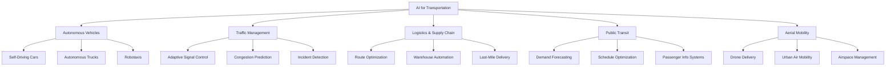

# Introduction to AI for Transportation

## Overview

Transportation is undergoing a profound transformation driven by artificial intelligence. From the earliest rule-based traffic signal controllers of the 1960s, which simply cycled through green, yellow, and red on fixed timers, to today's deep learning systems that can pilot vehicles through complex urban environments, AI has steadily expanded its role in how people and goods move.

The journey began with classical control theory and operations research. Early traffic engineers used mathematical models to optimize signal timing for intersections and highway on-ramps. By the 1980s, expert systems emerged that encoded human knowledge into rule-based decision trees for logistics routing and fleet scheduling. The 1990s brought statistical machine learning to the table, enabling demand forecasting for airlines and freight companies. Then, starting around 2012, the deep learning revolution changed everything. Convolutional neural networks (CNNs) enabled machines to see the road; recurrent neural networks (RNNs) and later transformers allowed them to predict traffic patterns with unprecedented accuracy; and reinforcement learning (RL) taught autonomous agents to make sequential driving decisions.

Today, AI for transportation spans several key domains. **Autonomous vehicles (AVs)** represent perhaps the most visible application, with companies like Waymo, Cruise, and Tesla developing self-driving systems. **Traffic management** uses AI for adaptive signal control, congestion prediction, and incident detection. **Logistics and supply chain** leverages AI for route optimization, warehouse automation, and last-mile delivery. **Public transit** benefits from AI-driven scheduling, demand prediction, and passenger information systems. **Aerial mobility**, including drones and urban air mobility (UAM), uses AI for flight path planning and airspace management.

The core AI methods powering these applications are diverse. **Computer vision** processes camera and LiDAR data to detect vehicles, pedestrians, lane markings, and traffic signs. **Reinforcement learning** trains agents to make optimal sequential decisions, whether controlling a vehicle or managing traffic signals. **Sensor fusion** combines data from multiple sensors (cameras, LiDAR, radar, GPS, IMUs) to build robust environmental models. **Natural language processing (NLP)** powers voice-based ride-hailing interfaces, chatbots for transit information, and text analysis of traffic reports.

The data landscape supporting these AI systems is vast. Modern vehicles carry dozens of sensors: high-resolution cameras capture visual scenes, LiDAR units generate 3D point clouds of the surroundings, radar measures the velocity of nearby objects, and ultrasonic sensors detect close-range obstacles. Beyond the vehicle, IoT sensors embedded in roads and bridges monitor traffic flow and structural health. GPS data from smartphones and fleet vehicles provides real-time location information. Together, these data streams generate terabytes of information per vehicle per day, creating both opportunities and challenges for AI systems.

The societal impact of AI in transportation is enormous. Road crashes kill approximately 1.35 million people annually worldwide, and human error contributes to over 90% of these accidents. AI-driven systems hold the promise of dramatically reducing this toll. At the same time, AI-optimized logistics can reduce fuel consumption and emissions, while smart traffic management can cut urban congestion. However, important safety considerations remain: how do we validate AI systems that must handle rare but critical edge cases? How do we ensure equitable access to AI-driven transportation? And how do we address the workforce displacement that automation may bring? These questions will accompany us throughout this track.

## Key Concepts

- **Rule-based systems vs. learned systems**: Early transportation AI used hand-coded rules (e.g., fixed signal timing). Modern approaches learn from data, adapting to changing conditions automatically.
- **Perception-prediction-planning pipeline**: Most transportation AI follows this paradigm — first perceive the environment, then predict what other agents will do, then plan actions accordingly.
- **Sensor fusion**: The process of combining data from multiple sensor modalities (cameras, LiDAR, radar, GPS) to create a more complete and reliable understanding of the environment. Mathematically, sensor fusion often uses Bayesian estimation: $$P(\text{state} \mid \text{sensors}) \propto P(\text{sensors} \mid \text{state}) \cdot P(\text{state})$$
- **Edge cases**: Rare but critical scenarios (e.g., unusual road debris, extreme weather) that challenge AI systems and are difficult to cover in training data.
- **V2X communication**: Vehicle-to-everything communication enables vehicles to share data with infrastructure, other vehicles, and pedestrians, extending perception beyond onboard sensors.

## Code Examples

A basic vehicle detection example using a pretrained deep learning model:

```python
import torch
from torchvision import models, transforms
from PIL import Image

# Load a pretrained Faster R-CNN model for object detection
model = models.detection.fasterrcnn_resnet50_fpn(pretrained=True)
model.eval()

# COCO class labels (subset relevant to transportation)
TRANSPORT_CLASSES = {
    3: "car", 4: "motorcycle", 6: "bus",
    8: "truck", 1: "person", 2: "bicycle",
    10: "traffic light", 13: "stop sign"
}

def detect_vehicles(image_path, confidence_threshold=0.5):
    """Detect transportation-related objects in an image."""
    image = Image.open(image_path).convert("RGB")
    transform = transforms.ToTensor()
    input_tensor = transform(image).unsqueeze(0)

    with torch.no_grad():
        predictions = model(input_tensor)[0]

    results = []
    for label, score, box in zip(
        predictions["labels"], predictions["scores"], predictions["boxes"]
    ):
        label_id = label.item()
        if score.item() >= confidence_threshold and label_id in TRANSPORT_CLASSES:
            results.append({
                "class": TRANSPORT_CLASSES[label_id],
                "confidence": round(score.item(), 3),
                "bbox": [round(c.item(), 1) for c in box]
            })

    return results

# Example usage
detections = detect_vehicles("street_scene.jpg")
for det in detections:
    print(f"{det['class']}: {det['confidence']} at {det['bbox']}")
```

## Diagrams

**Taxonomy of AI Transportation Domains**



## Exercises/Projects

1. **Sensor Inventory**: Pick a modern vehicle (e.g., Tesla Model 3, Waymo Jaguar). Research and list all the sensors it carries, their placement, and what each sensor is used for. Create a table comparing sensor types by range, resolution, and cost.
2. **Detection Exploration**: Using the code example above (or a similar pretrained model), run vehicle detection on 5 different street scene images. Record the detection accuracy and note which objects are missed or misclassified.
3. **Domain Mapping**: Choose one of the five AI transportation domains (AVs, traffic, logistics, transit, aerial). Write a one-page summary of the top three AI techniques used in that domain, with a real-world example for each.

## Further Reading

- [SAE J3016 Levels of Driving Automation](https://www.sae.org/standards/content/j3016_202104/)
- [USDOT Intelligent Transportation Systems](https://www.its.dot.gov/)
- [Waymo Safety Report](https://waymo.com/safety/)
- [MIT Deep Learning for Self-Driving Cars (Lecture Series)](https://deeplearning.mit.edu/)
