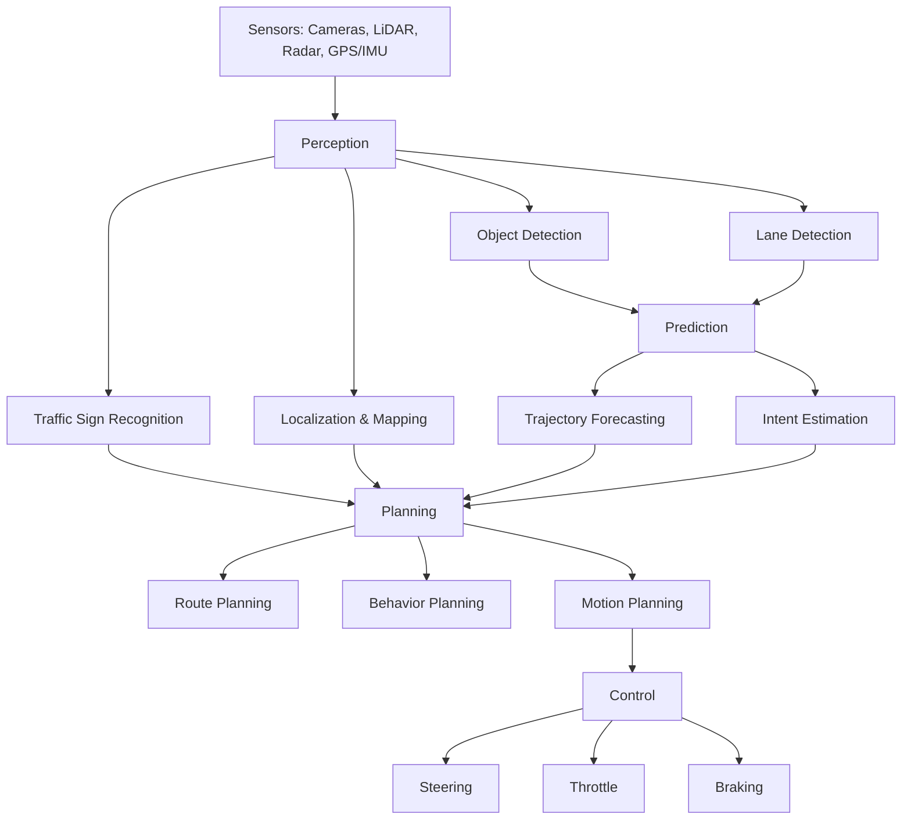
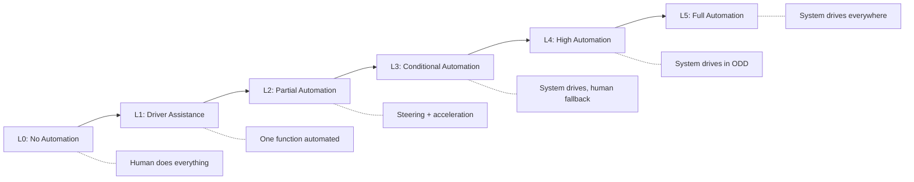

# Autonomous Vehicles: Levels, History, and Architecture

## Overview

Autonomous vehicles represent one of the most ambitious applications of artificial intelligence. To understand the current state of the field, we need to examine three pillars: the standardized levels of automation, the history that brought us here, and the system architecture that makes self-driving possible.

The **SAE J3016 standard** defines six levels of driving automation, from L0 to L5. **Level 0 (No Automation)** means the human driver does everything, though the vehicle may have warning systems. **Level 1 (Driver Assistance)** provides a single automated function such as adaptive cruise control or lane keeping, but not both simultaneously. **Level 2 (Partial Automation)** combines multiple functions — for example, steering and acceleration together — but the human must monitor the road at all times. Tesla's Autopilot and GM's Super Cruise operate at this level. **Level 3 (Conditional Automation)** allows the system to handle all driving tasks in specific conditions, but the human must be ready to take over when requested. Honda's Legend and Mercedes Drive Pilot have achieved limited L3 certification. **Level 4 (High Automation)** means the vehicle can drive itself in defined operational design domains (ODDs) without human intervention — Waymo's robotaxi service in Phoenix and San Francisco operates at this level within geofenced areas. **Level 5 (Full Automation)** would handle all driving conditions everywhere, with no steering wheel needed. No production vehicle has reached L5.

The history of autonomous driving stretches back decades, but the modern era began with DARPA. The **2004 DARPA Grand Challenge** asked teams to build vehicles that could navigate 142 miles of desert terrain autonomously. No team finished. In **2005**, Stanford's Stanley completed the course, proving desert autonomy was possible. The **2007 DARPA Urban Challenge** moved to city streets with traffic, and CMU's Boss won. These competitions seeded the talent and technology that went on to shape the industry. In 2009, Google launched its self-driving car project (later Waymo). By the mid-2010s, dozens of companies were racing toward autonomy. Today, Waymo operates commercial robotaxi services, Cruise (GM) has expanded testing, and Tesla pursues a camera-only approach at scale.

The **AV system architecture** follows a perception-prediction-planning-control pipeline. The perception module processes raw sensor data to understand the environment. The prediction module forecasts what other road users will do. The planning module decides what the ego vehicle should do, generating a trajectory. The control module executes that trajectory by sending commands to the steering, throttle, and brakes.

The **sensor suite** is the foundation of perception. Cameras provide rich color and texture information at high resolution. LiDAR generates precise 3D point clouds using laser pulses. Radar measures object velocity reliably and works in poor weather. Ultrasonic sensors handle close-range detection for parking. Companies differ in their sensor philosophy: Waymo uses cameras, LiDAR, and radar together for redundancy, while Tesla relies on cameras alone, arguing that a vision-only approach can scale more economically since cameras cost far less than LiDAR units.

Sensor fusion combines these modalities. A common approach uses an extended Kalman filter where the state estimate is updated by each sensor measurement:

$$\hat{x}_{k|k} = \hat{x}_{k|k-1} + K_k (z_k - H_k \hat{x}_{k|k-1})$$

where $K_k$ is the Kalman gain, $z_k$ is the measurement, and $H_k$ is the observation matrix. This allows the system to combine noisy readings from different sensors into a single, more accurate estimate of object positions and velocities.

## Key Concepts

- **Operational Design Domain (ODD)**: The specific conditions (geography, weather, speed, road type) under which an AV is designed to operate. L4 systems are defined by their ODD boundaries.
- **Sensor fusion**: Combining data from cameras, LiDAR, radar, and other sensors to create a unified world model. Early fusion combines raw data; late fusion combines per-sensor detections.
- **Perception-Prediction-Planning-Control stack**: The four-stage pipeline that processes sensor data into vehicle actions. Each stage feeds the next.
- **Kalman gain ($K_k$)**: Determines how much weight to give the new sensor measurement versus the prior prediction: $K_k = P_{k|k-1} H_k^T (H_k P_{k|k-1} H_k^T + R_k)^{-1}$
- **Vision-only vs. multi-sensor**: A strategic debate — cameras are cheap and information-rich but struggle with depth; LiDAR gives precise 3D geometry but is expensive and sparse in texture.

## Code Examples

A conceptual object detection pipeline that processes sensor data through the AV stack stages:

```python
import numpy as np

class SimpleObjectDetector:
    """Conceptual AV perception pipeline demonstrating the detection flow."""

    def __init__(self, confidence_threshold=0.5):
        self.confidence_threshold = confidence_threshold

    def preprocess_image(self, image_array):
        """Normalize image to [0, 1] range and resize."""
        normalized = image_array.astype(np.float32) / 255.0
        return normalized

    def generate_anchors(self, feature_map_size, image_size):
        """Generate anchor boxes across the feature map grid."""
        anchors = []
        stride = image_size // feature_map_size
        scales = [32, 64, 128]
        for y in range(feature_map_size):
            for x in range(feature_map_size):
                cx, cy = x * stride + stride // 2, y * stride + stride // 2
                for s in scales:
                    anchors.append([cx - s // 2, cy - s // 2,
                                    cx + s // 2, cy + s // 2])
        return np.array(anchors)

    def non_max_suppression(self, boxes, scores, iou_threshold=0.5):
        """Remove overlapping detections, keeping highest confidence."""
        if len(boxes) == 0:
            return []
        order = scores.argsort()[::-1]
        keep = []
        while len(order) > 0:
            i = order[0]
            keep.append(i)
            if len(order) == 1:
                break
            remaining = order[1:]
            ious = self._compute_iou(boxes[i], boxes[remaining])
            order = remaining[ious < iou_threshold]
        return keep

    def _compute_iou(self, box, boxes):
        """Compute Intersection over Union between one box and many."""
        x1 = np.maximum(box[0], boxes[:, 0])
        y1 = np.maximum(box[1], boxes[:, 1])
        x2 = np.minimum(box[2], boxes[:, 2])
        y2 = np.minimum(box[3], boxes[:, 3])
        intersection = np.maximum(0, x2 - x1) * np.maximum(0, y2 - y1)
        area_a = (box[2] - box[0]) * (box[3] - box[1])
        area_b = (boxes[:, 2] - boxes[:, 0]) * (boxes[:, 3] - boxes[:, 1])
        union = area_a + area_b - intersection
        return intersection / (union + 1e-6)

# Demonstrate the pipeline concept
detector = SimpleObjectDetector(confidence_threshold=0.6)
anchors = detector.generate_anchors(feature_map_size=8, image_size=256)
print(f"Generated {len(anchors)} anchor boxes for detection")
```

## Diagrams

**Autonomous Vehicle Software Stack**



**SAE Levels of Driving Automation**



## Exercises/Projects

1. **Level Classification**: Research five commercially available driver assistance features (e.g., Tesla Autopilot, GM Super Cruise, Honda Sensing). Classify each according to SAE J3016 levels and justify your classification.
2. **Sensor Comparison**: Build a table comparing cameras, LiDAR, radar, and ultrasonics across: range, resolution, cost, weather robustness, and information type. Discuss which combinations you would choose for an L4 urban robotaxi.
3. **Kalman Filter Implementation**: Implement a 1D Kalman filter in Python that fuses two noisy position measurements (e.g., from a camera and a radar) into a single estimate. Plot the fused estimate against individual sensor readings.

## Further Reading

- [SAE J3016 Levels of Driving Automation (Full Standard)](https://www.sae.org/standards/content/j3016_202104/)
- [DARPA Grand Challenge History](https://www.darpa.mil/about-us/timeline/-grand-challenge-for-autonomous-vehicles)
- [Waymo Open Dataset](https://waymo.com/open/)
- [Tesla AI Day Presentations](https://www.youtube.com/results?search_query=tesla+ai+day)
