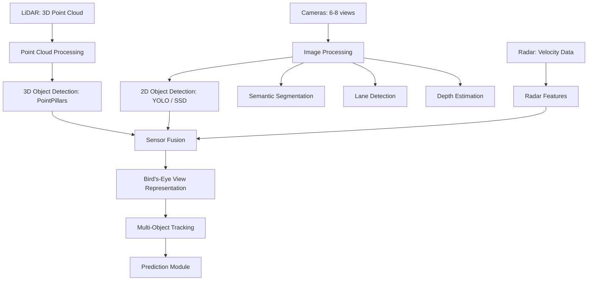
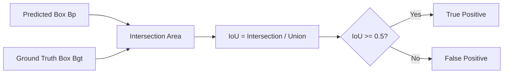

# Computer Vision for Driving: Cameras, LiDAR, and Perception

## Overview

Computer vision is the eyes of an autonomous vehicle. The perception module must answer fundamental questions at every moment: What objects are nearby? Where exactly are they? How fast are they moving? What do the lane markings and signs indicate? This lesson explores the algorithms and representations that make this possible.

**Camera-based perception** is the most natural modality since cameras capture the same visual information human drivers use. The core tasks include image classification (what is this object?), object detection (where are objects in the image?), and semantic segmentation (what class does every pixel belong to?). For object detection, two families of models dominate. **Two-stage detectors** like Faster R-CNN first propose candidate regions, then classify each region. They are accurate but slower. **Single-stage detectors** like YOLO (You Only Look Once) and SSD (Single Shot Detector) predict bounding boxes and class probabilities directly in one pass, achieving real-time speeds. YOLO divides the image into a grid, and each cell predicts bounding boxes and class probabilities simultaneously, making it well-suited for driving applications where latency matters.

**Semantic segmentation** assigns a class label to every pixel — road, sidewalk, vehicle, pedestrian, sky. Models like DeepLab and SegFormer use encoder-decoder architectures with dilated convolutions or transformer blocks to produce dense predictions. This is critical for understanding drivable surfaces and road boundaries.

**LiDAR point cloud processing** works with fundamentally different data. A LiDAR sensor emits laser pulses and measures their return time, producing a sparse 3D point cloud — a set of $(x, y, z)$ coordinates with optional intensity values. Processing these unstructured points requires specialized architectures. **PointNet** directly consumes raw point sets using shared MLPs and symmetric functions to achieve permutation invariance. **VoxelNet** discretizes the 3D space into voxels (volumetric pixels) and applies 3D convolutions. **PointPillars** organizes points into vertical pillars on a 2D grid, converting the problem to a pseudo-image that can be processed efficiently with 2D convolutions — a practical balance of speed and accuracy.

**2D vs. 3D object detection** represents a key distinction. 2D detection outputs bounding boxes in the image plane $(x_{\min}, y_{\min}, x_{\max}, y_{\max})$. 3D detection outputs oriented 3D bounding boxes $(x, y, z, w, h, l, \theta)$ — center position, dimensions, and heading angle. For driving, 3D detection is essential because you need to know not just that a car is visible but exactly how far away it is and in which direction it is heading.

**Lane detection** identifies lane markings and road boundaries. Classical methods used edge detection and Hough transforms; modern approaches like LaneNet use deep networks to predict lane instance segmentation. **Depth estimation from monocular cameras** predicts per-pixel depth from a single image, using self-supervised learning on stereo pairs or supervised training on LiDAR ground truth. This allows a single cheap camera to approximate 3D understanding.

**Bird's-eye view (BEV) representation** has become increasingly popular. Instead of processing separate camera views independently, BEV methods project multi-camera features into a unified top-down representation. Models like BEVFormer use transformer-based spatial cross-attention to lift 2D image features into 3D and then flatten them to BEV, enabling joint reasoning about objects, lanes, and maps in a single coherent coordinate frame.

Major **datasets** have accelerated research. KITTI (2012) provided the first large-scale benchmark with camera and LiDAR data. nuScenes offers full 360-degree sensor coverage with 3D annotations. The Waymo Open Dataset provides the largest collection of high-quality 3D labels from diverse driving conditions.

## Key Concepts

- **Intersection over Union (IoU)**: Measures detection quality by comparing predicted and ground-truth bounding boxes: $$\text{IoU} = \frac{|B_p \cap B_{gt}|}{|B_p \cup B_{gt}|}$$ An IoU above 0.5 is typically considered a correct detection.
- **Mean Average Precision (mAP)**: The primary detection metric. For each class, compute precision-recall curve, then average precision (AP) is the area under that curve. mAP averages AP across all classes: $$\text{mAP} = \frac{1}{C} \sum_{c=1}^{C} \text{AP}_c$$
- **Voxelization**: Converting a continuous 3D point cloud into a discrete grid of voxels for efficient processing with convolutional networks.
- **Bird's-eye view (BEV)**: A top-down representation of the scene that simplifies reasoning about spatial relationships and is the natural frame for planning.
- **Single-stage vs. two-stage detectors**: Trade-off between speed (YOLO, SSD) and accuracy (Faster R-CNN). Modern single-stage detectors have largely closed the accuracy gap.

## Code Examples

A basic 2D bounding box detection and IoU computation pipeline:

```python
import numpy as np

def compute_iou(box_a, box_b):
    """
    Compute Intersection over Union between two bounding boxes.
    Each box is [x_min, y_min, x_max, y_max].
    """
    x1 = max(box_a[0], box_b[0])
    y1 = max(box_a[1], box_b[1])
    x2 = min(box_a[2], box_b[2])
    y2 = min(box_a[3], box_b[3])

    intersection = max(0, x2 - x1) * max(0, y2 - y1)
    area_a = (box_a[2] - box_a[0]) * (box_a[3] - box_a[1])
    area_b = (box_b[2] - box_b[0]) * (box_b[3] - box_b[1])
    union = area_a + area_b - intersection

    return intersection / (union + 1e-6)

def compute_average_precision(precisions, recalls):
    """Compute AP using the 11-point interpolation method."""
    ap = 0.0
    for t in np.arange(0, 1.1, 0.1):
        precisions_above = [p for p, r in zip(precisions, recalls) if r >= t]
        ap += max(precisions_above) if precisions_above else 0.0
    return ap / 11.0

def evaluate_detections(predictions, ground_truths, iou_threshold=0.5):
    """
    Evaluate object detection predictions against ground truth.
    predictions: list of (box, confidence)
    ground_truths: list of boxes
    """
    # Sort predictions by confidence (descending)
    predictions = sorted(predictions, key=lambda x: x[1], reverse=True)

    tp = np.zeros(len(predictions))
    fp = np.zeros(len(predictions))
    matched = set()

    for i, (pred_box, conf) in enumerate(predictions):
        best_iou = 0
        best_gt = -1
        for j, gt_box in enumerate(ground_truths):
            iou = compute_iou(pred_box, gt_box)
            if iou > best_iou:
                best_iou = iou
                best_gt = j

        if best_iou >= iou_threshold and best_gt not in matched:
            tp[i] = 1
            matched.add(best_gt)
        else:
            fp[i] = 1

    cum_tp = np.cumsum(tp)
    cum_fp = np.cumsum(fp)
    recalls = cum_tp / len(ground_truths)
    precisions = cum_tp / (cum_tp + cum_fp)

    ap = compute_average_precision(precisions.tolist(), recalls.tolist())
    return ap

# Example
gt_boxes = [[50, 50, 200, 200], [300, 100, 450, 300]]
pred_boxes = [
    ([48, 52, 198, 195], 0.95),  # Good match to gt[0]
    ([305, 105, 445, 295], 0.88),  # Good match to gt[1]
    ([100, 100, 180, 250], 0.30),  # False positive
]

ap = evaluate_detections(pred_boxes, gt_boxes)
print(f"Average Precision: {ap:.3f}")

# IoU example
iou = compute_iou([50, 50, 200, 200], [48, 52, 198, 195])
print(f"IoU between prediction and ground truth: {iou:.3f}")
```

## Diagrams

**Perception Pipeline for Autonomous Driving**



**IoU Calculation Concept**



## Exercises/Projects

1. **IoU Calculator**: Extend the code example to handle 3D bounding boxes with dimensions $(x, y, z, w, h, l)$. Compute 3D IoU by calculating the volume of intersection.
2. **Dataset Exploration**: Download a small subset of the KITTI dataset. Visualize the camera images alongside projected LiDAR points. Count how many objects are visible in camera but missed by LiDAR, and vice versa.
3. **Detection Comparison**: Using a pretrained YOLOv8 model, run detection on 10 driving images. Compare results against a Faster R-CNN model on the same images. Measure inference time and mAP for each.
4. **BEV Visualization**: Given multi-camera images from nuScenes, write code to project detected bounding boxes from each camera view into a shared bird's-eye view coordinate frame.

## Further Reading

- [KITTI Vision Benchmark Suite](http://www.cvlibs.net/datasets/kitti/)
- [nuScenes Dataset](https://www.nuscenes.org/)
- [Waymo Open Dataset](https://waymo.com/open/)
- [YOLOv8 Documentation (Ultralytics)](https://docs.ultralytics.com/)
- [BEVFormer Paper (arXiv)](https://arxiv.org/abs/2203.17270)
