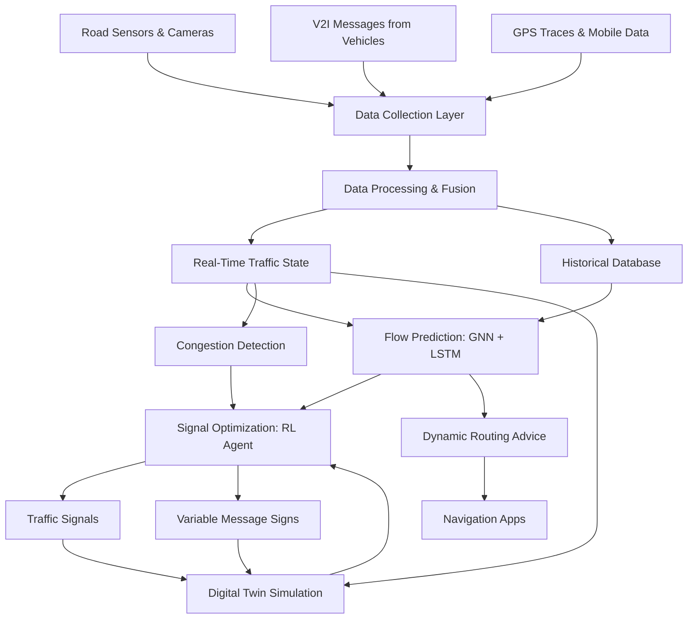
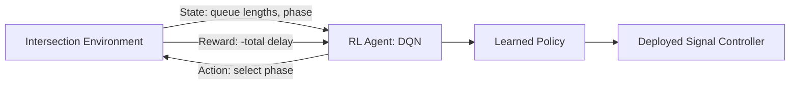

# AI for Traffic Management and Smart Cities

## Overview

While autonomous vehicles capture headlines, AI is quietly revolutionizing how cities manage traffic flow for millions of vehicles every day. Intelligent transportation systems (ITS) use AI to monitor, predict, and optimize traffic across entire urban networks, reducing congestion, emissions, and travel times.

**Adaptive traffic signal control** has evolved through several generations. First-generation systems like SCATS (Sydney Coordinated Adaptive Traffic System) and SCOOT (Split Cycle Offset Optimization Technique) use real-time detector data to adjust signal timing parameters — cycle length, green splits, and offsets between adjacent intersections. These systems rely on traffic engineering models and incremental optimization. The latest generation applies **reinforcement learning (RL)** directly to signal control. An RL agent observes the intersection state (queue lengths, waiting times, vehicle counts per lane), selects a signal phase, and receives a reward based on metrics like total delay reduction. Deep Q-Networks (DQN) and multi-agent RL methods have shown significant improvements over fixed-timing plans in simulation, with some real-world deployments in cities like Pittsburgh (Surtrac system) demonstrating 25% reductions in travel time.

**Traffic flow prediction** is essential for proactive management. The fundamental traffic flow equation relates three macroscopic variables:

$$q = k \cdot v$$

where $q$ is the flow (vehicles per hour), $k$ is the density (vehicles per km), and $v$ is the space mean speed (km/h). Predicting these variables over time and space is a spatiotemporal forecasting problem. **Graph neural networks (GNNs)** are a natural fit because road networks are graphs — intersections are nodes, road segments are edges. Models like DCRNN (Diffusion Convolutional Recurrent Neural Network) and STGCN (Spatio-Temporal Graph Convolutional Network) capture spatial dependencies through graph convolutions and temporal dynamics through recurrent or temporal convolution layers. **LSTMs** and temporal transformers handle the sequential nature of traffic time series, learning patterns like rush hour peaks, weekend differences, and event-driven anomalies.

**Congestion detection and management** uses a combination of sensor data (loop detectors, cameras, GPS traces from connected vehicles) to identify bottlenecks in real time. The **Lighthill-Whitham-Richards (LWR)** model describes traffic as a fluid with a conservation equation:

$$\frac{\partial k}{\partial t} + \frac{\partial q}{\partial x} = 0$$

AI systems learn the fundamental diagram — the relationship between density and flow — from data, enabling them to predict when and where congestion will form and recommend interventions such as ramp metering, variable speed limits, or rerouting suggestions.

**Smart parking systems** use computer vision and IoT sensors to detect occupancy in real time, guiding drivers to available spaces and reducing the estimated 30% of urban traffic caused by parking search. Camera-based systems classify spaces as occupied or vacant using CNNs, while in-ground magnetometer sensors detect the presence of metal objects above them.

**Connected vehicle infrastructure** extends the intelligence beyond fixed sensors. **Vehicle-to-Infrastructure (V2I)** communication allows traffic signals to broadcast Signal Phase and Timing (SPaT) messages, enabling vehicles to optimize speed for green waves. **Vehicle-to-Vehicle (V2V)** communication shares position and speed data for cooperative awareness. Together, these form the **V2X** ecosystem, typically using Dedicated Short-Range Communications (DSRC) or Cellular V2X (C-V2X) standards.

**Digital twins** for city traffic represent the cutting edge. A digital twin is a real-time virtual replica of the physical traffic network, continuously updated with live sensor data. Simulation platforms like SUMO (Simulation of Urban Mobility) can serve as the backbone, while AI models running inside the twin test control strategies, predict incidents, and evaluate infrastructure changes before real-world deployment. Cities like Shanghai and Singapore have deployed traffic digital twins to manage congestion across thousands of intersections simultaneously.

## Key Concepts

- **Fundamental diagram**: The relationship between traffic density $k$ and flow $q$, typically showing flow increasing with density up to a capacity point, then decreasing as congestion sets in. The critical density $k_c$ marks the transition from free-flow to congested traffic.
- **Reinforcement learning for signal control**: An agent learns to select signal phases by maximizing a reward (e.g., minimizing total wait time). The state captures queue lengths and signal status; actions are phase selections; rewards penalize vehicle delay.
- **Graph neural networks (GNNs)**: Process data defined on graph structures. For traffic, the road network graph lets GNNs propagate information along connected road segments, capturing how congestion at one intersection affects downstream locations.
- **V2I communication**: Enables infrastructure to send real-time signal timing to approaching vehicles, allowing speed optimization and priority for emergency or transit vehicles.
- **Digital twin**: A live simulation mirror of the physical traffic system, enabling scenario testing and optimization without disrupting real traffic.

## Code Examples

A simple traffic flow prediction model using a neural network:

```python
import numpy as np

# --- Traffic flow fundamentals ---
def fundamental_diagram(density, v_free=60, k_jam=150):
    """
    Greenshields model: speed decreases linearly with density.
    v = v_free * (1 - k / k_jam)
    q = k * v
    """
    speed = v_free * (1 - density / k_jam)
    flow = density * speed
    return flow, speed

# Show fundamental diagram
densities = np.linspace(0, 150, 100)
flows, speeds = fundamental_diagram(densities)
k_critical = 75  # density at max flow
q_max = fundamental_diagram(k_critical)[0]
print(f"Max flow: {q_max:.0f} veh/hr at density {k_critical} veh/km")


# --- Simple neural network for traffic flow prediction ---
class TrafficFlowPredictor:
    """
    A minimal 2-layer neural network for traffic flow prediction.
    Input: past T time steps of flow values
    Output: next time step flow prediction
    """

    def __init__(self, input_size=6, hidden_size=16, lr=0.01):
        self.W1 = np.random.randn(input_size, hidden_size) * 0.1
        self.b1 = np.zeros(hidden_size)
        self.W2 = np.random.randn(hidden_size, 1) * 0.1
        self.b2 = np.zeros(1)
        self.lr = lr

    def relu(self, x):
        return np.maximum(0, x)

    def forward(self, x):
        self.z1 = x @ self.W1 + self.b1
        self.a1 = self.relu(self.z1)
        self.z2 = self.a1 @ self.W2 + self.b2
        return self.z2.flatten()

    def train_step(self, x, y):
        pred = self.forward(x)
        loss = np.mean((pred - y) ** 2)

        # Backpropagation
        d_out = 2 * (pred - y) / len(y)
        d_W2 = self.a1.T @ d_out.reshape(-1, 1)
        d_b2 = d_out.sum()
        d_a1 = d_out.reshape(-1, 1) @ self.W2.T
        d_z1 = d_a1 * (self.z1 > 0)
        d_W1 = x.T @ d_z1
        d_b1 = d_z1.sum(axis=0)

        self.W2 -= self.lr * d_W2
        self.b2 -= self.lr * d_b2
        self.W1 -= self.lr * d_W1
        self.b1 -= self.lr * d_b1
        return loss


# Generate synthetic traffic data (hourly flow with daily pattern)
np.random.seed(42)
hours = np.arange(0, 24 * 7)  # One week, hourly
daily_pattern = np.array([
    200, 150, 100, 80, 100, 300, 800, 1200, 1400, 1100,
    900, 850, 900, 950, 1000, 1300, 1500, 1400, 1000, 700,
    500, 400, 350, 250
])
flow_data = np.tile(daily_pattern, 7) + np.random.normal(0, 50, len(hours))
flow_data = np.clip(flow_data, 0, 2000)

# Normalize
flow_max = flow_data.max()
flow_norm = flow_data / flow_max

# Create sequences: use past 6 hours to predict next hour
T = 6
X, Y = [], []
for i in range(len(flow_norm) - T):
    X.append(flow_norm[i:i + T])
    Y.append(flow_norm[i + T])
X, Y = np.array(X), np.array(Y)

# Train
model = TrafficFlowPredictor(input_size=T, hidden_size=16, lr=0.005)
for epoch in range(200):
    loss = model.train_step(X, Y)
    if (epoch + 1) % 50 == 0:
        print(f"Epoch {epoch + 1}, MSE Loss: {loss:.6f}")

# Predict
predictions = model.forward(X) * flow_max
actuals = Y * flow_max
mae = np.mean(np.abs(predictions - actuals))
print(f"Mean Absolute Error: {mae:.1f} vehicles/hour")
```

## Diagrams

**Smart Traffic Management System Architecture**



**Reinforcement Learning for Traffic Signal Control**



## Exercises/Projects

1. **Fundamental Diagram Analysis**: Using the Greenshields model in the code example, plot the fundamental diagram (flow vs. density and speed vs. density). Identify free-flow speed, critical density, jam density, and maximum flow capacity.
2. **Signal Timing Simulation**: Create a simple simulation of a single intersection with two phases. Compare fixed-timing control (30s each phase) against a rule-based adaptive controller that extends green when queue length exceeds a threshold. Measure average vehicle delay.
3. **Traffic Prediction Enhancement**: Extend the neural network predictor to use additional features: day of week (one-hot encoded), weather condition, and whether the day is a holiday. Compare prediction accuracy with and without these features.
4. **GNN Conceptual Design**: Given a small road network of 5 intersections, draw the graph representation (nodes and edges). Describe what features each node and edge would carry for a GNN-based traffic prediction model.

## Further Reading

- [SUMO Traffic Simulator](https://www.eclipse.org/sumo/)
- [STGCN Paper: Spatio-Temporal Graph Convolutional Networks (arXiv)](https://arxiv.org/abs/1709.04875)
- [Surtrac Adaptive Signal Control (Carnegie Mellon)](https://www.rapidflowtech.com/)
- [US DOT Connected Vehicle Pilot Program](https://www.its.dot.gov/pilots/)
- [CityFlow: Multi-Agent RL for Traffic Signal Control](https://cityflow-project.github.io/)
