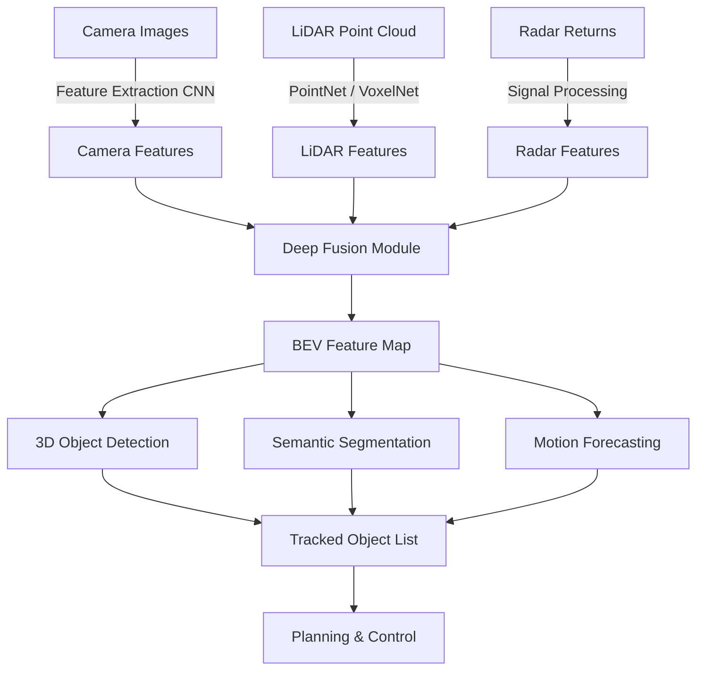
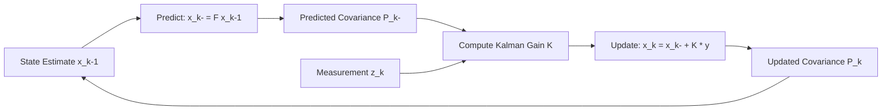

## Sensor Fusion and Localization for Self-Driving

## Overview

Self-driving vehicles rely on multiple sensors to perceive and navigate the world. No single sensor is sufficient: cameras provide rich texture and color but lack depth accuracy; LiDAR produces precise 3D point clouds but is expensive and sparse in texture; radar measures velocity directly and works well in rain or fog but has low spatial resolution. Sensor fusion is the discipline of combining these complementary data streams into a unified, reliable perception of the environment.

There are three canonical fusion architectures. **Early fusion** merges raw sensor data before any processing, projecting LiDAR points onto camera images or voxelizing everything into a shared 3D space. This preserves the most information but demands careful calibration and significant compute. **Late fusion** processes each sensor independently through its own detection pipeline, then merges the resulting object lists using association algorithms. This is modular and easier to develop but can lose correlations between modalities. **Deep fusion** sits in between: it extracts learned feature representations from each sensor and fuses them at intermediate network layers, allowing the model to learn cross-modal relationships while keeping the architecture manageable.

State estimation is the mathematical backbone of sensor fusion. The **Kalman filter** provides an optimal estimate of a system's state (position, velocity, orientation) by combining noisy measurements with a dynamics model. For nonlinear systems common in driving, the **Extended Kalman Filter (EKF)** linearizes the dynamics around the current estimate. When the system is highly nonlinear or the distribution is multi-modal, **particle filters** represent the belief as a set of weighted samples, trading computational cost for generality.

Localization answers the question "where am I?" GPS/GNSS gives a rough position but drifts in urban canyons and tunnels. **HD maps** pre-built from survey vehicles provide centimeter-accurate lane geometry; the car matches its sensor readings against the map to localize. **SLAM (Simultaneous Localization and Mapping)** builds and refines a map while simultaneously localizing within it, which is essential when HD maps are unavailable. Point cloud registration algorithms like **Iterative Closest Point (ICP)** align successive LiDAR scans to estimate motion.

Modern approaches use transformers to fuse multi-sensor data. **BEVFusion** projects camera and LiDAR features into a shared bird's-eye-view (BEV) space, enabling unified 3D detection. **TransFusion** uses cross-attention between LiDAR and camera tokens to enrich sparse point cloud features with image semantics. These methods have set new benchmarks on nuScenes and Waymo Open Dataset.

Multi-sensor **calibration** (extrinsic and intrinsic) is a prerequisite for all fusion: knowing the precise spatial and temporal relationship between sensors determines whether fusion helps or hurts.

## Key Concepts

- **Complementary Sensor Modalities**: Cameras excel at classification and lane detection; LiDAR provides geometric accuracy; radar gives velocity and weather robustness. Fusion exploits each strength.
- **Early vs. Late vs. Deep Fusion**: Trade-offs between information preservation, modularity, and computational cost. Deep fusion is the current industry trend.
- **Kalman Filter**: A recursive estimator that predicts a state forward in time, then corrects using a new measurement weighted by the Kalman gain $K$.
- **Extended Kalman Filter (EKF)**: Handles nonlinear dynamics by linearizing via Jacobians $F$ and $H$ at each step.
- **Particle Filter**: Represents belief as weighted samples; handles multi-modal distributions and arbitrary nonlinearities.
- **SLAM**: Jointly estimates robot pose and map, often using graph-based optimization or filter-based approaches.
- **ICP (Iterative Closest Point)**: Aligns two point clouds by iteratively finding closest-point correspondences and minimizing the rigid-body transformation error.
- **BEV Fusion**: Projects all sensor features into a common bird's-eye-view grid, enabling end-to-end 3D object detection.
- **Multi-Sensor Calibration**: Extrinsic calibration finds the 6-DOF transform between sensors; intrinsic calibration models lens distortion and focal length.

## Code Examples

### Simple Kalman Filter in 1D

```python
import numpy as np

class KalmanFilter1D:
    """1D Kalman filter for tracking position and velocity."""
    def __init__(self, dt=1.0, process_noise=0.1, measurement_noise=1.0):
        # State: [position, velocity]
        self.x = np.array([0.0, 0.0])  # initial state
        self.P = np.eye(2) * 500       # initial covariance (high uncertainty)
        # State transition matrix
        self.F = np.array([[1, dt],
                           [0, 1]])
        # Measurement matrix (we observe position only)
        self.H = np.array([[1, 0]])
        # Process noise covariance
        self.Q = np.array([[dt**4/4, dt**3/2],
                           [dt**3/2, dt**2]]) * process_noise
        # Measurement noise covariance
        self.R = np.array([[measurement_noise]])

    def predict(self):
        """Predict step: propagate state and covariance forward."""
        self.x = self.F @ self.x
        self.P = self.F @ self.P @ self.F.T + self.Q

    def update(self, z):
        """Update step: incorporate measurement z."""
        y = z - self.H @ self.x                          # innovation
        S = self.H @ self.P @ self.H.T + self.R          # innovation covariance
        K = self.P @ self.H.T @ np.linalg.inv(S)         # Kalman gain
        self.x = self.x + (K @ y.reshape(-1))
        self.P = (np.eye(2) - K @ self.H) @ self.P

# Simulate noisy position measurements of a vehicle moving at ~2 m/s
np.random.seed(42)
true_positions = [2.0 * t for t in range(20)]
measurements = [p + np.random.normal(0, 1.5) for p in true_positions]

kf = KalmanFilter1D(dt=1.0, process_noise=0.1, measurement_noise=2.25)
estimates = []
for z in measurements:
    kf.predict()
    kf.update(np.array([z]))
    estimates.append(kf.x[0])

print("Last 5 true positions: ", true_positions[-5:])
print("Last 5 measurements:   ", [f"{m:.2f}" for m in measurements[-5:]])
print("Last 5 KF estimates:   ", [f"{e:.2f}" for e in estimates[-5:]])
```

This implements the standard Kalman filter equations: the **predict** step applies the motion model, and the **update** step computes the Kalman gain $K = P H^T (H P H^T + R)^{-1}$ to optimally blend the prediction with the measurement.

## Diagrams

**Multi-Sensor Fusion Architecture**



**Kalman Filter Predict-Update Cycle**



## Exercises/Projects

1. **Extend to 2D Tracking**: Modify the Kalman filter to track a vehicle in 2D (x, y position and velocity). Add a simulated curved trajectory and plot the true path, noisy measurements, and filtered estimates.
2. **Implement ICP**: Write a simple 2D ICP algorithm that aligns two sets of points. Generate a source point cloud, apply a known rotation and translation, add noise, and recover the transform.
3. **Compare Fusion Strategies**: Using a dataset with both camera and LiDAR detections (e.g., KITTI), implement late fusion by merging bounding box lists with IoU-based association. Measure detection accuracy vs. single-sensor baselines.
4. **Particle Filter Localization**: Implement a particle filter that localizes a robot on a 1D map with known landmarks, comparing convergence speed to the Kalman filter.

## Further Reading

- [Kalman Filter Tutorial — Bzarg](https://www.bzarg.com/p/how-a-kalman-filter-works-in-pictures/)
- [BEVFusion Paper (MIT)](https://arxiv.org/abs/2205.13542)
- [TransFusion: Robust LiDAR-Camera Fusion](https://arxiv.org/abs/2203.11496)
- [Cyrill Stachniss — SLAM Lectures (YouTube)](https://www.youtube.com/playlist?list=PLgnQpQtFTOGQrZ4O5QzbIHgl3b1JHimN_)
- [nuScenes Dataset and Benchmarks](https://www.nuscenes.org/)
