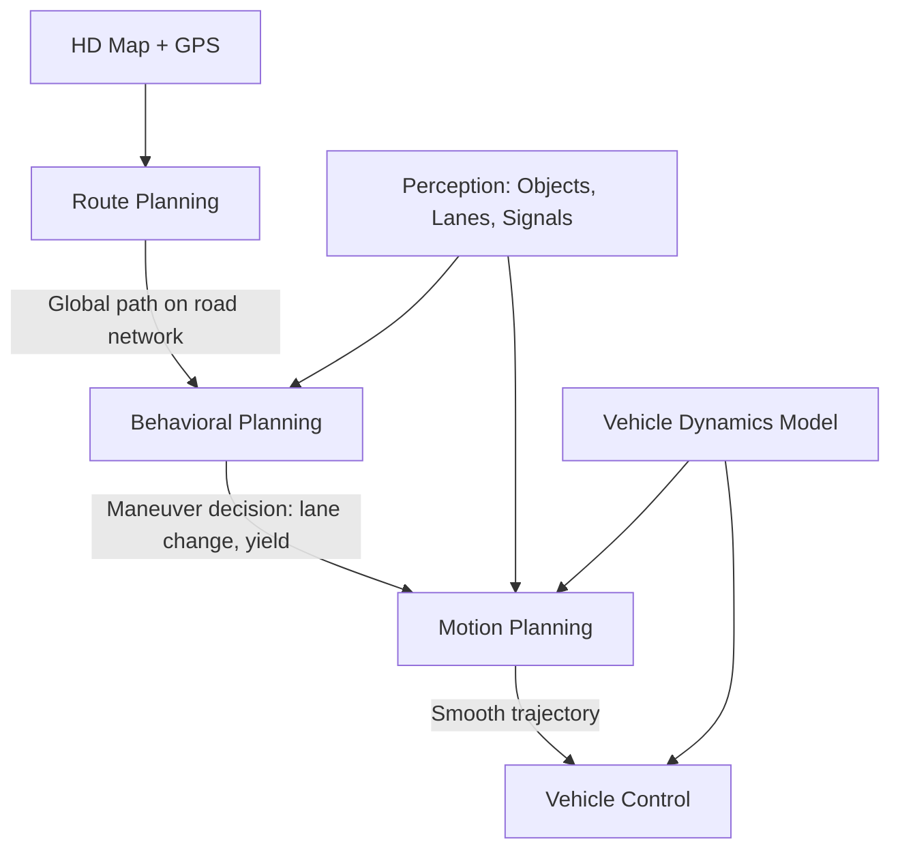
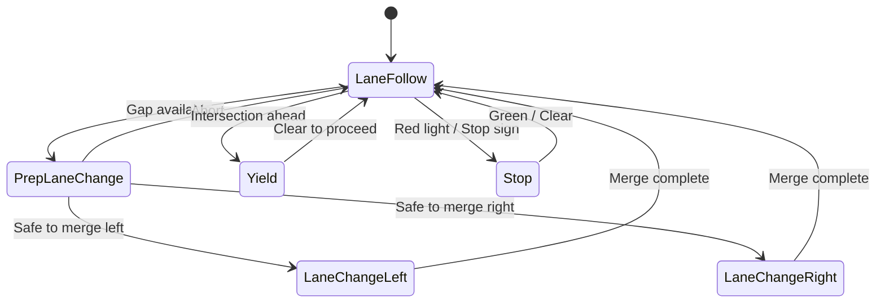

# Path Planning and Motion Planning Algorithms

## Overview

Planning is the bridge between perception and control in autonomous vehicles. It answers: given where I am and where I want to go, what sequence of actions should I take? This problem is decomposed into three hierarchical layers: **route planning** (global), **behavioral planning** (tactical), and **motion planning** (local trajectory generation).

**Global path planning** finds a route through the road network from origin to destination. Classic graph-search algorithms dominate here. **Dijkstra's algorithm** finds the shortest path by exploring nodes in order of cumulative cost; it is optimal but can be slow on large graphs. **A\*** improves on Dijkstra by adding a heuristic $h(n)$ that estimates the remaining cost to the goal, exploring fewer nodes while guaranteeing optimality when $h$ is admissible (never overestimates). The evaluation function is $f(n) = g(n) + h(n)$, where $g(n)$ is the cost so far. For continuous spaces, **RRT (Rapidly-exploring Random Trees)** grows a tree by sampling random configurations and extending the nearest node toward them. **RRT\*** adds rewiring to approach optimality asymptotically.

**Behavioral planning** decides high-level maneuvers: follow the lane, change lanes, yield at an intersection, or merge onto a highway. Finite state machines (FSMs) are a common formalism, where each state represents a driving mode and transitions depend on perception outputs and traffic rules. Decision trees and rule-based systems also appear, though learning-based approaches are increasingly replacing hand-crafted logic.

**Motion planning** generates a smooth, dynamically feasible trajectory that executes the behavioral decision. **Lattice planners** pre-compute a set of motion primitives (short trajectory segments) and search over combinations. **Polynomial trajectory generation** fits quintic or cubic polynomials to boundary conditions (start and goal positions, velocities, accelerations), producing smooth curves. **Model Predictive Control (MPC)** formulates trajectory generation as a receding-horizon optimization problem, minimizing a cost function over a finite time window while respecting constraints:

$$\min_{u_0, \ldots, u_{N-1}} \sum_{k=0}^{N} \ell(x_k, u_k) \quad \text{s.t.} \quad x_{k+1} = f(x_k, u_k), \; x_k \in \mathcal{X}, \; u_k \in \mathcal{U}$$

The **Frenet frame** transforms planning from Cartesian coordinates into road-relative coordinates $(s, d)$, where $s$ is the longitudinal distance along the road centerline and $d$ is the lateral offset. This simplifies trajectory generation because lane-keeping becomes minimizing $|d|$ and speed control becomes managing $\dot{s}$.

**Cost functions** for trajectory evaluation balance multiple objectives: safety (distance to obstacles, time-to-collision), comfort (jerk, lateral acceleration), efficiency (travel time, speed deviation from target), and traffic rule compliance. Weighted sums are common, but tuning the weights is a significant engineering challenge.

Planning approaches fall into three families. **Optimization-based** methods (MPC, convex optimization) produce smooth trajectories but can be slow for complex environments. **Sampling-based** methods (RRT, lattice) handle complex constraints well but may produce jerky paths. **Learning-based** methods (neural network planners, RL policies) promise generalization but lack safety guarantees without additional verification layers.

## Key Concepts

- **A\* Search**: Optimal graph search using $f(n) = g(n) + h(n)$. Common heuristics include Euclidean distance and Manhattan distance.
- **RRT / RRT\***: Sampling-based planners for continuous spaces. RRT is probabilistically complete; RRT\* is asymptotically optimal.
- **Behavioral Planning via FSM**: States like "lane follow," "lane change left," "yield" with transition conditions based on perception and rules.
- **Model Predictive Control**: Solves a finite-horizon optimization at each time step, applying only the first control action, then re-planning.
- **Frenet Frame**: Road-relative coordinate system $(s, d)$ that decouples longitudinal and lateral planning.
- **Lattice Planner**: Pre-computes a discrete set of motion primitives and searches over combinations, balancing coverage with computation.
- **Cost Function Design**: Multi-objective balancing of safety, comfort, efficiency, and legality. Often the hardest part of real-world deployment.
- **Dynamic Obstacle Avoidance**: Predicting obstacle trajectories and ensuring planned paths maintain safe clearance over time.

## Code Examples

### A* Search on a 2D Grid

```python
import heapq
import numpy as np

def astar(grid, start, goal):
    """A* search on a 2D grid. 0 = free, 1 = obstacle."""
    rows, cols = grid.shape
    open_set = [(0, start)]  # (f_score, position)
    came_from = {}
    g_score = {start: 0}

    def heuristic(a, b):
        # Euclidean distance (admissible heuristic)
        return ((a[0] - b[0])**2 + (a[1] - b[1])**2) ** 0.5

    while open_set:
        f, current = heapq.heappop(open_set)
        if current == goal:
            # Reconstruct path
            path = [current]
            while current in came_from:
                current = came_from[current]
                path.append(current)
            return path[::-1]

        for dr, dc in [(-1,0),(1,0),(0,-1),(0,1),(-1,-1),(-1,1),(1,-1),(1,1)]:
            neighbor = (current[0] + dr, current[1] + dc)
            if 0 <= neighbor[0] < rows and 0 <= neighbor[1] < cols:
                if grid[neighbor[0], neighbor[1]] == 1:
                    continue  # obstacle
                move_cost = 1.414 if abs(dr) + abs(dc) == 2 else 1.0
                tentative_g = g_score[current] + move_cost
                if tentative_g < g_score.get(neighbor, float('inf')):
                    came_from[neighbor] = current
                    g_score[neighbor] = tentative_g
                    f_score = tentative_g + heuristic(neighbor, goal)
                    heapq.heappush(open_set, (f_score, neighbor))

    return None  # no path found

# Example: 10x10 grid with obstacles
grid = np.zeros((10, 10), dtype=int)
grid[2, 2:8] = 1   # horizontal wall
grid[5, 0:6] = 1   # another wall
grid[7, 4:9] = 1   # third wall

path = astar(grid, (0, 0), (9, 9))
print(f"Path length: {len(path)} steps")
print("Path:", path)
```

The heuristic $h(n) = \sqrt{(\Delta x)^2 + (\Delta y)^2}$ is admissible for grid movement, guaranteeing that A\* finds the shortest path.

## Diagrams

**Planning Hierarchy in Autonomous Driving**



**Behavioral Planning Finite State Machine**



## Exercises/Projects

1. **Visualize A\***: Extend the code above with `matplotlib` to animate the A\* search, showing explored nodes, the frontier, and the final path on the grid.
2. **Implement RRT**: Write a 2D RRT planner that grows a tree from start to goal in a continuous space with circular obstacles. Visualize the tree growth.
3. **Frenet Trajectory Generation**: Given a road centerline as a list of waypoints, implement coordinate transforms between Cartesian and Frenet frames. Generate candidate trajectories with varying lateral offsets and select the lowest-cost one.
4. **MPC Simulation**: Implement a simple MPC controller for a bicycle-model vehicle tracking a reference path. Use `scipy.optimize.minimize` to solve the optimization at each step.

## Further Reading

- [Steven LaValle — Planning Algorithms (free textbook)](http://planning.cs.uiuc.edu/)
- [Frenet Optimal Trajectory Planning (Werling et al.)](https://www.researchgate.net/publication/224156269)
- [Apollo Planning Module Documentation](https://github.com/ApolloAuto/apollo/tree/master/modules/planning)
- [MPC for Autonomous Vehicles Tutorial](https://arxiv.org/abs/1904.07390)
