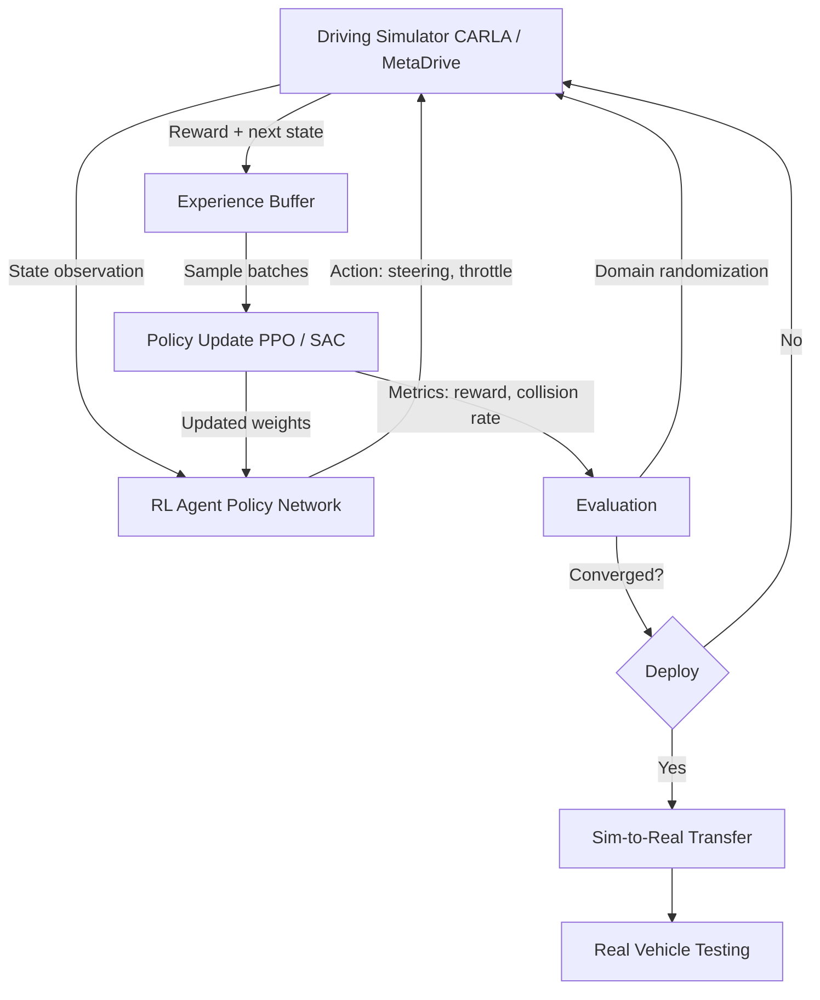
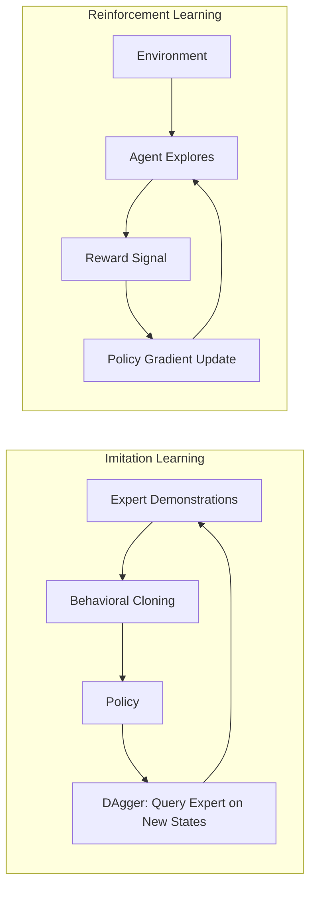

# Reinforcement Learning for Autonomous Driving

## Overview

Driving is fundamentally a sequential decision-making problem under uncertainty: at each moment the driver observes the environment, selects an action, and receives feedback in the form of progress toward a destination or safety violations. This makes **reinforcement learning (RL)** a natural framework for autonomous driving, complementing the traditional perception-planning-control pipeline with end-to-end learned policies.

The driving task is formalized as a **Markov Decision Process (MDP)**. The **state** $s$ encodes the ego vehicle's pose, velocity, and acceleration along with surrounding vehicles, pedestrians, lane markings, and traffic signals. The **action** $a$ typically includes steering angle and throttle/brake commands, either as continuous values or discretized bins. The **reward** $r(s, a)$ must encode multiple objectives: positive reward for making progress toward the goal, negative reward for collisions or lane departures, and shaping terms for comfort (low jerk) and traffic rule compliance.

The central equation of RL is the **Bellman equation**, which relates the value of a state to the values of successor states:

$$V^{\pi}(s) = \mathbb{E}_{a \sim \pi} \left[ r(s, a) + \gamma \sum_{s'} P(s' | s, a) V^{\pi}(s') \right]$$

**Model-free methods** learn a policy without explicitly modeling the transition dynamics. **DQN (Deep Q-Network)** learns an action-value function $Q(s, a)$ and selects actions greedily; it works well with discrete action spaces. For continuous control, **PPO (Proximal Policy Optimization)** and **SAC (Soft Actor-Critic)** are preferred. PPO constrains policy updates to a trust region for stability, while SAC maximizes both reward and entropy, encouraging exploration and robust policies.

The **policy gradient theorem** provides the foundation for these algorithms:

$$\nabla_\theta J(\theta) = \mathbb{E}_{\pi_\theta} \left[ \nabla_\theta \log \pi_\theta(a|s) \cdot A^{\pi}(s, a) \right]$$

where $A^{\pi}(s, a)$ is the advantage function estimating how much better action $a$ is compared to the average.

**Imitation learning** offers an alternative: instead of learning from a reward signal, the agent learns from human demonstrations. **Behavioral cloning** trains a supervised model to map observations to actions from an expert dataset. It is simple but suffers from **distribution shift**: small errors compound because the agent visits states the expert never demonstrated. **DAgger (Dataset Aggregation)** addresses this by iteratively collecting new data where the learned policy visits novel states and querying the expert for corrections.

**Reward shaping** is critical for driving. Naive reward functions (e.g., +1 for reaching the goal, -1 for crashing) produce sparse feedback that is hard to learn from. Practical designs add dense shaping terms: distance to lane center, speed relative to limit, time headway to the lead vehicle, and smoothness of controls. **Inverse RL** sidesteps manual reward design by inferring a reward function from expert demonstrations, assuming the expert is approximately optimal.

**Sim-to-real transfer** is the biggest practical challenge. RL agents are typically trained in simulation (CARLA, SUMO, MetaDrive) where millions of episodes are cheap, but simulators imperfectly model real physics, sensor noise, and human behavior. **Domain randomization** varies simulation parameters (lighting, friction, traffic density) to produce robust policies. **Domain adaptation** uses techniques like adversarial training to align simulated and real feature distributions.

**Multi-agent RL** extends the framework to scenarios with multiple interacting vehicles, such as unsignalized intersections or highway merging, where each agent's optimal action depends on the others' strategies.

## Key Concepts

- **MDP Formulation**: State (ego + environment), action (steering + throttle), reward (safety + progress + comfort), transition dynamics, discount factor $\gamma$.
- **DQN**: Learns $Q(s, a)$ via experience replay and target networks. Best for discrete action spaces.
- **PPO**: On-policy algorithm with clipped surrogate objective for stable updates. Widely used in driving simulators.
- **SAC**: Off-policy, entropy-regularized actor-critic. Balances exploration and exploitation, suited for continuous control.
- **Behavioral Cloning**: Supervised learning on expert demonstrations. Fast to train but fragile under distribution shift.
- **DAgger**: Iterative imitation learning that queries the expert on the learner's visited states, reducing compounding errors.
- **Reward Shaping**: Adding intermediate reward signals to guide learning. Must be potential-based to preserve optimal policy guarantees.
- **Inverse RL**: Recovering the reward function from demonstrations. Methods include MaxEntropy IRL and GAIL (Generative Adversarial Imitation Learning).
- **Sim-to-Real Transfer**: Bridging the reality gap via domain randomization, system identification, or sim-to-real adaptation networks.

## Code Examples

### Simple Driving Environment (Gym-style)

```python
import numpy as np

class SimpleDrivingEnv:
    """A minimal 1D driving environment following OpenAI Gym conventions."""

    def __init__(self, road_length=100, speed_limit=5.0):
        self.road_length = road_length
        self.speed_limit = speed_limit
        self.dt = 0.5
        self.reset()

    def reset(self):
        """Reset to start of road with zero velocity."""
        self.position = 0.0
        self.velocity = 0.0
        self.steps = 0
        return self._get_obs()

    def _get_obs(self):
        return np.array([self.position / self.road_length,
                         self.velocity / self.speed_limit])

    def step(self, action):
        """Action: acceleration in [-2, 2] m/s^2."""
        action = np.clip(action, -2.0, 2.0)
        self.velocity += action * self.dt
        self.velocity = np.clip(self.velocity, 0.0, self.speed_limit * 1.5)
        self.position += self.velocity * self.dt
        self.steps += 1

        # Reward design
        reward = 0.0
        reward += 0.1 * self.velocity / self.speed_limit     # progress
        reward -= 0.5 * max(0, self.velocity - self.speed_limit)  # speeding penalty
        reward -= 0.01 * abs(action)                          # comfort (low jerk)

        done = False
        if self.position >= self.road_length:
            reward += 10.0  # goal reached
            done = True
        if self.steps >= 500:
            done = True     # timeout

        return self._get_obs(), reward, done, {}

    def render(self):
        bar_len = 40
        pos = int(self.position / self.road_length * bar_len)
        bar = '.' * pos + 'C' + '.' * (bar_len - pos)
        print(f"[{bar}] v={self.velocity:.1f} m/s")

# Run a simple policy: accelerate then cruise
env = SimpleDrivingEnv()
obs = env.reset()
total_reward = 0
for _ in range(200):
    # Simple rule-based policy
    velocity = obs[1] * env.speed_limit
    action = 1.5 if velocity < env.speed_limit * 0.9 else 0.0
    obs, reward, done, _ = env.step(action)
    total_reward += reward
    if done:
        break

env.render()
print(f"Total reward: {total_reward:.2f}, Position: {env.position:.1f}")
```

This environment follows the standard Gym interface (`reset`, `step`, `render`), making it compatible with RL libraries like Stable-Baselines3. The reward function illustrates the multi-objective nature of driving rewards.

## Diagrams

**RL Training Loop for Autonomous Driving**



**Imitation Learning vs. Reinforcement Learning**



## Exercises/Projects

1. **Train with Stable-Baselines3**: Install `stable-baselines3` and train a PPO agent on the `SimpleDrivingEnv` above (wrap it as a proper Gym environment). Plot the learning curve and compare with SAC.
2. **Behavioral Cloning**: Collect 1000 episodes of expert data using the rule-based policy, then train a neural network to clone it. Measure how quickly performance degrades compared to the expert.
3. **Reward Shaping Experiment**: Modify the reward function to use only a sparse goal reward (+10 at the end, 0 otherwise). Compare learning speed with the dense reward version.
4. **Multi-Agent Intersection**: Extend the environment to a simple 2-agent intersection scenario where two cars approach from perpendicular roads. Train agents with independent PPO and observe emergent coordination.

## Further Reading

- [CARLA Simulator for Autonomous Driving](https://carla.org/)
- [Stable-Baselines3 Documentation](https://stable-baselines3.readthedocs.io/)
- [A Survey of RL for Autonomous Driving (Kiran et al., 2021)](https://arxiv.org/abs/2002.00444)
- [DAgger: A Reduction of Imitation Learning (Ross et al.)](https://arxiv.org/abs/1011.0686)
- [GAIL: Generative Adversarial Imitation Learning](https://arxiv.org/abs/1606.03476)
