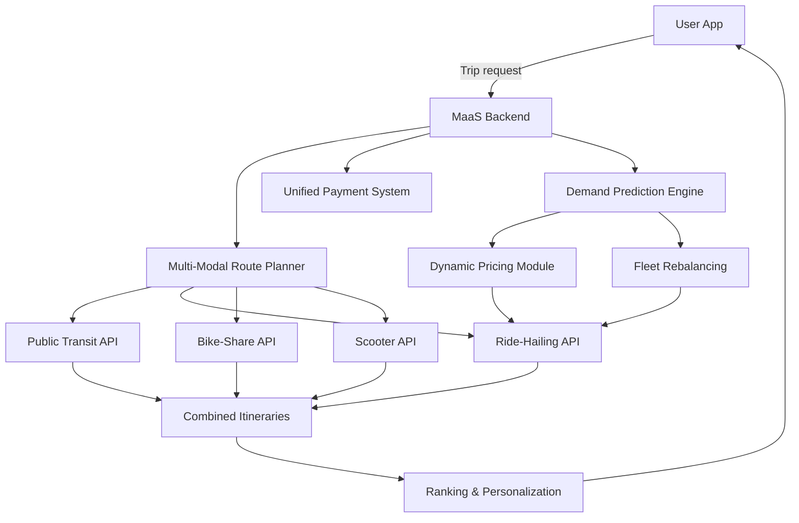
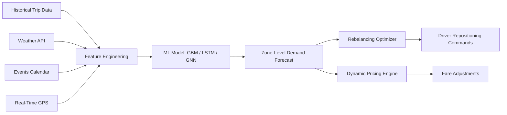

## AI for Public Transit and Mobility-as-a-Service (MaaS)

## Overview

While autonomous vehicles capture headlines, AI is quietly transforming **public transit and shared mobility** at a larger scale. Cities worldwide use machine learning to optimize bus and metro schedules, predict passenger demand, set dynamic prices, and integrate multiple transport modes into seamless **Mobility-as-a-Service (MaaS)** platforms.

**AI for scheduling and route optimization** tackles a classic operations research problem: given a set of stops, passenger demand patterns, and a fleet of vehicles, find routes and timetables that minimize total passenger travel time and operating cost. This is a variant of the Vehicle Routing Problem (VRP), which is NP-hard. Modern approaches combine metaheuristics (genetic algorithms, simulated annealing) with ML-based demand forecasting to dynamically adjust schedules. The objective often takes the form:

$$\min \sum_{i} w_{\text{wait}} \cdot T_{\text{wait},i} + w_{\text{travel}} \cdot T_{\text{travel},i} + w_{\text{cost}} \cdot C_{\text{ops}}$$

where the weights balance passenger wait time, travel time, and operational cost.

**Demand prediction** is the foundation of modern ride-sharing platforms like Uber and Lyft. Given historical trip data, weather, events, and time-of-day features, models predict the number of ride requests in each geographic zone for the next 15-60 minutes. Architectures range from gradient-boosted trees (XGBoost, LightGBM) to deep learning: convolutional networks treat the city grid as an image, recurrent networks capture temporal patterns, and graph neural networks model spatial dependencies between zones. Accurate demand prediction enables **vehicle rebalancing** — proactively repositioning idle vehicles to high-demand areas before requests arrive.

**Dynamic pricing** (surge pricing) adjusts fares in real time to balance supply and demand. When demand exceeds supply in an area, prices rise to attract more drivers and moderate demand. The pricing algorithm solves an optimization problem: maximize completed rides (or revenue) subject to fairness constraints and price elasticity estimates. Reinforcement learning approaches treat pricing as a sequential decision problem, learning policies that optimize long-term platform objectives rather than myopic per-trip revenue.

**Multi-modal trip planning** is the core of MaaS. A traveler wants to go from A to B and the system suggests combinations of bus, metro, bike-share, ride-hailing, and walking, optimized for time, cost, or carbon footprint. This requires real-time data integration across providers, graph-based routing algorithms that handle transfers and schedules, and user preference modeling.

**First/last mile** solutions address the gap between transit stations and final destinations. AI optimizes micro-transit (small shuttle routes), e-scooter placement, and bike-share rebalancing to feed passengers into the fixed-route transit network.

**Passenger flow prediction** uses time-series models to forecast crowding at stations and on vehicles, enabling real-time capacity management and passenger information. This has become especially important for maintaining comfortable occupancy levels.

**Equity and accessibility** are critical considerations. AI-driven optimization can inadvertently reduce service to low-income or low-density areas if the objective function only maximizes ridership or revenue. Fairness constraints and equity metrics must be embedded in the optimization: minimum service levels per zone, wheelchair-accessible vehicle allocation, and multilingual NLP for customer service chatbots that serve diverse populations.

**NLP for transit customer service** powers chatbots and virtual assistants that answer route queries, handle complaints, and provide real-time disruption information in natural language, reducing call center load and improving passenger experience.

## Key Concepts

- **Vehicle Routing Problem (VRP)**: NP-hard optimization of routes for a fleet to serve a set of demands. Solved via heuristics, metaheuristics, or ML-guided search.
- **Demand Prediction**: Forecasting ride requests or passenger counts using spatiotemporal features. Enables proactive fleet management.
- **Dynamic Pricing**: Real-time fare adjustment based on supply-demand imbalance. Must balance efficiency, revenue, and fairness.
- **MaaS Platform**: Integrates multiple transport modes (bus, metro, ride-hail, bike-share, scooter) into a single journey planner and payment system.
- **Fleet Rebalancing**: Repositioning idle vehicles to anticipated high-demand zones. Reduces passenger wait times and empty vehicle miles.
- **First/Last Mile**: Micro-transit and shared mobility solutions connecting passengers to/from fixed-route transit stations.
- **Passenger Flow Prediction**: Time-series forecasting of station and vehicle crowding for capacity management.
- **Equity in Transit AI**: Ensuring AI optimization does not disproportionately reduce service to underserved communities. Requires explicit fairness constraints.
- **NLP for Customer Service**: Chatbots and virtual assistants handling transit queries, complaints, and disruption notifications.

## Code Examples

### Simple Demand Prediction with Gradient Boosting

```python
import numpy as np
from sklearn.ensemble import GradientBoostingRegressor
from sklearn.model_selection import train_test_split
from sklearn.metrics import mean_absolute_error

# Simulate ride-sharing demand data
np.random.seed(42)
n_samples = 5000

# Features: hour of day, day of week, temperature, is_raining, zone_id
hours = np.random.randint(0, 24, n_samples)
days = np.random.randint(0, 7, n_samples)
temps = np.random.normal(20, 10, n_samples)
rain = np.random.binomial(1, 0.2, n_samples)
zones = np.random.randint(0, 10, n_samples)

# Synthetic demand: peaks at rush hours, lower on weekends, rain boosts demand
base_demand = 50 + 30 * np.sin(np.pi * hours / 12)  # peak at noon/midnight
weekend_effect = -15 * (days >= 5).astype(float)
rain_effect = 10 * rain
zone_popularity = zones * 3  # higher zone_id = more popular area
noise = np.random.normal(0, 8, n_samples)

demand = np.maximum(0, base_demand + weekend_effect + rain_effect
                    + zone_popularity + noise).astype(int)

X = np.column_stack([hours, days, temps, rain, zones])
feature_names = ['hour', 'day_of_week', 'temperature', 'is_raining', 'zone_id']

X_train, X_test, y_train, y_test = train_test_split(
    X, demand, test_size=0.2, random_state=42
)

model = GradientBoostingRegressor(n_estimators=200, max_depth=4,
                                   learning_rate=0.1, random_state=42)
model.fit(X_train, y_train)
predictions = model.predict(X_test)

mae = mean_absolute_error(y_test, predictions)
print(f"Mean Absolute Error: {mae:.2f} rides")

# Feature importance
for name, imp in sorted(zip(feature_names, model.feature_importances_),
                        key=lambda x: -x[1]):
    print(f"  {name}: {imp:.3f}")
```

This model captures the key patterns in ride-sharing demand: time-of-day effects, weekend drops, weather impact, and zone-level variation. In production, additional features like events, holidays, and historical demand lags would further improve accuracy.

## Diagrams

**MaaS Platform Architecture**



**Demand Prediction and Fleet Rebalancing Pipeline**



## Exercises/Projects

1. **Temporal Features**: Extend the demand model with cyclical encoding of hour and day (`sin` and `cos` transforms). Compare MAE with the raw integer features.
2. **Spatial Demand Heatmap**: Simulate demand on a 10x10 city grid over 24 hours. Use `matplotlib` to create an animated heatmap showing demand shifting throughout the day.
3. **Simple Dynamic Pricing**: Implement a pricing algorithm that increases the fare multiplier when predicted demand exceeds available supply in a zone. Simulate the effect on completed rides vs. revenue.
4. **Multi-Modal Route Planner**: Build a graph where nodes are transit stops and edges represent walking, bus, metro, and bike-share segments with different costs and travel times. Use Dijkstra's algorithm to find the optimal multi-modal route.
5. **Equity Analysis**: Add a constraint to the demand prediction + rebalancing system requiring that no zone has an average wait time more than 2x the citywide average. Analyze the impact on overall efficiency.

## Further Reading

- [MaaS Alliance — Mobility as a Service](https://maas-alliance.eu/)
- [Uber Engineering Blog: Forecasting at Scale](https://www.uber.com/en-US/blog/engineering/)
- [Dynamic Pricing in Ride-Sharing (Castillo et al.)](https://arxiv.org/abs/1710.04830)
- [Graph Neural Networks for Traffic Forecasting Survey](https://arxiv.org/abs/2101.11174)
- [TransitCenter — Equity in Transit](https://transitcenter.org/)
