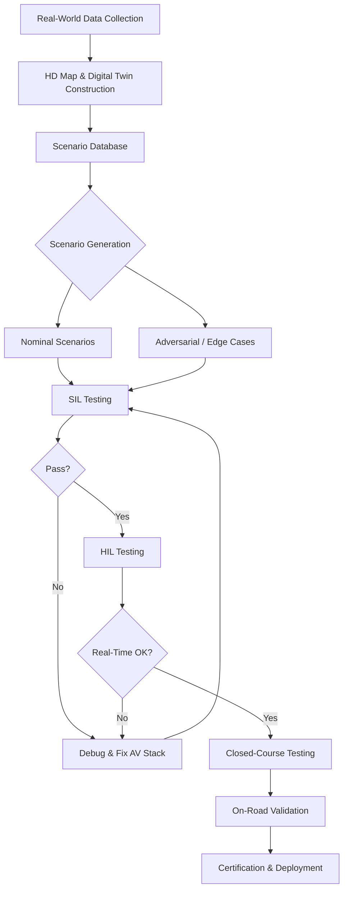

# Simulation Platforms for Autonomous Vehicle Testing

## Overview

Testing autonomous vehicles on public roads is extraordinarily expensive, dangerous, and slow. Waymo has reported that reaching statistical confidence in AV safety through real-world driving alone would require billions of miles of testing. Simulation provides a scalable, safe, and cost-effective alternative that has become indispensable to the modern AV development pipeline.

Simulation platforms recreate driving environments in software, allowing engineers to expose autonomous driving stacks to millions of scenarios per day without risking human life. These platforms range from open-source tools like CARLA and SUMO to commercial offerings such as NVIDIA DRIVE Sim and Applied Intuition. Each serves different layers of the stack: CARLA provides high-fidelity 3D rendering for perception testing, SUMO focuses on traffic-flow simulation, and NVIDIA DRIVE Sim delivers physically accurate sensor models for end-to-end validation.

A key concept in simulation is the **digital twin** -- a virtual replica of a real-world road environment constructed from HD maps, lidar scans, and satellite imagery. Digital twins allow engineers to replay recorded driving scenarios with modifications, such as inserting a jaywalking pedestrian or changing weather conditions. This capability is the foundation of **scenario-based testing**, where critical situations are systematically generated and evaluated.

**Adversarial testing** pushes scenario generation further by using optimization algorithms to discover failure modes. Techniques like coverage-guided fuzzing and reinforcement learning search the scenario parameter space to find edge cases that break the AV planner. These adversarial scenarios are far more informative than random sampling and help developers harden their systems against rare but catastrophic events.

One of the deepest challenges in simulation is the **domain gap** between simulated and real-world data. A perception model trained purely on synthetic imagery may fail when confronted with real sensor noise, lighting, and material textures. **Domain randomization** addresses this by varying simulation parameters -- lighting, textures, object placement, camera noise -- during training so the model learns features that generalize across domains. The complementary approach of **domain adaptation** uses techniques like GANs to transform synthetic images to look more realistic.

Simulation also supports **hardware-in-the-loop (HIL)** and **software-in-the-loop (SIL)** testing. SIL runs the full software stack against simulated sensor feeds on standard compute hardware, enabling rapid iteration. HIL integrates the actual AV compute platform and sensors into the simulation loop, verifying real-time performance, latency, and hardware-specific behavior before road testing.

Validation frameworks define quantitative metrics for simulation adequacy. Common metrics include **miles between disengagements**, **scenario coverage** (percentage of an operational design domain exercised), and **collision rates** normalized by exposure. Regulatory bodies like NHTSA and UNECE are increasingly accepting simulation evidence as part of AV certification, with standards like ISO 21448 (SOTIF) specifying how simulation should complement real-world testing. The industry consensus is converging on a three-pillar validation approach: simulation, closed-course testing, and monitored on-road driving.

## Key Concepts

- **CARLA**: Open-source simulator built on Unreal Engine providing high-fidelity rendering, customizable sensors (lidar, radar, cameras), weather control, and a Python API for scenario scripting.
- **SUMO (Simulation of Urban Mobility)**: Microscopic traffic simulator for modeling large-scale traffic flows, signal timing, and multi-modal transportation networks.
- **NVIDIA DRIVE Sim**: Commercially available platform with physically based rendering, accurate sensor models (including radar ray-tracing), and cloud-scale parallelism.
- **Digital Twins**: Virtual replicas of real road segments built from survey data, enabling faithful replay and modification of recorded scenarios.
- **Adversarial Scenario Generation**: Algorithmic search for failure-inducing test cases using techniques like evolutionary optimization, RL-based agents, and importance sampling.
- **Domain Randomization**: Randomizing visual and physical parameters in simulation to train perception models that transfer robustly to the real world.
- **SIL vs. HIL**: Software-in-the-loop tests the AV software on general hardware; hardware-in-the-loop tests on the actual vehicle compute platform to catch real-time and hardware-specific issues.
- **ISO 21448 (SOTIF)**: Safety of the Intended Functionality standard addressing hazards arising from functional insufficiencies, including simulation-based evidence requirements.

## Code Examples

Setting up a basic CARLA simulation scenario with a leading vehicle and collision sensor:

```python
import carla
import random
import time

def run_simulation():
    # Connect to the CARLA server
    client = carla.Client('localhost', 2000)
    client.set_timeout(10.0)
    world = client.get_world()

    # Set synchronous mode for deterministic simulation
    settings = world.get_settings()
    settings.synchronous_mode = True
    settings.fixed_delta_seconds = 0.05  # 20 FPS
    world.apply_settings(settings)

    blueprint_library = world.get_blueprint_library()
    spawn_points = world.get_map().get_spawn_points()

    # Spawn ego vehicle with collision sensor
    ego_bp = blueprint_library.find('vehicle.tesla.model3')
    ego_transform = spawn_points[0]
    ego_vehicle = world.spawn_actor(ego_bp, ego_transform)

    # Attach collision sensor
    collision_bp = blueprint_library.find('sensor.other.collision')
    collision_sensor = world.spawn_actor(
        collision_bp,
        carla.Transform(),
        attach_to=ego_vehicle
    )

    collisions = []
    collision_sensor.listen(lambda event: collisions.append(event))

    # Spawn a lead vehicle ahead of ego
    lead_bp = blueprint_library.find('vehicle.audi.a2')
    lead_transform = spawn_points[1]
    lead_vehicle = world.spawn_actor(lead_bp, lead_transform)
    lead_vehicle.set_autopilot(True)

    # Enable autopilot on ego vehicle
    ego_vehicle.set_autopilot(True)

    # Run simulation for 500 ticks
    for tick in range(500):
        world.tick()

    # Report results
    print(f"Simulation complete. Collisions detected: {len(collisions)}")
    for c in collisions:
        print(f"  Collision with {c.other_actor.type_id} "
              f"at intensity {c.normal_impulse.length():.2f}")

    # Cleanup
    collision_sensor.destroy()
    ego_vehicle.destroy()
    lead_vehicle.destroy()

if __name__ == '__main__':
    run_simulation()
```

## Diagrams

**Simulation-Based AV Development Pipeline**



## Exercises/Projects

1. **CARLA Scenario Suite**: Install CARLA and script three distinct scenarios -- a cut-in, a pedestrian crossing, and a red-light runner. Record collision metrics for each and compare your AV stack's performance.
2. **Domain Randomization Study**: Using a synthetic dataset, train an object detector with and without domain randomization. Measure the domain gap using:

$$D_{\text{gap}} = \frac{1}{N} \sum_{i=1}^{N} \left| f_{\theta}(x_i^{\text{sim}}) - f_{\theta}(x_i^{\text{real}}) \right|$$

where $f_{\theta}$ is the detector output, $x^{\text{sim}}$ are synthetic inputs, and $x^{\text{real}}$ are real-world inputs.

3. **Adversarial Scenario Search**: Implement a simple evolutionary algorithm that parameterizes scenarios (lead vehicle speed, cut-in distance, weather) and searches for collisions. Track the collision rate $P_c = \frac{N_{\text{collision}}}{N_{\text{total}}}$ as the search progresses.
4. **Validation Metrics Dashboard**: Build a dashboard that computes scenario coverage, miles between disengagements, and the mean time to failure $\text{MTTF} = \frac{T_{\text{total}}}{N_{\text{failures}}}$ across a batch of simulation runs.

## Further Reading

- [CARLA Simulator Documentation](https://carla.readthedocs.io/)
- [SUMO Traffic Simulator](https://eclipse.dev/sumo/)
- [NVIDIA DRIVE Sim](https://developer.nvidia.com/drive/simulation)
- [ISO 21448 SOTIF Overview](https://www.iso.org/standard/77490.html)
- Corso, A. et al., "Adaptive Stress Testing for Autonomous Vehicles" (2019)
