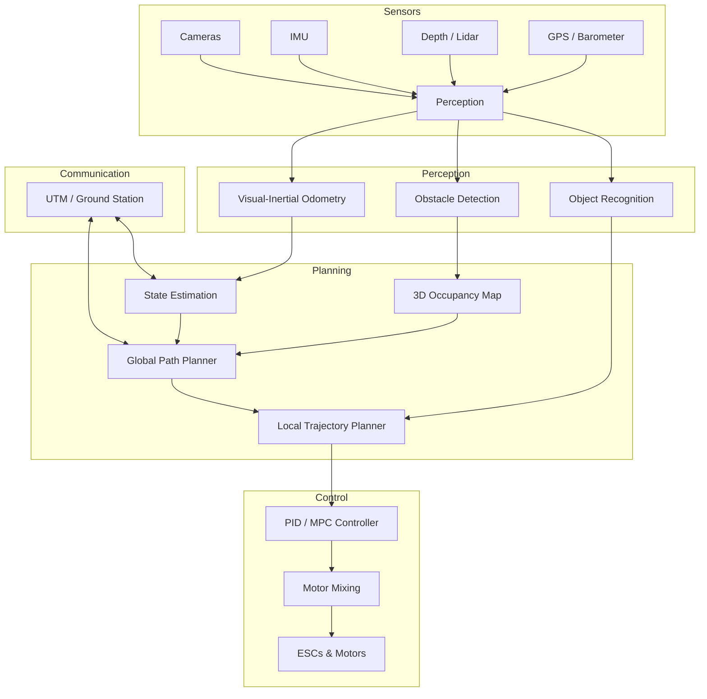

## AI for Drone Navigation and Air Mobility

## Overview

Unmanned aerial vehicles (UAVs) are rapidly transitioning from remote-controlled toys to fully autonomous platforms capable of delivery, inspection, mapping, and passenger transport. The AI systems that enable this autonomy mirror the ground-vehicle stack in structure -- perception, planning, and control -- but face unique challenges imposed by three-dimensional flight, limited payload, and stringent power constraints.

The **UAV autonomy stack** begins with perception. Drones typically carry lightweight sensors: monocular or stereo cameras, IMUs, and sometimes lidar or depth cameras. **Visual-Inertial Odometry (VIO)** fuses visual feature tracking with inertial measurements to estimate the drone's 6-DOF pose in real time. VIO is critical for GPS-denied environments such as indoor spaces, urban canyons, and under bridges. State-of-the-art VIO systems like VINS-Mono and MSCKF achieve centimeter-level accuracy by tightly coupling image features with IMU preintegration, solving a factor-graph optimization problem that minimizes the residual:

$$\min_{\mathbf{x}} \sum_{k} \| \mathbf{z}_k^{\text{imu}} - h_k^{\text{imu}}(\mathbf{x}) \|^2_{\Sigma_k} + \sum_{j} \| \mathbf{z}_j^{\text{vis}} - h_j^{\text{vis}}(\mathbf{x}) \|^2_{R_j}$$

where $\mathbf{x}$ is the state vector containing poses and velocities, and $\Sigma_k$, $R_j$ are the noise covariances.

**Deep reinforcement learning** has produced remarkable results in agile drone flight. Research groups have trained RL policies that outperform human pilots in drone racing, executing aggressive maneuvers through gates at speeds exceeding 20 m/s. These policies are typically trained in simulation and transferred to real hardware using domain randomization. The quadrotor dynamics used in simulation model the vehicle as a rigid body with four thrust inputs:

$$m \ddot{\mathbf{p}} = m\mathbf{g} + R \begin{bmatrix} 0 \\ 0 \\ \sum_{i=1}^{4} T_i \end{bmatrix}, \quad I \dot{\boldsymbol{\omega}} = \boldsymbol{\tau} - \boldsymbol{\omega} \times I \boldsymbol{\omega}$$

where $m$ is mass, $R$ is the rotation matrix, $T_i$ are individual rotor thrusts, $I$ is the inertia tensor, and $\boldsymbol{\tau}$ is the torque vector.

**Obstacle avoidance** is handled by depth cameras or stereo vision feeding into reactive planners. Approaches range from classical potential fields to learned end-to-end policies that map depth images directly to velocity commands. For structured environments, sampling-based planners like RRT* generate collision-free paths through 3D occupancy grids.

The emerging field of **Urban Air Mobility (UAM)** envisions electric vertical takeoff and landing (eVTOL) aircraft carrying passengers across cities. Companies like Joby Aviation, Lilium, and Archer are developing these vehicles, which require AI for autonomous or semi-autonomous flight, vertiport operations, and integration with ground transportation. **Unmanned Traffic Management (UTM)** systems coordinate airspace access for low-altitude drones, handling deconfliction, geofencing, and dynamic re-routing.

**Swarm intelligence** enables multiple drones to coordinate without centralized control. Bio-inspired algorithms like Reynolds flocking rules and more sophisticated consensus protocols allow swarms to perform tasks such as area coverage, search-and-rescue, and distributed sensing. Each agent follows local rules based on neighbor positions, producing emergent global behavior.

AI-powered delivery drones from companies like Wing and Amazon Prime Air use computer vision for landing-zone assessment, package detection, and obstacle avoidance during the final approach. Regulatory frameworks -- FAA Part 107 in the US, EASA regulations in Europe -- are evolving to accommodate beyond-visual-line-of-sight (BVLOS) operations, which are essential for commercial viability.

## Key Concepts

- **Visual-Inertial Odometry (VIO)**: Fuses camera and IMU data for robust 6-DOF pose estimation without GPS, using tightly or loosely coupled optimization.
- **Deep RL for Agile Flight**: Policies trained in simulation that achieve superhuman drone racing performance through aggressive, near-optimal trajectories.
- **Quadrotor Dynamics**: The rigid-body equations of motion with four thrust inputs that govern drone flight, forming the basis for both control design and simulation.
- **Obstacle Avoidance**: Reactive and deliberative methods using depth sensing to navigate clutch environments, from potential fields to learned depth-to-action mappings.
- **Urban Air Mobility (UAM)**: Passenger-carrying eVTOL aircraft requiring AI autonomy, vertiport management, and integration with existing air traffic control.
- **UTM (Unmanned Traffic Management)**: Systems for coordinating low-altitude drone operations including airspace deconfliction, geofencing, and weather-aware routing.
- **Swarm Intelligence**: Decentralized multi-agent coordination using local interaction rules to achieve collective objectives like area coverage or formation flight.
- **FAA Part 107 / EASA**: Regulatory frameworks governing commercial drone operations, with evolving provisions for BVLOS and autonomous flight.

## Code Examples

A PID-based waypoint-following controller for a quadrotor:

```python
import numpy as np

class WaypointController:
    """PID controller for waypoint following on a quadrotor."""

    def __init__(self, kp=4.0, kd=2.8, ki=0.4, dt=0.02):
        self.kp = kp
        self.kd = kd
        self.ki = ki
        self.dt = dt
        self.integral_error = np.zeros(3)
        self.prev_error = np.zeros(3)

    def compute_control(self, current_pos, current_vel, target_pos):
        """
        Compute desired acceleration to reach a waypoint.
        Returns thrust vector in world frame.
        """
        error = target_pos - current_pos
        self.integral_error += error * self.dt
        # Clamp integral to prevent windup
        self.integral_error = np.clip(self.integral_error, -2.0, 2.0)

        derivative = (error - self.prev_error) / self.dt
        self.prev_error = error.copy()

        # PID output: desired acceleration
        accel = (self.kp * error
                 + self.kd * derivative
                 + self.ki * self.integral_error)

        # Add gravity compensation (z-up frame)
        gravity = np.array([0.0, 0.0, -9.81])
        thrust_accel = accel - gravity

        return thrust_accel

    def reset(self):
        self.integral_error = np.zeros(3)
        self.prev_error = np.zeros(3)

def follow_waypoints(waypoints, start_pos, dt=0.02, threshold=0.3):
    """Simulate waypoint following with simple dynamics."""
    controller = WaypointController(dt=dt)
    pos = np.array(start_pos, dtype=float)
    vel = np.zeros(3)
    mass = 1.5  # kg

    trajectory = [pos.copy()]
    wp_idx = 0

    for step in range(10000):
        if wp_idx >= len(waypoints):
            break

        target = np.array(waypoints[wp_idx], dtype=float)
        thrust_accel = controller.compute_control(pos, vel, target)

        # Clamp max thrust (safety)
        max_accel = 15.0  # m/s^2
        norm = np.linalg.norm(thrust_accel)
        if norm > max_accel:
            thrust_accel = thrust_accel / norm * max_accel

        # Update dynamics: F = ma, add gravity
        accel = thrust_accel + np.array([0.0, 0.0, -9.81])
        vel += accel * dt
        pos += vel * dt
        trajectory.append(pos.copy())

        # Check waypoint reached
        if np.linalg.norm(pos - target) < threshold:
            print(f"Waypoint {wp_idx} reached at step {step}: {target}")
            wp_idx += 1
            controller.reset()

    return np.array(trajectory)

# Example usage
waypoints = [
    [5.0, 0.0, 10.0],
    [5.0, 10.0, 10.0],
    [0.0, 10.0, 5.0],
    [0.0, 0.0, 2.0],
]

traj = follow_waypoints(waypoints, start_pos=[0.0, 0.0, 0.0])
print(f"Trajectory length: {len(traj)} steps")
```

## Diagrams

**UAV Autonomy Architecture**



## Exercises/Projects

1. **VIO Feature Tracker**: Implement a simple visual odometry pipeline using OpenCV feature matching (ORB or SIFT) between consecutive frames. Estimate the essential matrix and recover relative pose. Compare accuracy with and without IMU preintegration.

2. **Waypoint Controller Tuning**: Using the PID controller above, tune $K_p$, $K_d$, and $K_i$ to minimize the settling time $t_s$ and overshoot $M_p$ defined as:

$$M_p = \frac{|p_{\text{max}} - p_{\text{target}}|}{|p_{\text{target}} - p_{\text{start}}|} \times 100\%$$

Plot the trajectory in 3D for different gain settings.

3. **Obstacle Avoidance with Potential Fields**: Implement an artificial potential field planner where the attractive potential toward the goal is $U_{\text{att}} = \frac{1}{2} k_a \| \mathbf{p} - \mathbf{p}_g \|^2$ and the repulsive potential from obstacles is $U_{\text{rep}} = \frac{1}{2} k_r \left(\frac{1}{d} - \frac{1}{d_0}\right)^2$ when $d < d_0$.

4. **Swarm Formation**: Simulate a swarm of 10 drones maintaining a V-formation using Reynolds separation, alignment, and cohesion rules. Measure formation error as drones navigate through a set of waypoints.

## Further Reading

- [VINS-Mono: A Robust and Versatile Monocular VIO](https://github.com/HKUST-Aerial-Robotics/VINS-Mono)
- Kaufmann, E. et al., "Champion-level Drone Racing using Deep Reinforcement Learning" (Nature, 2023)
- [PX4 Autopilot Documentation](https://docs.px4.io/)
- [NASA UTM Project](https://www.nasa.gov/utm)
- [FAA Part 107 Regulations](https://www.faa.gov/uas/commercial_operators)
