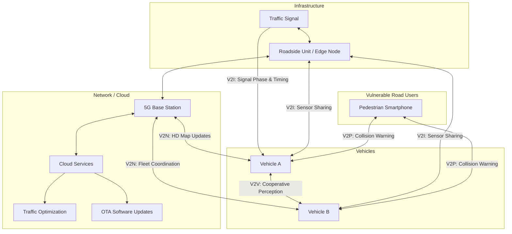

# Frontiers: V2X Communication, Ethics, and the Future of Mobility

## Overview

The future of transportation extends far beyond individual vehicle autonomy. As vehicles become connected, electrified, and shared, a web of AI-driven systems will reshape how people and goods move through cities and across regions. This lesson examines three frontier areas: Vehicle-to-Everything (V2X) communication, the ethical dimensions of autonomous systems, and the broader societal transformation that AI-powered mobility will bring.

**Vehicle-to-Everything (V2X)** communication encompasses four channels: Vehicle-to-Vehicle (V2V), Vehicle-to-Infrastructure (V2I), Vehicle-to-Pedestrian (V2P), and Vehicle-to-Network (V2N). V2V enables cooperative perception -- vehicles share detected objects, extending each other's sensor range beyond line-of-sight occlusions. V2I connects vehicles to traffic signals, toll systems, and road sensors. V2P warns vulnerable road users via smartphone alerts, and V2N provides cloud connectivity for HD map updates and fleet coordination.

The enabling technologies are **DSRC (Dedicated Short-Range Communications)** operating at 5.9 GHz and **C-V2X (Cellular V2X)** leveraging 4G/5G infrastructure. 5G's ultra-reliable low-latency communication (URLLC) targets end-to-end latencies below 10 ms, which is critical for safety applications. The latency constraint for a cooperative braking scenario can be expressed as:

$$t_{\text{comm}} + t_{\text{proc}} + t_{\text{act}} \leq \frac{d_{\text{gap}}}{v_{\text{rel}}}$$

where $t_{\text{comm}}$ is communication latency, $t_{\text{proc}}$ is processing time, $t_{\text{act}}$ is actuation delay, $d_{\text{gap}}$ is the inter-vehicle gap, and $v_{\text{rel}}$ is the relative closing speed. **Edge computing** places compute nodes at roadside units to minimize $t_{\text{proc}}$, enabling real-time sensor fusion from multiple vehicles.

**Cooperative perception** is a transformative application of V2X. When a vehicle's view is occluded -- for instance, by a bus blocking a crosswalk -- a nearby connected vehicle or infrastructure camera can share its detections. Fusing these shared observations dramatically improves situational awareness and reduces accident risk in scenarios where single-vehicle perception fails.

The **ethical dimensions** of autonomous driving are profound and unresolved. The trolley problem -- should an AV swerve to save passengers at the risk of hitting pedestrians? -- has captured public attention, but the real ethical landscape is broader. Algorithmic fairness asks whether AV perception performs equally across demographics; studies have shown object detectors can exhibit lower accuracy on darker skin tones. Liability frameworks must determine who is at fault when an AV causes harm: the manufacturer, the software developer, the fleet operator, or the vehicle owner. Insurance models are shifting from driver-based to product-liability paradigms.

**AI for sustainable transportation** represents another frontier. Intelligent EV charging optimization uses demand forecasting and grid-aware scheduling to minimize costs and carbon emissions. Route optimization algorithms reduce fleet fuel consumption, and AI-managed traffic signals cut idle time at intersections. At a systemic level, shared autonomous mobility could reduce the total vehicle fleet size by 60-80%, dramatically shrinking the environmental footprint of transportation.

**Foundation models for driving** are an emerging paradigm. Systems like UniAD (Unified Autonomous Driving) attempt end-to-end learning from raw sensor input to planning output, replacing the traditional modular pipeline. These models leverage large-scale pretraining on driving data and show promising generalization across scenarios, though questions about interpretability and safety certification remain.

The societal transformation will be vast. Autonomous freight threatens millions of trucking jobs, demanding proactive workforce transition policies. Urban design will evolve as parking demand drops and road capacity increases. Accessibility will improve for the elderly and disabled. The transition period, where human-driven and autonomous vehicles share roads, will be one of the most complex challenges -- requiring AI systems that understand and predict unpredictable human behavior.

## Key Concepts

- **V2V, V2I, V2P, V2N**: The four pillars of V2X communication, each enabling distinct safety and efficiency applications from cooperative braking to pedestrian warnings.
- **Cooperative Perception**: Sharing sensor data or detected objects between vehicles and infrastructure to overcome occlusion and extend effective sensing range.
- **5G URLLC and Edge Computing**: Ultra-reliable low-latency 5G combined with roadside edge nodes to meet the strict timing requirements of safety-critical V2X applications.
- **Trolley Problem and Algorithmic Fairness**: Ethical dilemmas in AV decision-making, including crash optimization scenarios and demographic bias in perception systems.
- **Liability Frameworks**: Evolving legal structures to assign responsibility for AV incidents, shifting from driver liability to product and manufacturer liability.
- **EV Charging Optimization**: AI-driven scheduling that balances charging demand across time and location to minimize grid stress and user cost.
- **Foundation Models for Driving (UniAD)**: End-to-end neural architectures that learn the full driving pipeline from perception to planning in a unified model.
- **Human-AV Shared Roads**: The mixed-autonomy transition period requiring AI that models and adapts to unpredictable human driving behavior.

## Code Examples

Simulating cooperative perception where two vehicles share detections to resolve occlusions:

```python
import numpy as np
from dataclasses import dataclass, field
from typing import List

@dataclass
class Detection:
    object_id: int
    position: np.ndarray  # [x, y] in global frame
    confidence: float
    source_vehicle: str

@dataclass
class Vehicle:
    name: str
    position: np.ndarray
    sensor_range: float = 50.0
    fov_angle: float = 120.0  # degrees
    heading: float = 0.0  # radians

    def detect_objects(self, objects: dict) -> List[Detection]:
        """Detect objects within sensor range and FOV."""
        detections = []
        for obj_id, obj_pos in objects.items():
            diff = obj_pos - self.position
            distance = np.linalg.norm(diff)
            if distance > self.sensor_range:
                continue

            # Check if within FOV
            angle_to_obj = np.arctan2(diff[1], diff[0])
            angle_diff = abs(angle_to_obj - self.heading)
            angle_diff = min(angle_diff, 2 * np.pi - angle_diff)

            if angle_diff <= np.radians(self.fov_angle / 2):
                # Confidence decreases with distance
                conf = max(0.3, 1.0 - distance / self.sensor_range)
                detections.append(Detection(
                    object_id=obj_id,
                    position=obj_pos.copy(),
                    confidence=conf,
                    source_vehicle=self.name
                ))
        return detections


def fuse_detections(
    local_dets: List[Detection],
    shared_dets: List[Detection],
    association_threshold: float = 3.0
) -> List[Detection]:
    """Fuse local and shared detections using nearest-neighbor association."""
    fused = list(local_dets)
    shared_ids_in_local = set()

    for s_det in shared_dets:
        best_match = None
        best_dist = association_threshold

        for l_det in local_dets:
            dist = np.linalg.norm(s_det.position - l_det.position)
            if dist < best_dist:
                best_dist = dist
                best_match = l_det

        if best_match is not None:
            # Weighted average of matched detections
            w1 = best_match.confidence
            w2 = s_det.confidence
            best_match.position = (
                (w1 * best_match.position + w2 * s_det.position) / (w1 + w2)
            )
            best_match.confidence = min(1.0, w1 + w2 * 0.5)
        else:
            # New object only seen by the other vehicle
            fused.append(s_det)

    return fused


# Simulation setup
objects = {
    1: np.array([30.0, 5.0]),   # Visible to vehicle A
    2: np.array([40.0, -10.0]), # Occluded from A, visible to B
    3: np.array([25.0, 0.0]),   # Visible to both
}

vehicle_a = Vehicle("A", np.array([0.0, 0.0]), heading=0.0)
vehicle_b = Vehicle("B", np.array([10.0, -20.0]), heading=np.pi / 4)

# Independent detections
dets_a = vehicle_a.detect_objects(objects)
dets_b = vehicle_b.detect_objects(objects)

print(f"Vehicle A detects: {[d.object_id for d in dets_a]}")
print(f"Vehicle B detects: {[d.object_id for d in dets_b]}")

# Cooperative perception: A receives B's detections via V2X
fused = fuse_detections(dets_a, dets_b)
print(f"Fused detections: {[d.object_id for d in fused]}")
print(f"Objects found: {len(fused)} "
      f"(A alone: {len(dets_a)}, B alone: {len(dets_b)})")
```

## Diagrams

**V2X Communication Ecosystem**



## Exercises/Projects

1. **V2X Latency Budget Analysis**: For a cooperative emergency braking scenario at highway speed ($v = 30$ m/s) with a following gap of $d = 15$ m, compute the maximum allowable total latency using:

$$t_{\text{max}} = \frac{d_{\text{gap}}}{v_{\text{rel}}} - t_{\text{brake}}$$

Assume braking time $t_{\text{brake}} = 0.3$ s. Determine what communication technology (DSRC at ~5 ms, C-V2X at ~10 ms, or 4G at ~50 ms) meets the requirement.

2. **Ethical Decision Framework**: Design a scoring matrix for AV ethical decisions that weighs passenger safety, pedestrian safety, legal compliance, and damage minimization. Implement it as a Python function that takes a scenario description and returns a ranked list of actions.

3. **Cooperative Perception Evaluation**: Extend the code example to simulate 5 vehicles at an intersection. Measure the detection recall improvement:

$$\Delta R = R_{\text{cooperative}} - R_{\text{independent}} = \frac{TP_{\text{coop}}}{TP_{\text{coop}} + FN_{\text{coop}}} - \frac{TP_{\text{indep}}}{TP_{\text{indep}} + FN_{\text{indep}}}$$

4. **EV Charging Scheduler**: Implement a greedy algorithm that schedules 20 EVs across 5 charging stations over a 24-hour period, minimizing peak grid load while ensuring all vehicles are charged by their departure time.

## Further Reading

- [3GPP C-V2X Standards](https://www.3gpp.org/technologies/c-v2x)
- Awad, E. et al., "The Moral Machine experiment" (Nature, 2018)
- Hu, Y. et al., "Planning-oriented Autonomous Driving" (UniAD, CVPR 2023)
- [SAE J3016: Levels of Driving Automation](https://www.sae.org/standards/content/j3016_202104/)
- [USDOT V2X Deployment Plan](https://www.transportation.gov/v2x)
