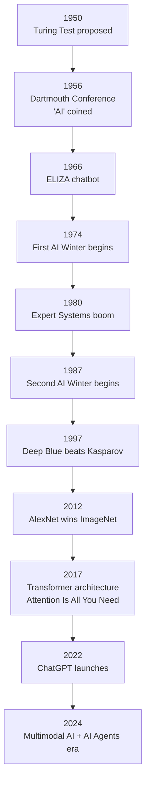
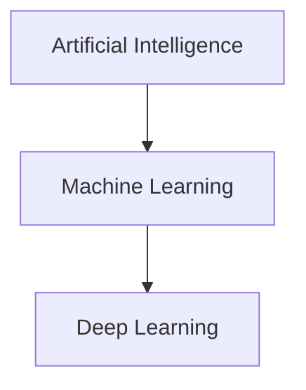

# What is Artificial Intelligence?

## Overview

Artificial Intelligence (AI) is the field of computer science dedicated to creating systems that can perform tasks typically requiring human intelligence — reasoning, learning, perception, and decision-making.

But this simple definition hides decades of debate, breakthroughs, and disappointments.

### A Brief History

The dream of intelligent machines predates computers. But the formal field began in **1956** at the Dartmouth Conference, where John McCarthy coined the term "artificial intelligence."

Early pioneers like Alan Turing had already laid the groundwork — his 1950 paper introduced the famous **Turing Test**: can a machine fool a human into thinking it's human?

The 1960s–70s saw early optimism. Programs could prove theorems and play checkers. But reality hit hard.

The **first AI winter** (mid-1970s) arrived when funding dried up after AI failed to deliver on grand promises. A **second winter** followed in the late 1980s when expert systems proved brittle and expensive.

The revival came in stages: statistical methods in the 1990s, big data in the 2000s, and the **deep learning revolution** starting around 2012 when AlexNet crushed the ImageNet competition.

Since then, progress has been exponential — GPT, AlphaFold, DALL·E, and autonomous vehicles have reshaped what we thought possible.

### AI vs ML vs Deep Learning

These terms are often confused. Think of them as nested circles:

$$\text{AI} \supset \text{Machine Learning} \supset \text{Deep Learning}$$

- **AI** — The broadest category. Any system that mimics intelligent behavior, including rule-based systems.
- **Machine Learning (ML)** — A subset of AI where systems learn from data rather than being explicitly programmed.
- **Deep Learning (DL)** — A subset of ML using neural networks with many layers to learn hierarchical representations.

### Types of AI

AI researchers commonly distinguish three levels:

1. **Narrow AI (ANI)** — Designed for one specific task. All current AI is narrow: chess engines, language models, image classifiers. They excel at their task but can't generalize.

2. **General AI (AGI)** — A hypothetical system with human-level reasoning across all domains. It could learn any intellectual task a human can. We haven't built this yet.

3. **Superintelligent AI (ASI)** — A system that surpasses human intelligence in virtually every domain. Purely theoretical and the subject of intense debate.

### AI vs Human Intelligence

Current AI systems are powerful but fundamentally different from human cognition:

| Dimension | AI | Humans |
|---|---|---|
| Speed | Processes billions of operations/sec | ~100 neural firings/sec |
| Learning efficiency | Needs millions of examples | Can learn from a few examples |
| Generalization | Poor across domains | Excellent transfer learning |
| Common sense | Weak | Strong intuitive physics/psychology |
| Energy | GPT-4 training: ~\$100M in compute | Brain: ~20 watts |

### The Current AI Landscape

As of 2025, AI is dominated by **large language models** (LLMs) like GPT-4, Claude, and Gemini, alongside **diffusion models** for image generation. Key trends include:

- Foundation models trained on massive datasets
- Multimodal AI (text + image + audio)
- AI agents that can use tools and take actions
- Open-source models catching up to proprietary ones
- Growing focus on safety and alignment

## Key Concepts

- **Turing Test**: A test of a machine's ability to exhibit intelligent behavior indistinguishable from a human
- **Narrow AI**: AI designed for a specific task (all current AI)
- **AGI**: Artificial General Intelligence — human-level reasoning across all domains
- **AI Winter**: Periods of reduced funding and interest in AI research
- **Foundation Model**: A large model trained on broad data that can be adapted to many tasks

## Diagrams

**AI Timeline**

**AI ⊃ Machine Learning ⊃ Deep Learning**

## Exercises

1. **Classify these systems**: For each example, decide if it's Narrow AI, and explain why it's not AGI: (a) a spam filter, (b) a self-driving car, (c) ChatGPT.
2. **Research task**: Find one example of AI being used in healthcare today. What type of learning does it use?
3. **Reflection**: Why do you think AI has gone through "winters"? What changed to cause the current boom?

## Further Reading

- Turing, A. M. (1950). "Computing Machinery and Intelligence." *Mind*, 59(236).
- McCarthy, J. et al. (1955). "A Proposal for the Dartmouth Summer Research Project on Artificial Intelligence."
- Russell, S. & Norvig, P. *Artificial Intelligence: A Modern Approach* (4th ed.)
