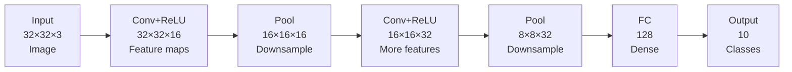

## CNNs for Image Processing

## Overview

Convolutional Neural Networks (CNNs) revolutionized computer vision. Instead of treating images as flat vectors of pixels, CNNs exploit the spatial structure of images using a clever operation: **convolution**.

### Why Not Just Use Regular Neural Networks?

A 256×256 color image has $256 \times 256 \times 3 = 196{,}608$ pixels. A fully connected layer mapping this to just 1,000 hidden neurons would need ~197 million parameters — for a single layer! This is wasteful because:

1. Nearby pixels are more related than distant ones (**locality**)
2. A cat's ear looks the same whether it's in the top-left or bottom-right (**translation invariance**)

CNNs encode these priors directly into the architecture.

### The Convolution Operation

A **filter** (or kernel) is a small matrix (e.g., 3×3) that slides across the image. At each position, it computes an element-wise multiplication and sum:

$$(I * K)(i,j) = \sum_{m}\sum_{n} I(i+m, j+n) \cdot K(m, n)$$

Where $I$ is the input image and $K$ is the kernel. This produces a **feature map** that highlights specific patterns (edges, textures, etc.).

Key parameters:
- **Stride**: How many pixels the filter moves each step (stride=1 moves one pixel at a time)
- **Padding**: Adding zeros around the border to control output size
- **Number of filters**: Each filter learns to detect a different feature

Output dimension formula:

$$\text{output size} = \frac{W - K + 2P}{S} + 1$$

Where $W$ = input width, $K$ = kernel size, $P$ = padding, $S$ = stride.

### Filters and What They Learn

Early layers learn **low-level features**: edges, corners, color gradients. Deeper layers combine these into **high-level features**: eyes, wheels, faces. This hierarchical learning is what makes CNNs powerful.

A 3×3 edge-detection filter might look like:

```text
[-1  -1  -1]
[-1   8  -1]
[-1  -1  -1]
```

In practice, the network learns filter values during training — you don't hand-design them.

### Pooling Layers

Pooling reduces the spatial dimensions of feature maps, decreasing computation and providing some translation invariance.

**Max Pooling** (most common): Take the maximum value in each window.

```text
Input (4×4):          Max Pool (2×2, stride 2):
[1  3  2  1]
[4  6  5  2]    →     [6  5]
[7  2  1  0]          [7  3]
[3  1  3  2]
```

**Average Pooling**: Take the mean. Sometimes used in the final layer (Global Average Pooling).

### Landmark CNN Architectures

**LeNet-5 (1998)** — Yann LeCun's pioneering network for digit recognition. Two conv layers, two pooling layers, three fully connected layers. Proved CNNs work.

**AlexNet (2012)** — Won ImageNet by a huge margin. Introduced ReLU, dropout, and GPU training to deep CNNs. 8 layers, 60M parameters. Sparked the deep learning revolution.

**VGGNet (2014)** — Showed that depth matters. Used only 3×3 filters stacked deep (16–19 layers).

**ResNet (2015)** — Introduced **skip connections** that allow gradients to flow through shortcut paths. Enabled training of 152+ layer networks. Key insight:

$$\text{output} = F(x) + x$$

Instead of learning the full mapping, the network learns the **residual** $F(x) = H(x) - x$.

### Applications

- **Image Classification**: Is this a cat or dog?
- **Object Detection**: Where are the objects? (YOLO, Faster R-CNN)
- **Semantic Segmentation**: Label every pixel (U-Net)
- **Face Recognition**: Match faces across images
- **Medical Imaging**: Detect tumors, classify X-rays

## Key Concepts

- **Convolution**: Sliding a filter across an image to produce a feature map
- **Filter/Kernel**: Small learnable matrix that detects specific patterns
- **Pooling**: Downsampling to reduce spatial dimensions
- **Feature Hierarchy**: Low-level features combine into high-level features in deeper layers
- **Skip Connection**: Shortcut path that enables very deep networks (ResNet)

## Code Examples

```python
import torch
import torch.nn as nn

# A simple CNN for image classification
class SimpleCNN(nn.Module):
    def __init__(self, num_classes=10):
        super().__init__()
        self.features = nn.Sequential(
            nn.Conv2d(3, 16, kernel_size=3, padding=1),  # 3 input channels (RGB)
            nn.ReLU(),
            nn.MaxPool2d(2, 2),                           # Halve spatial dims
            nn.Conv2d(16, 32, kernel_size=3, padding=1),
            nn.ReLU(),
            nn.MaxPool2d(2, 2),
        )
        self.classifier = nn.Sequential(
            nn.Flatten(),
            nn.Linear(32 * 8 * 8, 128),  # Assuming 32x32 input
            nn.ReLU(),
            nn.Linear(128, num_classes),
        )

    def forward(self, x):
        x = self.features(x)
        x = self.classifier(x)
        return x

model = SimpleCNN()
# Input: batch of 4 RGB images, 32x32
sample = torch.randn(4, 3, 32, 32)
output = model(sample)
print(f"Output shape: {output.shape}")  # [4, 10]
```

## Diagrams

**CNN Architecture (simplified)**



## Exercises

1. **Calculate output size**: Input is 64×64, kernel is 5×5, stride 1, padding 0. What is the output size?
2. **Code challenge**: Add a third convolutional layer to the model. How does the parameter count change?
3. **Research**: Look up how ResNet's skip connections solve the vanishing gradient problem. Draw a skip connection block.

## Further Reading

- LeCun, Y. et al. (1998). "Gradient-Based Learning Applied to Document Recognition"
- He, K. et al. (2015). "Deep Residual Learning for Image Recognition"
- CS231n: Convolutional Neural Networks for Visual Recognition (Stanford)
