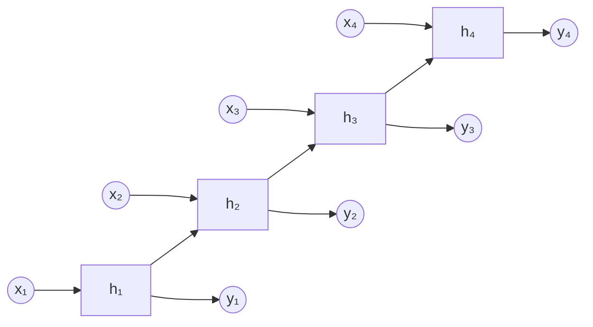
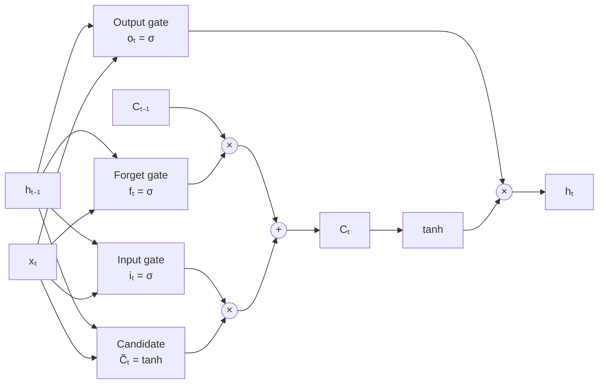

# RNNs and LSTMs for Sequence Data

## Overview

Many real-world data types are sequential — text, speech, music, stock prices, sensor readings. Standard neural networks treat each input independently, but sequences have **temporal dependencies**: what comes before matters. Recurrent Neural Networks (RNNs) were designed to handle this.

### What Makes Sequence Data Special?

Consider the sentence: "The cat sat on the ___." To predict the next word, you need context from previous words. Sequence data has:

- **Variable length**: Sentences, songs, and time series have different lengths
- **Order matters**: "Dog bites man" ≠ "Man bites dog"
- **Long-range dependencies**: "The cat, which was sitting on the mat near the window, ___ purring" — the verb depends on "cat" from 10 words ago

### RNN Architecture

An RNN processes sequences one element at a time, maintaining a **hidden state** $h_t$ that acts as memory:

$$h_t = \tanh(W_{hh} \cdot h_{t-1} + W_{xh} \cdot x_t + b_h)$$
$$y_t = W_{hy} \cdot h_t + b_y$$

At each timestep $t$:
1. Take the current input $x_t$ and previous hidden state $h_{t-1}$
2. Compute the new hidden state $h_t$
3. (Optionally) produce an output $y_t$

The same weights $W_{hh}$, $W_{xh}$, and $W_{hy}$ are shared across all timesteps — this is called **weight sharing** and allows the network to handle sequences of any length.

### The Vanishing Gradient Problem

RNNs are trained using **backpropagation through time (BPTT)** — unrolling the network across timesteps and applying standard backpropagation. The problem: gradients must flow through many timesteps, and they get multiplied by the weight matrix at each step.

$$\frac{\partial L}{\partial h_0} = \prod_{t=1}^{T} \frac{\partial h_t}{\partial h_{t-1}} \cdot \frac{\partial L}{\partial h_T}$$

If these partial derivatives are consistently less than 1, the gradient **vanishes** — shrinking exponentially. If greater than 1, it **explodes**. In practice, vanilla RNNs struggle to learn dependencies longer than ~10–20 timesteps.

### LSTM: Long Short-Term Memory

LSTMs (Hochreiter & Schmidhuber, 1997) solve the vanishing gradient problem with a **gating mechanism** and a separate **cell state** $C_t$ that acts as a conveyor belt for information.

Three gates control information flow:

**Forget Gate** — Decides what to remove from cell state:
$$f_t = \sigma(W_f \cdot [h_{t-1}, x_t] + b_f)$$

**Input Gate** — Decides what new information to store:
$$i_t = \sigma(W_i \cdot [h_{t-1}, x_t] + b_i)$$
$$\tilde{C}_t = \tanh(W_C \cdot [h_{t-1}, x_t] + b_C)$$

**Cell State Update**:
$$C_t = f_t \odot C_{t-1} + i_t \odot \tilde{C}_t$$

**Output Gate** — Decides what to output:
$$o_t = \sigma(W_o \cdot [h_{t-1}, x_t] + b_o)$$
$$h_t = o_t \odot \tanh(C_t)$$

Where $\sigma$ is sigmoid and $\odot$ is element-wise multiplication.

The key insight: the cell state $C_t$ can flow through time with only additive interactions (no repeated multiplication), allowing gradients to propagate over hundreds of timesteps.

### GRU: A Simpler Alternative

The **Gated Recurrent Unit** (GRU) simplifies LSTMs by merging the cell state and hidden state and using only two gates (reset and update). Performance is comparable to LSTMs on many tasks with fewer parameters.

### Applications

- **Natural Language Processing**: Language modeling, machine translation, sentiment analysis
- **Time Series**: Stock prediction, weather forecasting, anomaly detection
- **Speech**: Speech recognition, text-to-speech
- **Music**: Composition, genre classification
- **Bioinformatics**: Protein structure, DNA sequence analysis

### The Transformer Takeover

While LSTMs dominated NLP from ~2015–2018, the **Transformer** architecture (covered in the next lesson) has largely replaced them. Transformers process all positions in parallel and handle long-range dependencies more effectively. However, RNNs remain relevant for streaming data and resource-constrained environments.

## Key Concepts

- **Recurrent Neural Network (RNN)**: Neural network with loops, processing sequences with a hidden state
- **Hidden State**: The network's "memory" of what it has seen so far
- **Vanishing Gradient**: Gradients shrinking exponentially during backpropagation through time
- **LSTM**: RNN variant with gates and cell state to preserve long-range dependencies
- **Gating Mechanism**: Learned switches (sigmoid outputs) that control information flow

## Code Examples

```python
import torch
import torch.nn as nn

# LSTM for sequence classification
class SentimentLSTM(nn.Module):
    def __init__(self, vocab_size, embed_dim, hidden_dim, num_classes):
        super().__init__()
        self.embedding = nn.Embedding(vocab_size, embed_dim)
        self.lstm = nn.LSTM(embed_dim, hidden_dim, batch_first=True)
        self.fc = nn.Linear(hidden_dim, num_classes)

    def forward(self, x):
        # x: [batch_size, seq_len] of token indices
        embeds = self.embedding(x)            # [batch, seq_len, embed_dim]
        _, (hidden, _) = self.lstm(embeds)    # hidden: [1, batch, hidden_dim]
        output = self.fc(hidden.squeeze(0))   # [batch, num_classes]
        return output

model = SentimentLSTM(vocab_size=10000, embed_dim=128, hidden_dim=64, num_classes=2)
sample_input = torch.randint(0, 10000, (8, 50))  # batch of 8, length 50
output = model(sample_input)
print(f"Output shape: {output.shape}")  # [8, 2]
```

## Diagrams

**RNN Unrolled**



**LSTM Cell**



## Exercises

1. **Trace through**: Given $h_0 = [0, 0]$, $W_{hh} = [[0.5, 0], [0, 0.5]]$, $W_{xh} = [[1], [1]]$, and input sequence $x = [1, 2, 3]$, compute $h_1, h_2, h_3$ (ignore bias, use tanh).
2. **Vanishing gradient demo**: Compute $0.9^{50}$ and $0.9^{100}$. How does this relate to the vanishing gradient problem?
3. **Code challenge**: Modify the LSTM model to be bidirectional. How does this change the output?

## Further Reading

- Hochreiter, S. & Schmidhuber, J. (1997). "Long Short-Term Memory"
- Colah's Blog: "Understanding LSTM Networks"
- Karpathy, A. "The Unreasonable Effectiveness of Recurrent Neural Networks" (blog post)
