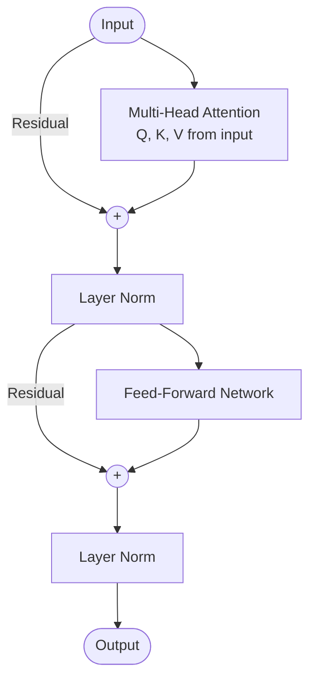
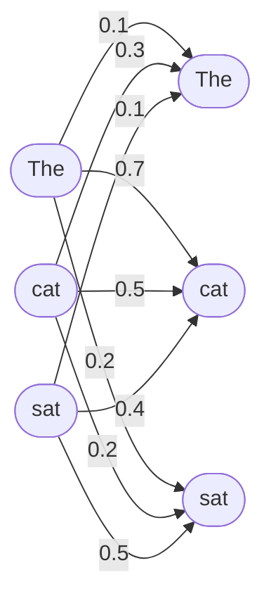

## Transformers Architecture

## Overview

The Transformer, introduced in the 2017 paper "Attention Is All You Need," is arguably the most important architecture in modern AI. It powers GPT, BERT, Claude, Gemini, and virtually every state-of-the-art language model. Its key innovation: replacing recurrence with **self-attention**, enabling parallel processing and superior handling of long-range dependencies.

### Why Transformers Beat RNNs

RNNs process sequences one token at a time. This creates two problems:

1. **No parallelism**: Each step depends on the previous one, so training is slow
2. **Long-range dependencies**: Information must survive passing through many steps

Transformers solve both. They process all positions simultaneously and use attention to directly connect any two positions, regardless of distance.

### Self-Attention Mechanism

Self-attention lets each token "look at" every other token in the sequence to decide what's important. The mechanism works through three learned projections:

For each input token $x_i$, compute:
- **Query** $Q_i = x_i W^Q$ — "What am I looking for?"
- **Key** $K_i = x_i W^K$ — "What do I contain?"
- **Value** $V_i = x_i W^V$ — "What information do I provide?"

The attention score between tokens $i$ and $j$ is the dot product of query $i$ with key $j$:

$$\text{Attention}(Q, K, V) = \text{softmax}\left(\frac{QK^T}{\sqrt{d_k}}\right)V$$

Where $d_k$ is the dimension of the key vectors. The $\sqrt{d_k}$ scaling prevents the dot products from growing too large.

**Intuition**: In "The cat sat on the mat because **it** was tired," the attention mechanism lets "it" attend strongly to "cat" to resolve the pronoun — regardless of how far apart they are.

### Multi-Head Attention

Rather than computing a single attention function, Transformers use **multi-head attention** — running $h$ attention functions in parallel, each with different learned projections:

$$\text{MultiHead}(Q, K, V) = \text{Concat}(\text{head}_1, \ldots, \text{head}_h)W^O$$

Where each head $= \text{Attention}(QW_i^Q, KW_i^K, VW_i^V)$.

Each head can learn to attend to different types of relationships:
- Head 1 might focus on syntactic structure
- Head 2 might focus on semantic similarity
- Head 3 might focus on positional proximity

### Positional Encoding

Since Transformers process all positions in parallel, they have no inherent sense of order. **Positional encodings** are added to the input embeddings to inject position information:

$$PE_{(pos, 2i)} = \sin\left(\frac{pos}{10000^{2i/d}}\right)$$
$$PE_{(pos, 2i+1)} = \cos\left(\frac{pos}{10000^{2i/d}}\right)$$

These sinusoidal functions have useful properties: the model can learn to attend to relative positions, and they generalize to sequence lengths not seen during training.

Modern models often use **learned positional embeddings** or **rotary positional embeddings (RoPE)** instead.

### Transformer Block

A complete Transformer block consists of:

1. **Multi-Head Self-Attention** + Residual Connection + Layer Norm
2. **Feed-Forward Network (FFN)** + Residual Connection + Layer Norm

$$\text{output} = \text{LayerNorm}(x + \text{FFN}(\text{LayerNorm}(x + \text{MultiHeadAttn}(x))))$$

The FFN is a simple two-layer network with a non-linearity:

$$\text{FFN}(x) = \text{ReLU}(xW_1 + b_1)W_2 + b_2$$

Stack 12–96 of these blocks, and you have GPT, BERT, or Claude.

### Encoder vs Decoder

The original Transformer has both:

- **Encoder** (e.g., BERT): Bidirectional attention — each token sees all other tokens. Good for understanding (classification, NER).
- **Decoder** (e.g., GPT): Causal (masked) attention — each token only sees previous tokens. Good for generation.
- **Encoder-Decoder** (e.g., T5, original paper): Encoder processes input, decoder generates output with cross-attention to the encoder.

Most modern LLMs are decoder-only.

## Key Concepts

- **Self-Attention**: Mechanism allowing each token to attend to all others in the sequence
- **Query, Key, Value**: Three learned projections that compute attention weights
- **Multi-Head Attention**: Running multiple attention functions in parallel for richer representations
- **Positional Encoding**: Injecting sequence order information since attention is permutation-invariant
- **Residual Connection**: Skip connections ($x + f(x)$) enabling deep stacking of Transformer blocks

## Code Examples

```python
import torch
import torch.nn as nn
import math

class SelfAttention(nn.Module):
    def __init__(self, d_model, n_heads):
        super().__init__()
        self.d_model = d_model
        self.n_heads = n_heads
        self.d_k = d_model // n_heads

        self.W_q = nn.Linear(d_model, d_model)
        self.W_k = nn.Linear(d_model, d_model)
        self.W_v = nn.Linear(d_model, d_model)
        self.W_o = nn.Linear(d_model, d_model)

    def forward(self, x):
        batch, seq_len, _ = x.shape

        # Project to Q, K, V and reshape for multi-head
        Q = self.W_q(x).view(batch, seq_len, self.n_heads, self.d_k).transpose(1, 2)
        K = self.W_k(x).view(batch, seq_len, self.n_heads, self.d_k).transpose(1, 2)
        V = self.W_v(x).view(batch, seq_len, self.n_heads, self.d_k).transpose(1, 2)

        # Scaled dot-product attention
        scores = torch.matmul(Q, K.transpose(-2, -1)) / math.sqrt(self.d_k)
        attn_weights = torch.softmax(scores, dim=-1)
        context = torch.matmul(attn_weights, V)

        # Concatenate heads and project
        context = context.transpose(1, 2).contiguous().view(batch, seq_len, self.d_model)
        return self.W_o(context)

# Example: 4 heads, 256-dim model
attn = SelfAttention(d_model=256, n_heads=4)
x = torch.randn(2, 10, 256)  # batch=2, seq_len=10
output = attn(x)
print(f"Output shape: {output.shape}")  # [2, 10, 256]
```

## Diagrams

**Transformer Block**



**Self-Attention (for "The cat sat")**



## Exercises

1. **Compute attention**: Given $Q = [1, 0]$, $K_1 = [1, 0]$, $K_2 = [0, 1]$, $V_1 = [5, 0]$, $V_2 = [0, 5]$, compute the attention output (use $d_k = 2$).
2. **Why scale by $\sqrt{d_k}$?** What happens to softmax when the dot products are very large?
3. **Code challenge**: Modify the code to add a causal mask (decoder-style) so tokens can only attend to earlier positions.

## Further Reading

- Vaswani, A. et al. (2017). "Attention Is All You Need"
- Jay Alammar: "The Illustrated Transformer" (blog post)
- Karpathy, A. "Let's build GPT: from scratch, in code" (YouTube)
