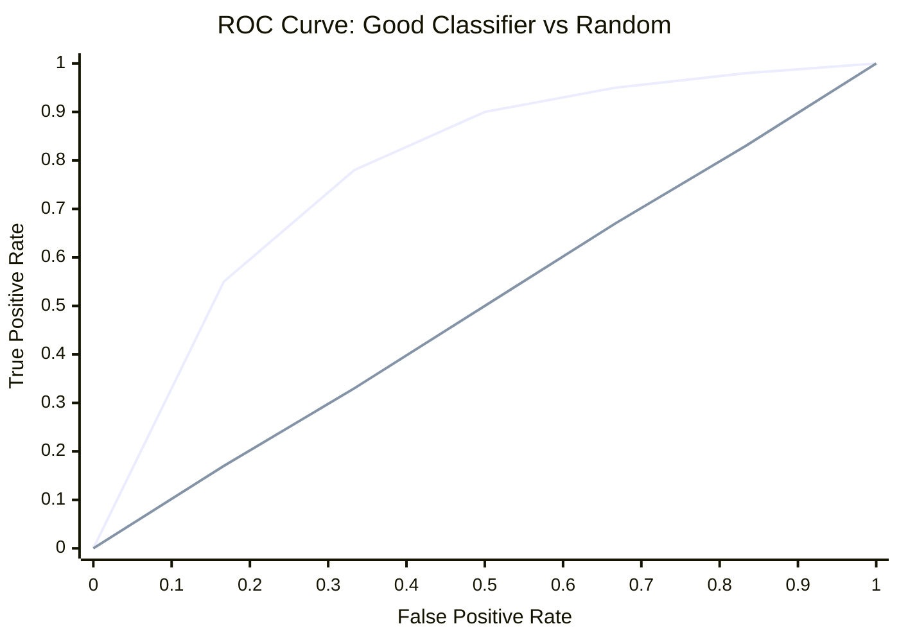
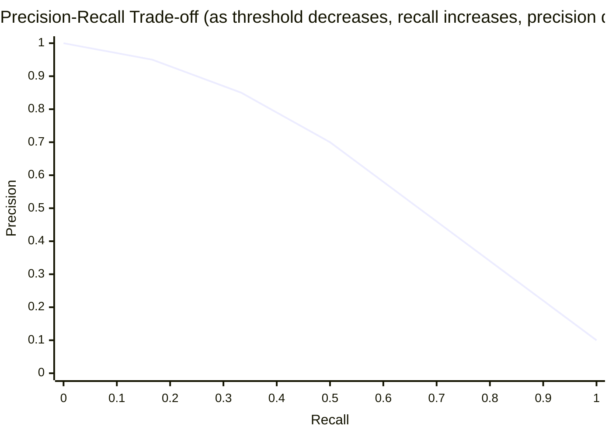

## Evaluating AI Systems

## Overview

"How good is this model?" sounds like a simple question, but the answer depends entirely on what you measure and how. Choosing the right evaluation metric is critical — the wrong metric can lead you to deploy a model that looks great on paper but fails in practice.

### Classification Metrics

Consider a medical test for a disease. There are four possible outcomes:

|  | Predicted Positive | Predicted Negative |
|---|---|---|
| **Actually Positive** | True Positive (TP) | False Negative (FN) |
| **Actually Negative** | False Positive (FP) | True Negative (TN) |

This is the **confusion matrix**. From it, we derive:

**Accuracy** — The most intuitive but often misleading metric:

$$\text{Accuracy} = \frac{TP + TN}{TP + TN + FP + FN}$$

Problem: If 99% of patients don't have the disease, a model that always predicts "negative" gets 99% accuracy while being completely useless.

**Precision** — "Of all positive predictions, how many were correct?"

$$\text{Precision} = \frac{TP}{TP + FP}$$

High precision means few false alarms. Important when false positives are costly (spam detection — you don't want to lose real emails).

**Recall (Sensitivity)** — "Of all actual positives, how many did we catch?"

$$\text{Recall} = \frac{TP}{TP + FN}$$

High recall means few missed cases. Important when false negatives are costly (cancer screening — you don't want to miss a tumor).

**F1 Score** — The harmonic mean of precision and recall, balancing both:

$$F1 = 2 \cdot \frac{\text{Precision} \cdot \text{Recall}}{\text{Precision} + \text{Recall}}$$

### The Precision-Recall Trade-off

Most classifiers output a probability score. You choose a **threshold** to convert this to a binary decision. Lowering the threshold catches more positives (higher recall) but also more false positives (lower precision). There's no free lunch.

### ROC and AUC

The **ROC curve** (Receiver Operating Characteristic) plots True Positive Rate vs False Positive Rate at various thresholds.

$$\text{TPR} = \frac{TP}{TP + FN} \quad \text{FPR} = \frac{FP}{FP + TN}$$

**AUC** (Area Under the ROC Curve) summarizes this into a single number:
- AUC = 1.0: Perfect classifier
- AUC = 0.5: Random guessing
- AUC < 0.5: Worse than random (something is wrong)

AUC is threshold-independent, making it useful for comparing models.

### Regression Metrics

For continuous predictions:

- **Mean Squared Error (MSE)**: $\frac{1}{n}\sum(y_i - \hat{y}_i)^2$ — Penalizes large errors heavily
- **Mean Absolute Error (MAE)**: $\frac{1}{n}\sum|y_i - \hat{y}_i|$ — More robust to outliers
- **R² Score**: Proportion of variance explained. $R^2 = 1 - \frac{\sum(y_i - \hat{y}_i)^2}{\sum(y_i - \bar{y})^2}$. A value of 1.0 is perfect; 0 means the model is no better than predicting the mean.

### Benchmark Datasets

Standardized benchmarks allow fair comparison across models:

**Computer Vision**:
- **ImageNet**: 14M images, 1000 classes. The benchmark that sparked the deep learning revolution.
- **CIFAR-10/100**: 60K small images, 10/100 classes. Popular for quick experiments.

**Natural Language Processing**:
- **GLUE/SuperGLUE**: Suite of NLU tasks (sentiment, entailment, similarity). The standard for evaluating language understanding.
- **SQuAD**: Question answering on Wikipedia paragraphs.

**LLM Evaluation**:
- **MMLU**: 57 subjects from STEM to humanities. Tests broad knowledge.
- **HumanEval**: Code generation benchmark — can the model write correct Python functions?
- **HellaSwag**: Common-sense reasoning about everyday situations.

### LLM-Specific Metrics

Evaluating language models has unique challenges:

- **Perplexity**: How "surprised" the model is by text. Lower is better. $PPL = e^{-\frac{1}{N}\sum \log P(w_i|w_{<i})}$
- **BLEU**: Compares machine translation to reference translations by measuring n-gram overlap. Widely used but has known limitations.
- **ROUGE**: Measures overlap between generated and reference summaries. Variants: ROUGE-1 (unigrams), ROUGE-L (longest common subsequence).

**The Evaluation Crisis**: As LLMs improve, they saturate existing benchmarks. Models scoring 90%+ on MMLU may still fail at basic reasoning. The field is actively developing harder, more robust evaluations — including human evaluation, adversarial testing, and capability-specific probes.

## Key Concepts

- **Confusion Matrix**: Table of TP, FP, TN, FN — the foundation of classification metrics
- **Precision vs Recall**: Trade-off between false positives and false negatives
- **F1 Score**: Harmonic mean balancing precision and recall
- **AUC-ROC**: Threshold-independent measure of classifier quality
- **Perplexity**: Measures how well a language model predicts text

## Code Examples

```python
from sklearn.metrics import (
    accuracy_score, precision_score, recall_score,
    f1_score, confusion_matrix, roc_auc_score
)
import numpy as np

# Simulated predictions
y_true = [1, 0, 1, 1, 0, 1, 0, 0, 1, 0]
y_pred = [1, 0, 1, 0, 0, 1, 1, 0, 1, 0]
y_prob = [0.9, 0.1, 0.8, 0.4, 0.2, 0.95, 0.6, 0.15, 0.85, 0.3]

print(f"Accuracy:  {accuracy_score(y_true, y_pred):.2f}")
print(f"Precision: {precision_score(y_true, y_pred):.2f}")
print(f"Recall:    {recall_score(y_true, y_pred):.2f}")
print(f"F1 Score:  {f1_score(y_true, y_pred):.2f}")
print(f"AUC-ROC:   {roc_auc_score(y_true, y_prob):.2f}")
print(f"\nConfusion Matrix:\n{confusion_matrix(y_true, y_pred)}")
```

## Diagrams

**ROC Curve**



**Precision-Recall Trade-off**



## Exercises

1. **Compute metrics**: Given TP=80, FP=20, FN=10, TN=890, compute accuracy, precision, recall, and F1. Is accuracy a good metric here? Why or why not?
2. **When to use what**: For each scenario, which metric matters most? (a) Email spam filter, (b) Cancer screening, (c) Search engine ranking.
3. **Code challenge**: Compute precision and recall at 5 different probability thresholds for the example above. Plot the precision-recall curve.

## Further Reading

- Google's Machine Learning Crash Course: Classification metrics
- Lipton, Z. et al. (2018). "Troubling Trends in Machine Learning Scholarship"
- Papers With Code leaderboards: https://paperswithcode.com/
