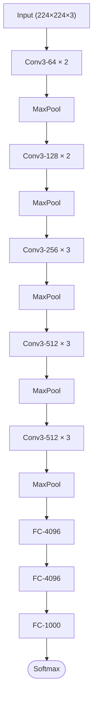
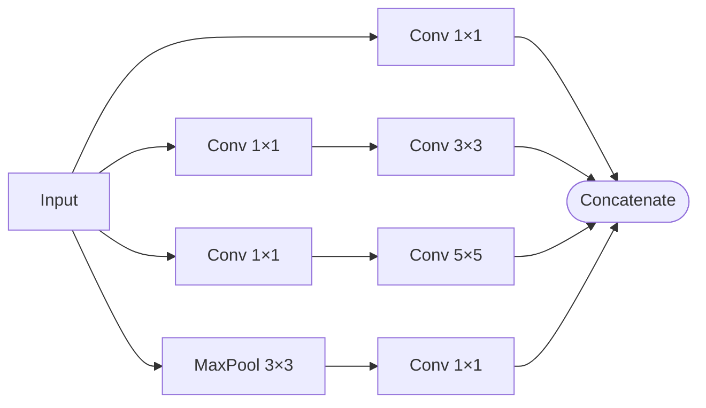
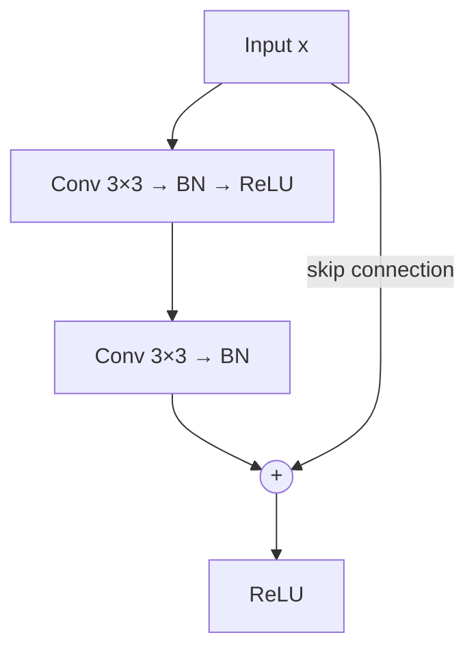
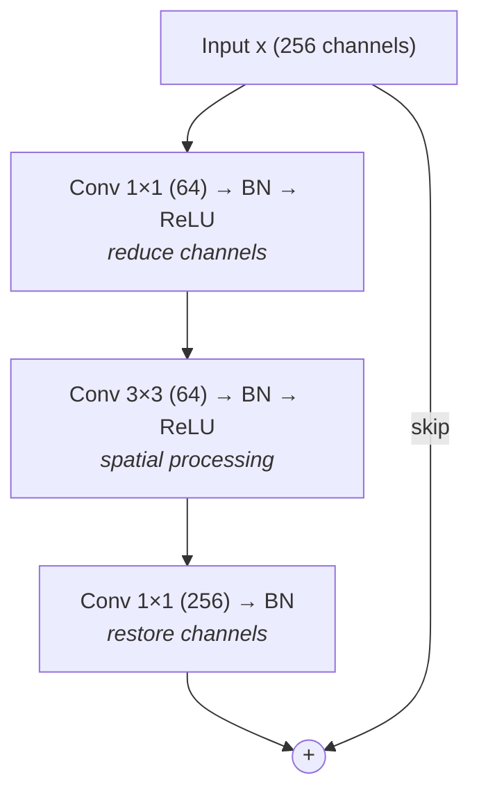

# Convolutional Neural Networks: Advanced Architectures

## Overview

The basic CNN building blocks — convolutions, pooling, and fully connected layers — were introduced in the 1990s by Yann LeCun for handwritten digit recognition. But the real revolution came between 2012 and 2020, as researchers discovered that specific architectural patterns dramatically improve depth, accuracy, and efficiency. This lesson covers the landmark CNN architectures that shaped modern computer vision, from VGGNet's elegant simplicity to ResNet's skip connections, and explores how transfer learning makes these powerful models accessible for any task.

## Pooling Layers Revisited

Pooling reduces spatial dimensions and provides local translation invariance. The two main variants:

### Max Pooling

$$y_{i,j} = \max_{(m,n) \in R_{i,j}} x_{m,n}$$

Max pooling selects the strongest activation in each region, preserving the most prominent features. A $2 \times 2$ max pool with stride 2 halves each spatial dimension (and thus quarters the total feature map size).

### Average Pooling

$$y_{i,j} = \frac{1}{|R_{i,j}|} \sum_{(m,n) \in R_{i,j}} x_{m,n}$$

Average pooling computes the mean activation. It retains more information but can dilute strong signals. **Global Average Pooling (GAP)** averages each entire feature map to a single value, replacing fully connected layers at the end of the network. GAP drastically reduces parameters and acts as a regularizer.

### Strided Convolutions as an Alternative

Modern architectures often replace pooling with **strided convolutions** (stride > 1). This is learnable downsampling — the network learns how to reduce spatial resolution rather than relying on a fixed operation.

## Landmark Architectures

### VGGNet (2014)

VGG (Simonyan & Zisserman) demonstrated that **depth matters**. Key insight: replace large filters with stacks of small $3 \times 3$ filters. Two stacked $3 \times 3$ convolutions have the same receptive field as a single $5 \times 5$, but with fewer parameters and more nonlinearity:

- Two $3 \times 3$ layers: $2 \times (3 \times 3 \times C^2) = 18C^2$ parameters
- One $5 \times 5$ layer: $5 \times 5 \times C^2 = 25C^2$ parameters

VGG-16 architecture (16 weight layers):

**VGG-16 Architecture**



**Impact**: VGG proved that a simple, uniform architecture of small filters can achieve excellent performance. Its 138M parameters made it expensive, but its clean design made it popular as a feature extractor.

### GoogLeNet / Inception (2014)

Szegedy et al. took a different approach: instead of choosing one filter size, use them all. The **Inception module** applies $1 \times 1$, $3 \times 3$, and $5 \times 5$ convolutions in parallel, concatenating their outputs:

**Inception Module**



The $1 \times 1$ convolutions (called **bottleneck layers**) reduce channel dimensions before expensive operations, dramatically cutting computation:

Without bottleneck: $5 \times 5 \times 256 \times 256 = 1,638,400$ multiplications
With bottleneck ($1 \times 1 \times 256 \times 64$ then $5 \times 5 \times 64 \times 256$): $425,984$ multiplications — a **4x reduction**.

GoogLeNet achieved better accuracy than VGG with only 5M parameters (vs. VGG's 138M).

### ResNet (2015)

Kaiming He et al. solved the **degradation problem**: adding more layers to a deep network eventually *hurts* training accuracy, not because of overfitting, but because optimization becomes harder. Their solution: **skip connections** (residual connections).

Instead of learning a mapping $H(\mathbf{x})$, a residual block learns the *residual* $F(\mathbf{x}) = H(\mathbf{x}) - \mathbf{x}$:

$$H(\mathbf{x}) = F(\mathbf{x}) + \mathbf{x}$$

**Residual Block**



**Why it works**: If the optimal transformation is close to identity, learning $F(\mathbf{x}) \approx 0$ is much easier than learning $H(\mathbf{x}) \approx \mathbf{x}$ from scratch. Skip connections also create shorter gradient paths, alleviating vanishing gradients in very deep networks.

ResNet enabled training networks with 50, 101, and even 152 layers — far deeper than anything before. ResNet-152 won ImageNet 2015 with 3.57% top-5 error, surpassing human performance (~5.1%).

**Bottleneck residual block** (used in ResNet-50+):

**Bottleneck Residual Block**



```python
import torch.nn as nn

class ResidualBlock(nn.Module):
    def __init__(self, channels):
        super().__init__()
        self.conv1 = nn.Conv2d(channels, channels, 3, padding=1)
        self.bn1 = nn.BatchNorm2d(channels)
        self.conv2 = nn.Conv2d(channels, channels, 3, padding=1)
        self.bn2 = nn.BatchNorm2d(channels)
        self.relu = nn.ReLU(inplace=True)

    def forward(self, x):
        residual = x
        out = self.relu(self.bn1(self.conv1(x)))
        out = self.bn2(self.conv2(out))
        out += residual  # skip connection
        return self.relu(out)
```

### Beyond ResNet: DenseNet, EfficientNet

- **DenseNet** (2017): Instead of adding the skip connection, DenseNet *concatenates* all previous layer outputs. Each layer receives feature maps from every preceding layer, promoting feature reuse and reducing parameters.

- **EfficientNet** (2019): Uses neural architecture search (NAS) to find optimal width, depth, and resolution scaling ratios. EfficientNet-B7 achieved state-of-the-art accuracy with 8.4x fewer parameters than the previous best.

## Transfer Learning

Training a large CNN from scratch requires millions of labeled images and days of GPU time. **Transfer learning** lets you leverage models pre-trained on ImageNet (14M images, 1000 classes) for new tasks with far less data.

### How It Works

1. **Take a pre-trained model** (e.g., ResNet-50 trained on ImageNet)
2. **Remove the classification head** (final FC layer)
3. **Add a new head** for your task (e.g., 2 classes instead of 1000)
4. **Fine-tune** — two strategies:

**Feature extraction** (freeze backbone):
- Freeze all pre-trained layers
- Train only the new classification head
- Best when your dataset is small and similar to ImageNet

**Full fine-tuning**:
- Initialize with pre-trained weights
- Train all layers with a small learning rate
- Best when your dataset is large or very different from ImageNet

```python
import torchvision.models as models
import torch.nn as nn

# Load pre-trained ResNet-50
model = models.resnet50(weights=models.ResNet50_Weights.IMAGENET1K_V2)

# Freeze backbone for feature extraction
for param in model.parameters():
    param.requires_grad = False

# Replace classification head
model.fc = nn.Linear(model.fc.in_features, num_classes)

# Only the new head will be trained
optimizer = torch.optim.Adam(model.fc.parameters(), lr=1e-3)
```

### Why Transfer Learning Works

Early CNN layers learn universal features: edges, textures, corners, color gradients. These features are useful for virtually any visual task. Middle layers learn more complex patterns (parts, shapes). Only the final layers are task-specific. By reusing early and middle layers, you leverage features learned from millions of images even when you have only hundreds.

## Object Detection Basics

CNNs aren't limited to "what's in this image?" — they can also answer "where is it?"

### Two-Stage Detectors

**R-CNN family** (Girshick et al., 2014-2017):
1. Generate region proposals (candidate bounding boxes)
2. Classify each proposal with a CNN

Faster R-CNN introduced the **Region Proposal Network (RPN)** — a CNN that proposes regions, making the entire pipeline end-to-end trainable.

### Single-Stage Detectors

**YOLO** (You Only Look Once): Divides the image into a grid and predicts bounding boxes and class probabilities for each cell in a single forward pass. Much faster than two-stage detectors, making it suitable for real-time applications.

**SSD** (Single Shot Detector): Similar to YOLO but uses multi-scale feature maps for detecting objects at different sizes.

## Key Concepts

- **Small filters stacked deep**: Two $3 \times 3$ convs = one $5 \times 5$ conv, with fewer parameters and more nonlinearity
- **$1 \times 1$ convolutions**: Channel dimensionality reduction (bottleneck layers)
- **Skip connections**: Enable training of very deep networks by providing gradient shortcuts
- **Residual learning**: Learning $F(\mathbf{x}) = H(\mathbf{x}) - \mathbf{x}$ is easier than learning $H(\mathbf{x})$ directly
- **Transfer learning**: Reuse pre-trained features; fine-tune for new tasks with limited data
- **Global Average Pooling**: Replaces FC layers, reduces parameters significantly
- **Object detection**: Extends classification CNNs to localize objects with bounding boxes

## Further Reading

- [Simonyan & Zisserman — Very Deep Convolutional Networks (VGGNet, 2014)](https://arxiv.org/abs/1409.1556)
- [He et al. — Deep Residual Learning for Image Recognition (ResNet, 2015)](https://arxiv.org/abs/1512.03385)
- [Szegedy et al. — Going Deeper with Convolutions (Inception, 2014)](https://arxiv.org/abs/1409.4842)
- [Tan & Le — EfficientNet: Rethinking Model Scaling (2019)](https://arxiv.org/abs/1905.11946)
- [Redmon et al. — You Only Look Once: Unified, Real-Time Object Detection (2016)](https://arxiv.org/abs/1506.02640)
