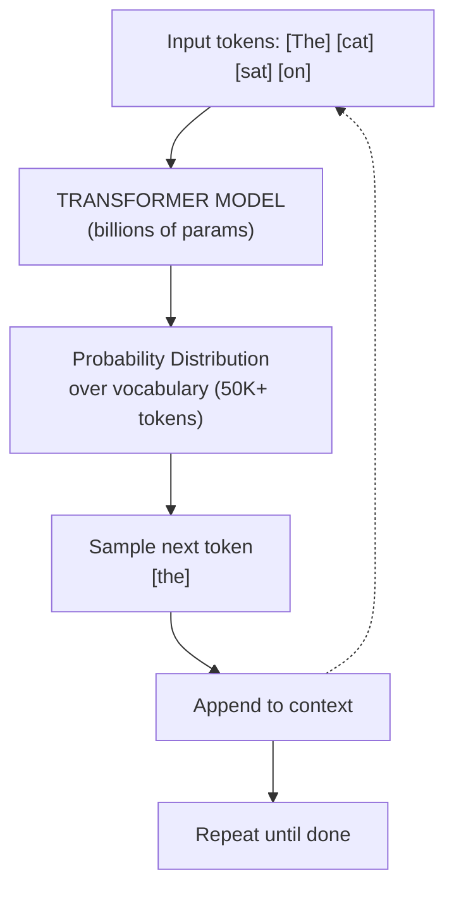
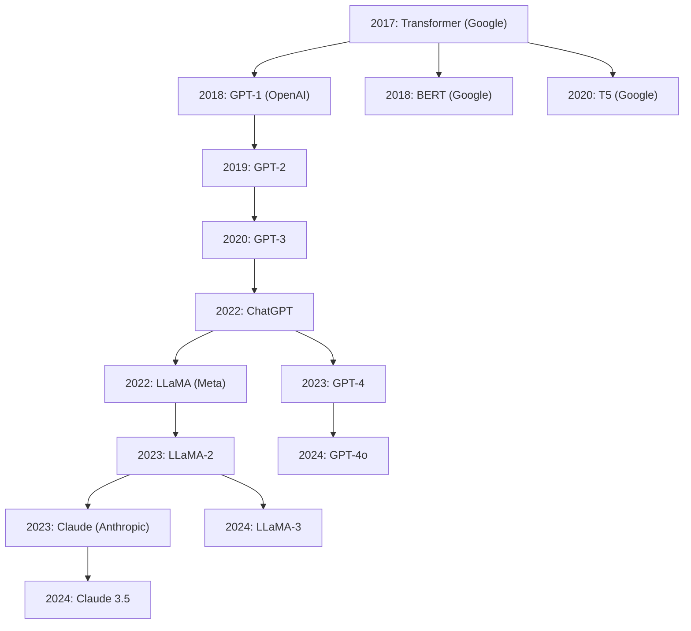

# What are Large Language Models?

## Overview

Large Language Models (LLMs) are neural networks trained on massive text corpora to predict the next token in a sequence. While the idea of statistical language modeling dates back decades, the modern era of LLMs began with the 2017 paper "Attention Is All You Need," which introduced the Transformer architecture. Before Transformers, recurrent neural networks (RNNs) and LSTMs dominated sequence modeling, but they struggled with long-range dependencies and could not be parallelized efficiently during training.

The first major breakthrough was **GPT (Generative Pre-trained Transformer)** from OpenAI in 2018, which showed that unsupervised pre-training on large text followed by supervised fine-tuning could achieve strong results across many tasks. Shortly after, Google released **BERT (Bidirectional Encoder Representations from Transformers)**, which used a masked language modeling objective rather than autoregressive prediction, excelling at understanding tasks like classification and question answering.

The field then scaled rapidly. GPT-2 (2019) had 1.5 billion parameters, GPT-3 (2020) jumped to 175 billion, and GPT-4 (2023) is estimated to be far larger still. Meanwhile, Meta released the **LLaMA** family of open-weight models, making powerful LLMs accessible to the research community. Anthropic developed the **Claude** family, focusing on safety and helpfulness through techniques like Constitutional AI and RLHF.

What sets LLMs apart from traditional machine learning models is their generality. A traditional ML model -- say, a sentiment classifier -- is trained on labeled examples for one specific task. An LLM, by contrast, learns a broad representation of language during pre-training and can then be adapted to virtually any text task through prompting or fine-tuning. This is sometimes called the "foundation model" paradigm.

The fundamental mechanism is **next-token prediction**. Given a sequence of tokens (subword units), the model outputs a probability distribution over the entire vocabulary for what comes next. During training, the model adjusts its billions of parameters to minimize the cross-entropy loss between its predictions and the actual next token. At inference time, tokens are sampled from this distribution one at a time, autoregressively building up a response.

An important phenomenon in LLMs is **emergent behavior** -- capabilities that appear only at sufficient scale. Small models cannot perform chain-of-thought reasoning or in-context learning, but once models reach a certain size (typically tens of billions of parameters), these abilities emerge without being explicitly trained. This has led to intense research into **scaling laws**, which relate model performance to the number of parameters, amount of training data, and compute budget.

The scale involved is staggering. Training a frontier LLM requires thousands of GPUs running for weeks or months, consuming megawatt-hours of electricity and costing tens of millions of dollars. The training data typically spans trillions of tokens drawn from books, websites, code repositories, and other text sources.

## Key Concepts

- **Token**: The basic unit of text for an LLM. Words are split into subword tokens using algorithms like Byte-Pair Encoding (BPE). For example, "unhappiness" might become ["un", "happiness"] or ["un", "happ", "iness"].
- **Parameters**: The learnable weights in the neural network. More parameters generally means greater capacity to store and retrieve patterns from training data.
- **Pre-training**: The initial phase where the model learns from a large unlabeled corpus using self-supervised objectives like next-token prediction.
- **Autoregressive generation**: Producing text one token at a time, where each new token is conditioned on all previous tokens.
- **Context window**: The maximum number of tokens the model can process at once. Early models had windows of 512-2048 tokens; modern models support 100K+ tokens.
- **Emergent abilities**: Capabilities like arithmetic, translation, and reasoning that appear only in sufficiently large models.

## Code Examples

Below is a minimal next-token prediction sketch in Python. This is not a full LLM but illustrates the core loop.

```python
import numpy as np

# Tiny vocabulary for illustration
vocab = ["the", "cat", "sat", "on", "mat"]
vocab_size = len(vocab)
word_to_id = {w: i for i, w in enumerate(vocab)}

# Simulate a probability distribution over next tokens
# In a real LLM, this comes from a Transformer forward pass
def fake_logits(context_ids):
    """Return raw logits for the next token given context."""
    np.random.seed(sum(context_ids))  # deterministic for demo
    return np.random.randn(vocab_size)

def softmax(logits, temperature=1.0):
    """Convert logits to probabilities."""
    scaled = logits / temperature
    exp_vals = np.exp(scaled - np.max(scaled))  # numerical stability
    return exp_vals / exp_vals.sum()

def sample_next_token(context_ids, temperature=0.8):
    """Sample one token from the predicted distribution."""
    logits = fake_logits(context_ids)
    probs = softmax(logits, temperature)
    next_id = np.random.choice(len(probs), p=probs)
    return next_id

# Autoregressive generation loop
context = [word_to_id["the"]]
for _ in range(4):
    next_id = sample_next_token(context)
    context.append(next_id)

print("Generated:", " ".join(vocab[i] for i in context))
# Example output: "the cat sat on mat"
```

**Line-by-line explanation:**
- We define a small vocabulary and map words to integer IDs.
- `fake_logits` stands in for the Transformer forward pass, returning a score for each vocabulary token.
- `softmax` converts raw scores into a valid probability distribution. The `temperature` parameter controls randomness: lower values make the distribution sharper (more deterministic), higher values make it flatter (more random).
- `sample_next_token` draws one token from the distribution using `np.random.choice`.
- The generation loop appends each new token to the context and feeds it back in, exactly as a real LLM does.

## Math/Formulas (KaTeX)

The training objective for a causal language model is to minimize the negative log-likelihood:

$$\mathcal{L} = -\sum_{t=1}^{T} \log P(x_t \mid x_1, x_2, \ldots, x_{t-1}; \theta)$$

where $x_t$ is the token at position $t$, $T$ is the sequence length, and $\theta$ represents the model parameters.

The softmax function that converts logits $z_i$ to probabilities is:

$$P(x_i) = \frac{e^{z_i}}{\sum_{j=1}^{V} e^{z_j}}$$

where $V$ is the vocabulary size.

## Diagrams

**Autoregressive Generation**



**Family Tree of Major LLMs**



## Exercises

1. **Vocabulary exploration**: Take the sentence "Tokenization is surprisingly tricky!" and manually split it into plausible BPE tokens. Then verify your answer using the `tiktoken` Python library with the `cl100k_base` encoding.

2. **Temperature experiment**: Modify the code example above to generate 10 sequences at temperature 0.1, 0.8, and 2.0. Observe how the outputs differ in diversity and coherence.

3. **Scaling reflection**: Research the number of parameters in GPT-2, GPT-3, and LLaMA-2-70B. Calculate the ratio between successive models. What pattern do you see?

4. **Conceptual question**: Why can an autoregressive model generate text of arbitrary length even though it has a fixed context window? What happens when the generated text exceeds the context window?

## Further Reading

- [Attention Is All You Need (Vaswani et al., 2017)](https://arxiv.org/abs/1706.03762)
- [Language Models are Few-Shot Learners (GPT-3 paper)](https://arxiv.org/abs/2005.14165)
- [LLaMA: Open and Efficient Foundation Language Models](https://arxiv.org/abs/2302.13971)
- [Anthropic's Claude Model Card](https://www.anthropic.com)
- [The Illustrated Transformer (Jay Alammar)](https://jalammar.github.io/illustrated-transformer/)
