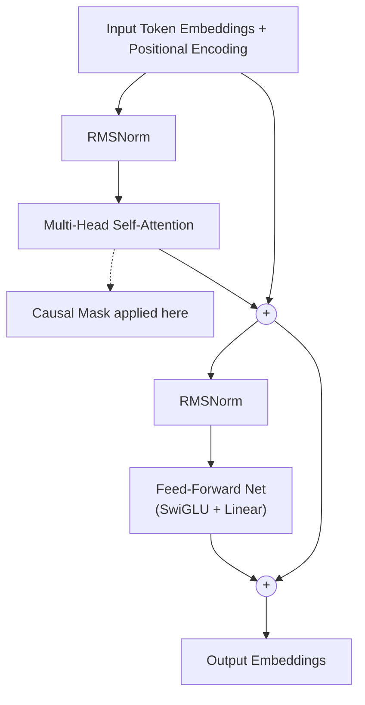
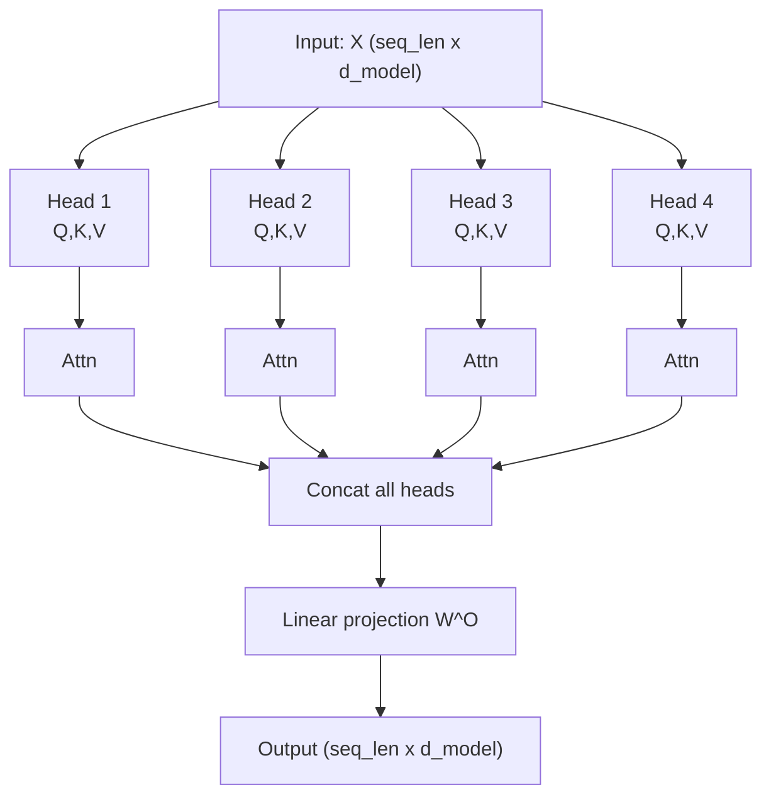
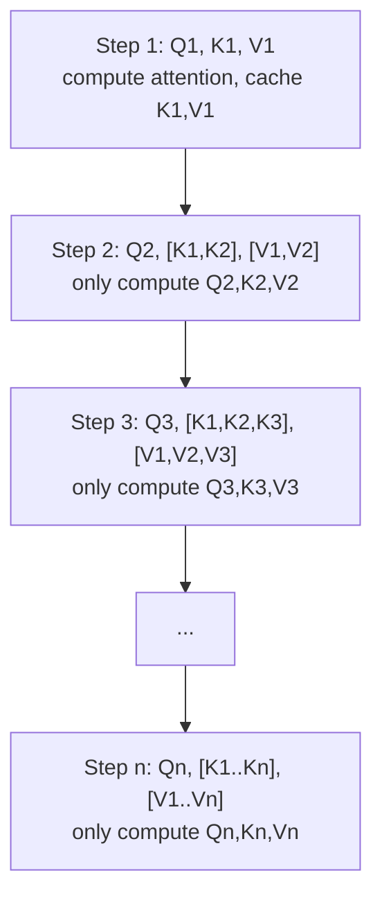

# LLM Architecture Deep Dive

## Overview

Modern Large Language Models are built on the Transformer architecture, specifically the decoder-only variant. Understanding the internal mechanics of a Transformer is essential for anyone working with or building LLMs. This lesson walks through each component in detail, from multi-head self-attention to the final output projection.

The Transformer processes a sequence of token embeddings through a stack of identical layers. Each layer contains two sub-blocks: a **multi-head self-attention** mechanism and a **feed-forward network (FFN)**. Both sub-blocks use **residual connections** and **layer normalization** to stabilize training and enable gradient flow through deep networks.

**Multi-head self-attention** is the core innovation. For each token in the sequence, attention computes a weighted sum over all other tokens, where the weights reflect how "relevant" each token is to the current one. The input is projected into three matrices -- Queries ($Q$), Keys ($K$), and Values ($V$) -- through learned linear transformations. The attention scores are computed as the scaled dot product of queries and keys, then used to weight the values.

Using multiple heads allows the model to attend to different aspects of the input simultaneously. One head might capture syntactic relationships, another semantic similarity, and another positional proximity. The outputs of all heads are concatenated and projected back to the model dimension.

**Positional encodings** are critical because the attention mechanism is permutation-invariant -- without position information, the model cannot distinguish "the cat sat on the mat" from "mat the on sat cat the." The original Transformer used fixed sinusoidal encodings, but modern LLMs use learned or relative schemes. **Rotary Position Embedding (RoPE)** encodes position by rotating the query and key vectors in 2D subspaces, making attention scores naturally depend on the relative distance between tokens. **ALiBi (Attention with Linear Biases)** takes a simpler approach: it adds a linear penalty to attention scores based on the distance between tokens, requiring no learned parameters. ALiBi also generalizes better to sequence lengths longer than those seen during training.

**Layer normalization** ensures that the activations within each layer have stable mean and variance, preventing the exploding or vanishing gradient problem. Most modern LLMs use **Pre-LayerNorm** (applying normalization before the attention and FFN sub-blocks rather than after), and many use **RMSNorm** instead of the original LayerNorm for computational efficiency, as it skips the mean-centering step.

**Residual connections** add the input of each sub-block to its output, creating a "skip connection" that allows gradients to flow directly through the network. Without residuals, training networks with 80+ layers would be impractical.

During autoregressive generation, the model must recompute attention over all previous tokens at every step. The **KV cache** avoids this redundancy by storing the key and value projections from previous time steps. At each new step, only the new token's query, key, and value are computed; the cached keys and values are reused. This reduces the per-step complexity from $O(n^2)$ to $O(n)$, but requires memory proportional to the sequence length, batch size, number of layers, and head dimension.

Efficient attention variants have been developed to handle long sequences. **Multi-Query Attention (MQA)** shares a single key-value head across all query heads, drastically reducing KV cache size. **Grouped-Query Attention (GQA)**, used in LLaMA-2 and many recent models, is a middle ground where groups of query heads share key-value heads. **Flash Attention** is not an approximation but an IO-aware exact attention algorithm that tiles the computation to minimize memory reads and writes, achieving significant speedups on GPU hardware.

## Key Concepts

- **Self-attention**: Each token attends to every other token in the sequence, producing context-aware representations.
- **Multi-head**: Running attention in parallel across $h$ heads, each with dimension $d_k = d_{model} / h$, then concatenating results.
- **Causal masking**: In decoder-only models, tokens can only attend to previous positions (not future ones), enforced by setting future attention scores to $-\infty$ before softmax.
- **RoPE**: Encodes relative position by applying rotation matrices to query and key vectors in paired dimensions.
- **KV cache**: Stores previously computed key and value tensors to avoid redundant computation during autoregressive generation.
- **Feed-forward network**: Typically two linear layers with a nonlinearity (ReLU, GELU, or SwiGLU) in between, applied independently to each token position.

## Code Examples

Here is a simplified self-attention implementation in Python using NumPy.

```python
import numpy as np

def scaled_dot_product_attention(Q, K, V, mask=None):
    """
    Compute scaled dot-product attention.

    Args:
        Q: Query matrix, shape (seq_len, d_k)
        K: Key matrix, shape (seq_len, d_k)
        V: Value matrix, shape (seq_len, d_v)
        mask: Optional causal mask, shape (seq_len, seq_len)

    Returns:
        Attention output, shape (seq_len, d_v)
    """
    d_k = Q.shape[-1]

    # Step 1: Compute raw attention scores
    scores = Q @ K.T / np.sqrt(d_k)   # (seq_len, seq_len)

    # Step 2: Apply causal mask (set future positions to -inf)
    if mask is not None:
        scores = np.where(mask == 0, -1e9, scores)

    # Step 3: Softmax to get attention weights
    exp_scores = np.exp(scores - scores.max(axis=-1, keepdims=True))
    weights = exp_scores / exp_scores.sum(axis=-1, keepdims=True)

    # Step 4: Weighted sum of values
    output = weights @ V   # (seq_len, d_v)
    return output

# Example usage
seq_len, d_k = 4, 8
Q = np.random.randn(seq_len, d_k)
K = np.random.randn(seq_len, d_k)
V = np.random.randn(seq_len, d_k)

# Create causal mask: lower triangular matrix
causal_mask = np.tril(np.ones((seq_len, seq_len)))

output = scaled_dot_product_attention(Q, K, V, mask=causal_mask)
print("Output shape:", output.shape)  # (4, 8)
```

**Explanation:**
- Line by line, we first compute the dot product $QK^T$, which measures the similarity between every pair of tokens.
- We divide by $\sqrt{d_k}$ to prevent the dot products from growing too large, which would push softmax into regions with tiny gradients.
- The causal mask zeros out positions where token $i$ would attend to token $j > i$ (future tokens).
- After softmax, the weights sum to 1 along each row, forming a valid probability distribution.
- Multiplying by $V$ produces the final output: a weighted combination of value vectors.

## Math/Formulas (KaTeX)

The scaled dot-product attention formula is:

$$\text{Attention}(Q, K, V) = \text{softmax}\left(\frac{QK^T}{\sqrt{d_k}}\right)V$$

For multi-head attention with $h$ heads:

$$\text{MultiHead}(Q, K, V) = \text{Concat}(\text{head}_1, \ldots, \text{head}_h) W^O$$

where each head is:

$$\text{head}_i = \text{Attention}(Q W_i^Q, K W_i^K, V W_i^V)$$

and $W_i^Q \in \mathbb{R}^{d_{model} \times d_k}$, $W_i^K \in \mathbb{R}^{d_{model} \times d_k}$, $W_i^V \in \mathbb{R}^{d_{model} \times d_v}$, $W^O \in \mathbb{R}^{hd_v \times d_{model}}$.

RMSNorm is defined as:

$$\text{RMSNorm}(x) = \frac{x}{\sqrt{\frac{1}{d}\sum_{i=1}^{d} x_i^2 + \epsilon}} \cdot \gamma$$

where $\gamma$ is a learned scale parameter and $\epsilon$ is a small constant for numerical stability.

## Diagrams

**Transformer Decoder Block (x N layers)**



**Multi-Head Attention (h=4 heads)**



**KV Cache During Generation**



## Exercises

1. **Attention by hand**: For a sequence of 3 tokens with $d_k = 2$, manually compute the attention output given $Q = [[1,0],[0,1],[1,1]]$, $K = [[1,0],[0,1],[0.5,0.5]]$, $V = [[1,0],[0,1],[0.5,0.5]]$. Apply a causal mask.

2. **KV cache memory**: Calculate the KV cache memory for a model with 32 layers, 32 heads, $d_k = 128$, batch size 1, sequence length 4096, using float16. Express your answer in gigabytes.

3. **GQA analysis**: If a model has 32 query heads and uses GQA with 8 key-value groups, by what factor is the KV cache reduced compared to standard multi-head attention?

4. **Implementation**: Extend the code example to implement multi-head attention with $h = 4$ heads. Verify that the output shape matches the input shape.

## Further Reading

- [Attention Is All You Need (Vaswani et al., 2017)](https://arxiv.org/abs/1706.03762)
- [RoFormer: Enhanced Transformer with Rotary Position Embedding](https://arxiv.org/abs/2104.09864)
- [Train Short, Test Long: Attention with Linear Biases (ALiBi)](https://arxiv.org/abs/2108.12409)
- [FlashAttention: Fast and Memory-Efficient Exact Attention](https://arxiv.org/abs/2205.14135)
- [GQA: Training Generalized Multi-Query Transformer Models](https://arxiv.org/abs/2305.13245)
