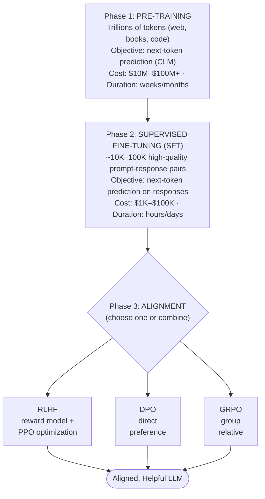
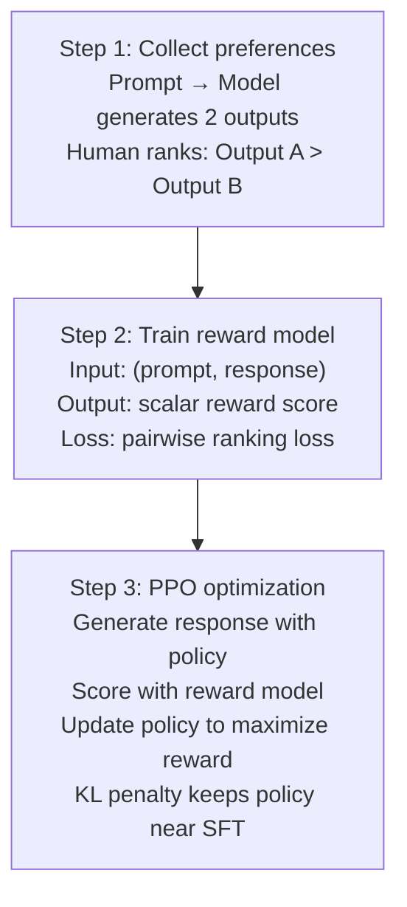

# Training LLMs

## Overview

Training a Large Language Model involves multiple distinct phases, each with its own objectives, data requirements, and computational costs. Understanding these phases is essential for anyone who wants to fine-tune models, evaluate training decisions, or appreciate why modern LLMs behave the way they do.

**Pre-training** is the most expensive phase. The model learns to predict the next token in a sequence using **causal language modeling** (CLM). Given a sequence of tokens $x_1, x_2, \ldots, x_T$, the model is trained to maximize the likelihood of each token conditioned on all preceding tokens. The training data typically consists of trillions of tokens drawn from web crawls, books, code, and curated datasets. A single pre-training run for a frontier model can cost tens of millions of dollars in compute and take weeks on thousands of GPUs.

**Scaling laws** provide a principled way to allocate compute budgets. The Kaplan et al. (2020) scaling laws showed that loss decreases as a power law with model size, dataset size, and compute. However, the **Chinchilla** paper (Hoffmann et al., 2022) revised these findings, demonstrating that many models were significantly over-parameterized relative to their training data. Chinchilla showed that for a given compute budget $C$, the optimal strategy is to scale model parameters $N$ and training tokens $D$ roughly equally: if you double your compute, you should both double the model size and double the data. Specifically, the compute-optimal relationship is approximately $D \approx 20N$ -- a 10-billion parameter model should be trained on roughly 200 billion tokens.

After pre-training, the model can generate coherent text but does not reliably follow instructions or align with human preferences. This is where **post-training** comes in.

**Supervised Fine-Tuning (SFT)** is the first post-training step. The model is trained on high-quality demonstration data -- typically human-written examples of ideal assistant behavior in a prompt-response format. SFT teaches the model the format and style of helpful responses. The training objective is the same next-token prediction loss, but applied only to the assistant's response tokens (the prompt tokens are masked from the loss).

**Reinforcement Learning from Human Feedback (RLHF)** further aligns the model with human preferences. The process has three stages: (1) collect comparison data where humans rank model outputs, (2) train a **reward model** to predict human preferences, and (3) optimize the language model using the reward model as a signal, typically with the **Proximal Policy Optimization (PPO)** algorithm. The optimization objective balances maximizing the reward with staying close to the SFT policy to prevent reward hacking.

**Direct Preference Optimization (DPO)** simplifies the RLHF pipeline by eliminating the need for a separate reward model and RL training loop. DPO reparameterizes the reward function in terms of the policy itself, turning the alignment problem into a simple classification loss on preference pairs. Given a preferred response $y_w$ and a dispreferred response $y_l$ for a prompt $x$, DPO directly increases the probability of $y_w$ relative to $y_l$.

**Group Relative Policy Optimization (GRPO)**, introduced by DeepSeek, takes a different approach by eliminating the need for a separate critic model. Instead of estimating a value function, GRPO samples a group of outputs for each prompt, computes rewards for all of them, and then normalizes advantages within the group. This makes training more stable and computationally efficient, as the baseline is computed directly from the sampled group rather than from a learned value network.

Each of these methods makes different trade-offs between simplicity, computational cost, and alignment quality. In practice, modern LLM training pipelines often combine multiple techniques -- for example, SFT followed by DPO, or SFT followed by GRPO with a rule-based reward signal for verifiable tasks like math and code.

## Key Concepts

- **Causal language modeling**: The pre-training objective where the model predicts the next token given all preceding tokens, with a causal mask preventing attention to future positions.
- **Compute-optimal scaling**: Allocating a fixed compute budget to balance model size and training data, following the Chinchilla-optimal ratio.
- **Reward model**: A model (often initialized from the SFT model) trained to score outputs according to human preferences.
- **KL penalty**: A regularization term in RLHF that penalizes the policy for diverging too far from the reference (SFT) model, preventing reward hacking.
- **Preference pairs**: Pairs of outputs $(y_w, y_l)$ where $y_w$ is preferred by humans over $y_l$ for the same prompt.
- **Group advantage normalization**: GRPO's technique of computing relative advantages within a sampled group rather than using a learned critic.

## Code Examples

Below is a simplified SFT training loop in PyTorch-style pseudocode.

```python
import torch
from torch.utils.data import DataLoader

# Assume: model is a pre-trained causal LM
# Assume: dataset yields (input_ids, labels) where labels mask prompt tokens

optimizer = torch.optim.AdamW(model.parameters(), lr=2e-5, weight_decay=0.01)
dataloader = DataLoader(dataset, batch_size=4, shuffle=True)

model.train()
for epoch in range(3):
    total_loss = 0
    for batch in dataloader:
        input_ids = batch["input_ids"].to(device)      # (batch, seq_len)
        labels = batch["labels"].to(device)             # (batch, seq_len)
        # labels[i] = -100 for prompt tokens (ignored in loss)
        
        # Forward pass: model returns logits for each position
        outputs = model(input_ids=input_ids, labels=labels)
        loss = outputs.loss  # cross-entropy over non-masked tokens
        
        # Backward pass and update
        optimizer.zero_grad()
        loss.backward()
        torch.nn.utils.clip_grad_norm_(model.parameters(), max_norm=1.0)
        optimizer.step()
        
        total_loss += loss.item()
    
    avg_loss = total_loss / len(dataloader)
    print(f"Epoch {epoch+1}, Average Loss: {avg_loss:.4f}")
```

**Line-by-line explanation:**
- We use AdamW optimizer with a small learning rate (2e-5) typical for fine-tuning to avoid catastrophic forgetting.
- Labels are set to -100 for prompt tokens so the loss is computed only on the assistant's response tokens.
- `outputs.loss` is the standard cross-entropy loss computed by the model's forward method.
- Gradient clipping (`clip_grad_norm_`) prevents training instability from large gradient updates.
- Typically only 1-3 epochs of SFT are needed; more can cause overfitting to the fine-tuning data.

## Math/Formulas (KaTeX)

The **pre-training objective** (causal language modeling loss):

$$\mathcal{L}_{CLM} = -\sum_{t=1}^{T} \log P_\theta(x_t \mid x_{<t})$$

The **Chinchilla scaling law** relates optimal model size $N$ and data $D$ to compute budget $C$:

$$C \approx 6ND$$

where $C$ is measured in FLOPs. For compute-optimal training: $N_{opt} \propto C^{0.5}$ and $D_{opt} \propto C^{0.5}$.

The **RLHF objective** maximizes expected reward with a KL penalty:

$$\mathcal{L}_{RLHF} = \mathbb{E}_{x \sim \mathcal{D}, \, y \sim \pi_\theta(\cdot|x)} \left[ R_\phi(x, y) - \beta \, D_{KL}\left(\pi_\theta(\cdot|x) \| \pi_{ref}(\cdot|x)\right) \right]$$

where $R_\phi$ is the learned reward model, $\pi_\theta$ is the policy being optimized, $\pi_{ref}$ is the reference (SFT) policy, and $\beta$ controls the strength of the KL penalty.

The **DPO loss** for a preference pair $(y_w, y_l)$:

$$\mathcal{L}_{DPO} = -\log \sigma\left(\beta \log \frac{\pi_\theta(y_w|x)}{\pi_{ref}(y_w|x)} - \beta \log \frac{\pi_\theta(y_l|x)}{\pi_{ref}(y_l|x)}\right)$$

where $\sigma$ is the sigmoid function.

## Diagrams

**LLM Training Pipeline**



**RLHF Pipeline in Detail**



## Exercises

1. **Compute budget**: You have a compute budget of $10^{23}$ FLOPs. Using the Chinchilla-optimal relationship $C \approx 6ND$ and $D \approx 20N$, calculate the optimal model size and training token count.

2. **Loss comparison**: Explain in your own words why DPO does not need a separate reward model. What implicit assumption does DPO make about the reward function?

3. **SFT data design**: Design 5 high-quality SFT training examples for a coding assistant. Each should have a user prompt and an ideal assistant response. Consider what makes a response "high quality" -- correctness, explanation, formatting.

4. **GRPO intuition**: Why might normalizing advantages within a group of sampled outputs be more stable than using a learned value function? Consider what happens when the reward scale shifts during training.

5. **Scaling laws**: A model trained with 10B parameters on 200B tokens achieves a loss of 2.8. Using the Chinchilla insight, would you expect a 5B parameter model trained on 400B tokens (same total compute) to do better or worse? Why?

## Further Reading

- [Scaling Laws for Neural Language Models (Kaplan et al., 2020)](https://arxiv.org/abs/2001.08361)
- [Training Compute-Optimal Large Language Models (Chinchilla)](https://arxiv.org/abs/2203.15556)
- [Training language models to follow instructions with human feedback (InstructGPT/RLHF)](https://arxiv.org/abs/2203.02155)
- [Direct Preference Optimization (Rafailov et al., 2023)](https://arxiv.org/abs/2305.18290)
- [DeepSeekMath: Pushing the Limits of Mathematical Reasoning (GRPO)](https://arxiv.org/abs/2402.03300)
