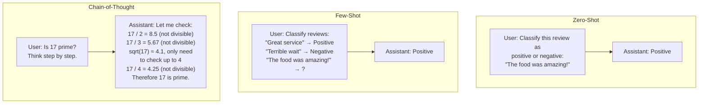
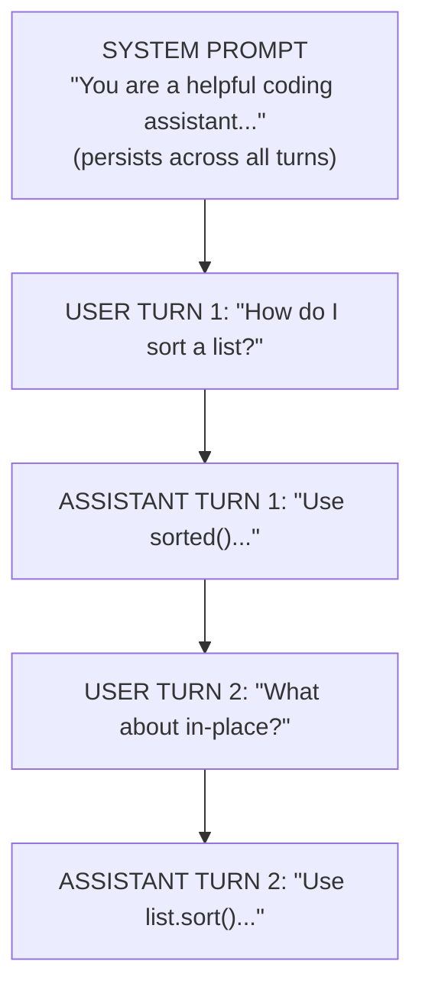

# Prompt Engineering Fundamentals

## Overview

Prompt engineering is the practice of crafting inputs to Large Language Models to elicit accurate, useful, and well-structured outputs. Because LLMs are next-token predictors, the way you frame a request profoundly influences the response. A well-engineered prompt can be the difference between a vague, incorrect answer and a precise, reliable one.

The simplest approach is **zero-shot prompting**: you give the model an instruction with no examples. This works well for straightforward tasks where the model's pre-training knowledge is sufficient. For example, "Translate the following English text to French: 'Hello, how are you?'" is a clear zero-shot prompt. The model understands the task from the instruction alone.

**Few-shot prompting** improves performance by providing examples of the desired input-output behavior directly in the prompt. Instead of just describing what you want, you show the model. This is especially powerful for tasks with specific formatting requirements or where the model might be ambiguous about the expected output format. Research has shown that even 2-3 examples can dramatically improve accuracy on classification, extraction, and reasoning tasks.

**Chain-of-thought (CoT) prompting** asks the model to reason step by step before giving a final answer. The landmark paper by Wei et al. (2022) showed that simply adding "Let's think step by step" to a prompt can unlock significantly better performance on math and logic problems. The mechanism is believed to work because intermediate reasoning tokens provide the model with a "scratchpad" -- the model can use its own generated tokens as additional context, effectively extending its computation. CoT can be combined with few-shot prompting by providing examples that include reasoning steps.

**System prompts vs. user prompts** represent different roles in the conversation structure. The system prompt sets the overall behavior, persona, and constraints for the model. It typically includes instructions like "You are a helpful coding assistant. Always provide code examples in Python. Never execute code that could be harmful." The user prompt contains the specific request. This separation is important because the system prompt persists across turns in a conversation and establishes ground rules, while user prompts are individual requests within that context.

**Structured output** is an increasingly important technique. Many applications need the model to return data in a specific format -- JSON, XML, or a particular schema -- rather than free-form text. Most API providers now support a "JSON mode" or structured output feature that constrains the model's output to valid JSON. Even without dedicated API support, you can achieve structured output by providing a clear schema in the prompt and including examples of the expected format.

Several common **prompting patterns** have emerged. **Role prompting** assigns the model a specific persona: "You are an expert data scientist with 15 years of experience." This activates relevant knowledge and sets an appropriate tone. **Constraint prompting** sets explicit boundaries: "Respond in exactly 3 bullet points" or "Use only information from the provided context." **Decomposition prompting** breaks complex tasks into subtasks, asking the model to handle each step separately.

The difference between a novice and expert prompt engineer often comes down to specificity. Vague prompts produce vague outputs. "Tell me about Python" will get a generic overview, while "Explain Python's Global Interpreter Lock: what it is, why it exists, its impact on multi-threaded performance, and three workarounds, with code examples for each" will get a focused, detailed response. The key principle is: the more precisely you define the task, the more reliably the model will deliver what you need.

Temperature and other sampling parameters also play a role. Lower temperatures (0.0-0.3) produce more deterministic, focused outputs suitable for factual tasks. Higher temperatures (0.7-1.0) increase diversity and creativity. For structured outputs and code generation, a low temperature is almost always preferred.

## Key Concepts

- **Zero-shot**: No examples provided, relying purely on the instruction and the model's training.
- **Few-shot**: 2-5 examples of desired input-output pairs included in the prompt to guide behavior.
- **Chain-of-thought**: Instructing the model to show its reasoning steps before arriving at a final answer.
- **System prompt**: A privileged instruction that sets the model's persona, constraints, and behavior for the entire conversation.
- **Structured output**: Constraining the model to produce output in a specific format (JSON, XML, etc.) for programmatic consumption.
- **Temperature**: A sampling parameter that controls randomness; lower values make output more deterministic.

## Code Examples

Here is a practical example of few-shot prompting with structured JSON output using the Anthropic Python SDK.

```python
import anthropic

client = anthropic.Anthropic()

# System prompt sets the overall behavior
system_prompt = """You are a data extraction assistant.
Given a natural language description of a person, extract structured data.
Always respond with valid JSON matching this schema:
{"name": string, "age": number|null, "occupation": string|null, "skills": string[]}"""

# Few-shot examples embedded in the conversation
few_shot_examples = [
    {
        "role": "user",
        "content": "Dr. Sarah Chen is a 42-year-old neurosurgeon who specializes in pediatric cases. She is skilled in microsurgery and MRI interpretation."
    },
    {
        "role": "assistant",
        "content": '{"name": "Dr. Sarah Chen", "age": 42, "occupation": "neurosurgeon", "skills": ["microsurgery", "MRI interpretation", "pediatric neurosurgery"]}'
    },
    {
        "role": "user",
        "content": "Marcus runs a bakery downtown. He makes incredible sourdough and croissants."
    },
    {
        "role": "assistant",
        "content": '{"name": "Marcus", "age": null, "occupation": "baker", "skills": ["sourdough baking", "croissant making"]}'
    }
]

# The actual query
new_query = {
    "role": "user",
    "content": "Priya Patel, 29, is a full-stack developer at a fintech startup. She works with React, Python, and PostgreSQL."
}

response = client.messages.create(
    model="claude-sonnet-4-20250514",
    max_tokens=256,
    system=system_prompt,
    messages=few_shot_examples + [new_query],
    temperature=0.0  # Low temperature for deterministic structured output
)

print(response.content[0].text)
# Expected: {"name": "Priya Patel", "age": 29, "occupation": "full-stack developer",
#            "skills": ["React", "Python", "PostgreSQL"]}
```

**Explanation:**
- The system prompt defines the task and the expected JSON schema.
- Two few-shot examples demonstrate the exact format, including how to handle missing data (`null` for age).
- Temperature is set to 0.0 for maximum consistency in structured output.
- The few-shot examples are structured as alternating user/assistant messages, which is the natural way to provide examples in a chat API.

Here is an example of chain-of-thought prompting:

```python
# Without chain-of-thought
basic_prompt = "What is 247 * 38?"

# With chain-of-thought
cot_prompt = """What is 247 * 38?

Think step by step:
1. Break down the multiplication
2. Show each intermediate calculation
3. Sum the partial products
4. State the final answer"""

# The CoT version produces more reliable results because
# the model can use intermediate tokens as working memory
```

## Math/Formulas (KaTeX)

The probability of the model generating a specific token $t$ at position $i$ given prompt $p$ is:

$$P(t_i \mid p, t_1, \ldots, t_{i-1}; \theta, \tau) = \frac{e^{z_i / \tau}}{\sum_{j=1}^{V} e^{z_j / \tau}}$$

where $z_i$ are the logits, $V$ is the vocabulary size, and $\tau$ is the temperature parameter.

At $\tau \to 0$, the distribution becomes a delta function on the highest-logit token (greedy decoding):

$$\lim_{\tau \to 0} P(t_i) = \begin{cases} 1 & \text{if } z_i = \max_j z_j \\ 0 & \text{otherwise} \end{cases}$$

At $\tau = 1$, the original model distribution is preserved. At $\tau > 1$, the distribution becomes flatter, increasing diversity.

## Diagrams

**Prompting Strategies Comparison**



**Conversation Structure**



## Exercises

1. **Prompt transformation**: Improve each of these vague prompts into effective ones:
   - "Tell me about machine learning" -> Specify the audience, scope, desired format, and length.
   - "Write some code" -> Specify the language, task, input/output format, and error handling.
   - "Help me with my essay" -> Specify the topic, current draft state, what kind of help, and constraints.

2. **Few-shot design**: Create a 3-shot prompt for a model to convert natural language dates into ISO 8601 format (e.g., "next Tuesday" -> "2026-05-05"). Include edge cases like relative dates and ambiguous formats.

3. **Chain-of-thought**: Write a CoT prompt that helps the model solve this word problem: "A store has 3 types of fruit. Apples cost $2 each, bananas cost $1 each, and cherries cost $3 per bag. If I buy 4 apples, 6 bananas, and 2 bags of cherries, how much do I spend?" Verify the model gets $20.

4. **System prompt engineering**: Design a system prompt for a customer support chatbot that: (a) only answers questions about a fictional product called "CloudSync Pro," (b) never reveals internal pricing rules, (c) escalates billing issues to a human, and (d) responds in a friendly but professional tone.

5. **Structured output challenge**: Write a prompt that extracts all dates, monetary amounts, and person names from a paragraph of text and returns them as JSON with keys `dates`, `amounts`, and `names`. Test it on a news article.

## Further Reading

- [Chain-of-Thought Prompting Elicits Reasoning in Large Language Models (Wei et al., 2022)](https://arxiv.org/abs/2201.11903)
- [Language Models are Few-Shot Learners (Brown et al., 2020)](https://arxiv.org/abs/2005.14165)
- [Anthropic Prompt Engineering Guide](https://docs.anthropic.com/en/docs/build-with-claude/prompt-engineering)
- [OpenAI Prompt Engineering Best Practices](https://platform.openai.com/docs/guides/prompt-engineering)
- [Prompting Guide (DAIR.AI)](https://www.promptingguide.ai/)
