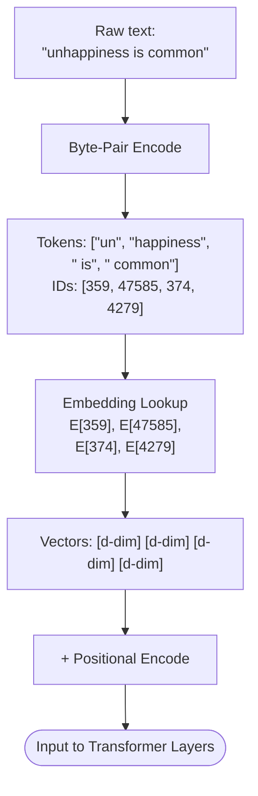
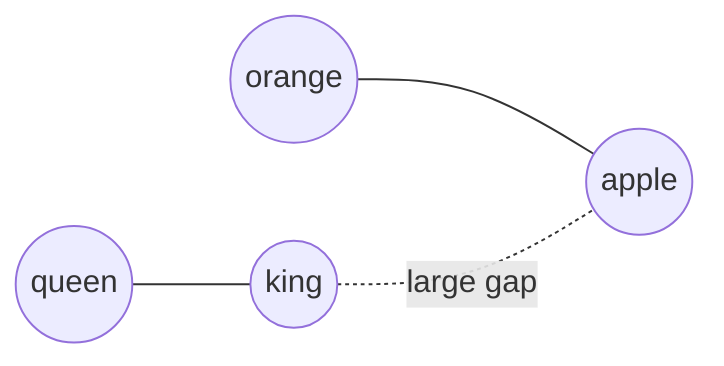

# Tokenization and Embeddings

## Overview

Before a large language model can process text, it must convert raw characters into numerical representations. This two-stage pipeline -- tokenization followed by embedding -- is the foundation of every modern NLP system.

**Tokenization** splits text into discrete units called tokens. Early approaches used whitespace or rule-based splitting, but modern LLMs rely on subword tokenization algorithms that balance vocabulary size against sequence length. The three dominant methods are Byte-Pair Encoding (BPE), WordPiece, and SentencePiece.

**Byte-Pair Encoding (BPE)** was originally a data compression algorithm. Applied to text, it starts with individual characters (or bytes) and iteratively merges the most frequent adjacent pair into a new token. After thousands of merges, the vocabulary captures common words as single tokens while rare words decompose into recognizable subwords. GPT-2, GPT-3, GPT-4, and Claude all use variants of BPE. OpenAI's `tiktoken` library implements a fast, production-grade BPE tokenizer.

**WordPiece**, used by BERT and related models, works similarly but selects merges that maximize a likelihood objective over the training corpus rather than raw frequency. This subtle difference means WordPiece tends to prefer merges that improve a language-model score.

**SentencePiece** treats the input as a raw byte stream (no pre-tokenization by whitespace), making it language-agnostic. It supports both BPE and a unigram language model mode. T5, LLaMA, and many multilingual models use SentencePiece.

Once text is tokenized, each token ID is mapped to a dense vector through an **embedding layer**. Early embedding methods like word2vec and GloVe produced static vectors -- one fixed vector per word regardless of context. The sentence "bank of the river" and "bank account" would share the same vector for "bank." Transformer-based models replaced this with **contextual embeddings**, where each token's representation depends on the entire input sequence. This is why LLMs can disambiguate polysemous words so effectively.

The embedding matrix $E \in \mathbb{R}^{V \times d}$ maps each of the $V$ vocabulary tokens to a $d$-dimensional vector. For GPT-3, $V = 50{,}257$ and $d = 12{,}288$, meaning the embedding table alone contains over 617 million parameters. Understanding token counts matters practically because API pricing is per-token, context windows are measured in tokens, and tokenization artifacts (like splitting numbers digit-by-digit) can silently inflate costs.

## Key Concepts

- **Subword tokenization** avoids out-of-vocabulary problems: unknown words decompose into known subwords (e.g., "unhappiness" becomes ["un", "happiness"] or ["un", "hap", "piness"]).
- **Vocabulary size tradeoff**: larger vocabularies mean shorter sequences (fewer tokens per sentence) but a bigger embedding matrix; smaller vocabularies mean longer sequences but a more compact model.
- **Byte-level BPE** (used by GPT-4 and Claude) operates on UTF-8 bytes, so it can represent any Unicode text without unknown tokens.
- **Positional encodings** are added to token embeddings so the model knows token order -- embeddings alone carry no positional information.
- **Cosine similarity** measures how close two embedding vectors are in direction, independent of magnitude.

## Code Examples

### Counting tokens with tiktoken

```python
import tiktoken

# Load the tokenizer used by GPT-4 / GPT-4o
enc = tiktoken.encoding_for_model("gpt-4o")

text = "Tokenization splits text into subword units."
tokens = enc.encode(text)

print(f"Text: {text}")
print(f"Token IDs: {tokens}")
print(f"Token count: {len(tokens)}")
print(f"Decoded tokens: {[enc.decode([t]) for t in tokens]}")

# Cost estimation (GPT-4o pricing as example)
input_cost_per_token = 2.50 / 1_000_000   # $2.50 per 1M input tokens
output_cost_per_token = 10.00 / 1_000_000  # $10.00 per 1M output tokens

num_input_tokens = len(tokens)
estimated_output_tokens = 200  # assume a 200-token reply

cost = (num_input_tokens * input_cost_per_token
        + estimated_output_tokens * output_cost_per_token)
print(f"Estimated API cost: ${cost:.6f}")
```

Lines 1-2 load `tiktoken` and select the tokenizer matching a specific model. Line 5 encodes the string to a list of integer IDs. Line 10 decodes each ID back to its string fragment, revealing how the tokenizer split the text. Lines 13-20 show a practical cost estimator using per-token pricing.

### Visualizing embedding similarity

```python
import numpy as np
from numpy.linalg import norm

# Simulated 4-dimensional embeddings for illustration
embeddings = {
    "king":   np.array([0.8,  0.6,  0.1, -0.3]),
    "queen":  np.array([0.75, 0.65, 0.1, -0.25]),
    "apple":  np.array([-0.2, 0.1,  0.9,  0.7]),
    "orange": np.array([-0.15, 0.15, 0.85, 0.65]),
}

def cosine_similarity(a, b):
    """Compute cosine similarity between two vectors."""
    return np.dot(a, b) / (norm(a) * norm(b))

# Compare all pairs
words = list(embeddings.keys())
for i in range(len(words)):
    for j in range(i + 1, len(words)):
        sim = cosine_similarity(embeddings[words[i]], embeddings[words[j]])
        print(f"sim({words[i]}, {words[j]}) = {sim:.4f}")
```

The output will show that "king" and "queen" have high similarity, as do "apple" and "orange," while cross-category pairs like "king" and "apple" score low. This demonstrates how embedding spaces organize semantically related words into clusters.

## Math/Formulas (KaTeX)

The embedding lookup for token $t$ with one-hot vector $\mathbf{x}_t$ is:

$$\mathbf{e}_t = E^\top \mathbf{x}_t \in \mathbb{R}^d$$

Cosine similarity between two embedding vectors:

$$\text{sim}(\mathbf{a}, \mathbf{b}) = \frac{\mathbf{a} \cdot \mathbf{b}}{\|\mathbf{a}\| \, \|\mathbf{b}\|} = \frac{\sum_{i=1}^{d} a_i b_i}{\sqrt{\sum_{i=1}^{d} a_i^2} \cdot \sqrt{\sum_{i=1}^{d} b_i^2}}$$

The classic word2vec analogy relationship:

$$\mathbf{e}_{\text{king}} - \mathbf{e}_{\text{man}} + \mathbf{e}_{\text{woman}} \approx \mathbf{e}_{\text{queen}}$$

BPE merge selection at each step picks the pair $(a, b)$ maximizing frequency:

$$\text{merge}^* = \arg\max_{(a,b)} \; \text{count}(a, b)$$

## Diagrams

**Tokenization Pipeline**



**Embedding Space (2D projection)**



## Exercises

1. **Token counting**: Install `tiktoken` and tokenize the sentence "Large language models use subword tokenization." Compare token counts across `cl100k_base` (GPT-4) and `o200k_base` (GPT-4o) encodings. Why do they differ?

2. **Cost calculator**: Write a function that takes a prompt string and a model name, looks up the per-token price, and returns the estimated cost. Test it on a 2,000-word essay.

3. **Embedding arithmetic**: Using a pre-trained word2vec model (e.g., via `gensim`), verify the analogy "Paris - France + Italy = Rome." What other analogies work? Which ones fail, and why?

4. **Tokenization edge cases**: Tokenize numbers like "123456789" and code snippets like `def foo(bar):`. Observe how different tokenizers handle digits and programming syntax.

## Further Reading

- [OpenAI tiktoken library](https://github.com/openai/tiktoken)
- [Byte-Pair Encoding paper (Sennrich et al., 2016)](https://arxiv.org/abs/1508.07909)
- [SentencePiece (Kudo & Richardson, 2018)](https://arxiv.org/abs/1808.06226)
- [word2vec explained (Mikolov et al., 2013)](https://arxiv.org/abs/1301.3781)
- [Hugging Face Tokenizer summary](https://huggingface.co/docs/transformers/tokenizer_summary)
