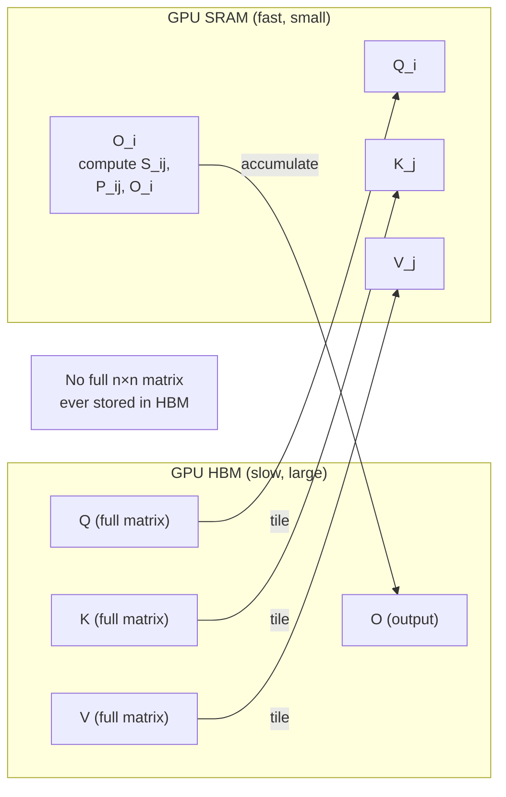
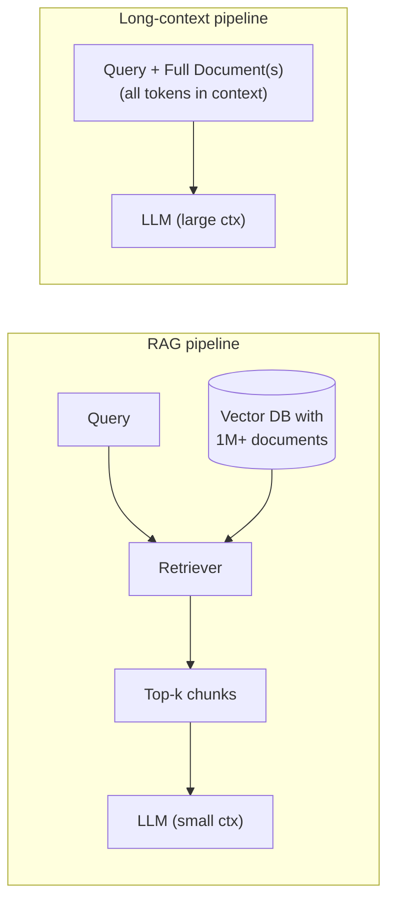

# Context Windows and Attention

## Overview

A context window is the maximum number of tokens a language model can process in a single forward pass. Think of it as the model's working memory -- everything it can "see" at once when generating a response. GPT-3 had a 2,048-token context window; GPT-4 extended this to 128K tokens; Claude supports up to 200K tokens; and Gemini 1.5 Pro pushed to 1 million tokens. These numbers matter enormously for practical applications because any information outside the context window simply does not exist to the model.

The reason context windows are limited comes down to the **self-attention mechanism** at the heart of transformers. In standard (dense) self-attention, every token attends to every other token. For a sequence of $n$ tokens, this produces an $n \times n$ attention matrix, giving **quadratic** time and memory complexity: $O(n^2)$. Doubling the context length quadruples the compute cost. This is the fundamental bottleneck that years of research have tried to overcome.

**Sparse attention** methods reduce cost by restricting which token pairs interact. Instead of the full $n \times n$ matrix, each token attends only to a subset of other tokens. Several patterns have emerged. **Sliding window attention** (used in Mistral and Mixtral) lets each token attend to only the $w$ nearest tokens, yielding $O(n \cdot w)$ complexity. Information from distant tokens propagates indirectly through intermediate layers -- after $L$ layers, a token can theoretically access information up to $L \times w$ positions away. **Dilated attention** (used in Longformer) combines local windows with periodic global attention tokens, creating a mix of fine-grained local context and coarse global context.

**Flash Attention** (Dao et al., 2022) does not change which tokens attend to which -- it computes exact standard attention. Instead, it restructures the computation to minimize reads and writes to GPU high-bandwidth memory (HBM). The key insight is that the attention matrix does not need to be fully materialized in memory. By tiling the computation into blocks that fit in fast SRAM, Flash Attention achieves 2-4x wall-clock speedups and reduces memory from $O(n^2)$ to $O(n)$, making longer context windows practical on existing hardware.

For **agentic workflows** (tool use, multi-step reasoning, code generation), context windows are critical. An agent might need to hold a system prompt, conversation history, retrieved documents, tool outputs, and scratch-pad reasoning all within a single context window. When this exceeds the limit, information must be dropped or summarized, potentially losing important details. This creates a direct tradeoff: richer agent capabilities demand more context, but longer contexts are slower and more expensive.

The **RAG vs. long-context** debate centers on two strategies for giving models access to large knowledge bases. Retrieval-Augmented Generation (RAG) keeps a separate index and retrieves only the most relevant chunks into a modest context window. Long-context models stuff entire documents directly into the window. RAG is cheaper and scales to arbitrarily large corpora, but retrieval can miss relevant passages. Long-context is simpler architecturally and avoids retrieval errors, but costs scale with document size and attention over very long sequences can lose focus on critical details (the "lost in the middle" problem). In practice, many production systems combine both: RAG to select candidates, then a long-context model to reason over them.

## Key Concepts

- **Quadratic bottleneck**: Standard self-attention is $O(n^2)$ in both compute and memory, where $n$ is the sequence length.
- **Sliding window attention**: Each token attends only to its $w$ nearest neighbors, making complexity $O(n \cdot w)$.
- **Flash Attention**: An IO-aware exact attention algorithm that tiles computation to exploit fast on-chip SRAM, avoiding materializing the full $n \times n$ attention matrix in slow HBM.
- **KV cache**: During autoregressive generation, key and value tensors from previous tokens are cached to avoid recomputation. The KV cache grows linearly with sequence length and is often the practical memory bottleneck.
- **Lost in the middle**: Models tend to recall information at the beginning and end of long contexts more reliably than information in the middle.
- **Context window vs. effective context**: A model may accept 200K tokens but degrade in quality beyond a practical effective range.

## Code Examples

### Measuring attention patterns

```python
import torch
import torch.nn.functional as F

def scaled_dot_product_attention(Q, K, V, mask=None):
    """
    Standard scaled dot-product attention.
    Q, K, V: (batch, heads, seq_len, d_k)
    """
    d_k = Q.size(-1)
    # Step 1: Compute raw attention scores
    scores = torch.matmul(Q, K.transpose(-2, -1)) / (d_k ** 0.5)

    # Step 2: Apply mask (e.g., causal mask for autoregressive models)
    if mask is not None:
        scores = scores.masked_fill(mask == 0, float('-inf'))

    # Step 3: Softmax to get attention weights
    attn_weights = F.softmax(scores, dim=-1)

    # Step 4: Weighted sum of values
    output = torch.matmul(attn_weights, V)
    return output, attn_weights

# Example: 1 batch, 1 head, 6 tokens, d_k=4
seq_len, d_k = 6, 4
Q = torch.randn(1, 1, seq_len, d_k)
K = torch.randn(1, 1, seq_len, d_k)
V = torch.randn(1, 1, seq_len, d_k)

# Causal mask: token i can only attend to tokens 0..i
causal_mask = torch.tril(torch.ones(seq_len, seq_len)).unsqueeze(0).unsqueeze(0)

output, weights = scaled_dot_product_attention(Q, K, V, mask=causal_mask)
print("Attention weights (causal):")
print(weights.squeeze().detach().numpy().round(2))
```

Line 10 computes $QK^\top / \sqrt{d_k}$, the core attention score. Line 14 applies a causal mask so that during generation, token $i$ cannot peek at future tokens $i+1, i+2, \ldots$. Line 17 normalizes scores to probabilities. The printed weight matrix shows how each token distributes its attention across preceding tokens.

### Sliding window mask

```python
def sliding_window_mask(seq_len, window_size):
    """Create a sliding window attention mask."""
    mask = torch.zeros(seq_len, seq_len)
    for i in range(seq_len):
        start = max(0, i - window_size + 1)
        mask[i, start:i+1] = 1.0
    return mask

w_mask = sliding_window_mask(seq_len=8, window_size=3)
print("Sliding window mask (w=3):")
print(w_mask.int().numpy())
```

This creates a band matrix where each row has at most `window_size` non-zero entries, restricting each token to only attend within its local window.

## Math/Formulas (KaTeX)

Standard scaled dot-product attention:

$$\text{Attention}(Q, K, V) = \text{softmax}\!\left(\frac{QK^\top}{\sqrt{d_k}}\right) V$$

where $Q, K, V \in \mathbb{R}^{n \times d_k}$ and the softmax is applied row-wise.

Memory complexity comparison:

$$\text{Standard: } O(n^2) \quad \text{vs.} \quad \text{Sliding window: } O(n \cdot w)$$

Flash Attention computes the same result but tiles the $Q$, $K$, $V$ matrices into blocks of size $B$:

$$\text{For each block } i,j: \quad S_{ij} = Q_i K_j^\top / \sqrt{d_k}, \quad P_{ij} = \text{softmax}(S_{ij})$$

The running softmax uses the log-sum-exp trick to combine blocks without materializing the full matrix:

$$m_{\text{new}} = \max(m_{\text{old}}, \max(S_{ij})), \quad \ell_{\text{new}} = e^{m_{\text{old}} - m_{\text{new}}} \ell_{\text{old}} + \text{rowsum}(e^{S_{ij} - m_{\text{new}}})$$

KV cache memory per layer:

$$\text{KV memory} = 2 \times n \times d_{\text{model}} \times \text{bytes per param}$$

## Diagrams

The standard vs. sliding-window attention masks (n = 8) are shown below.

| Q\K | 1 | 2 | 3 | 4 | 5 | 6 | 7 | 8 |   | Q\K | 1 | 2 | 3 | 4 | 5 | 6 | 7 | 8 |
|-----|---|---|---|---|---|---|---|---|---|-----|---|---|---|---|---|---|---|---|
| 1   | X | . | . | . | . | . | . | . |   | 1   | X | . | . | . | . | . | . | . |
| 2   | X | X | . | . | . | . | . | . |   | 2   | X | X | . | . | . | . | . | . |
| 3   | X | X | X | . | . | . | . | . |   | 3   | X | X | X | . | . | . | . | . |
| 4   | X | X | X | X | . | . | . | . |   | 4   | . | X | X | X | . | . | . | . |
| 5   | X | X | X | X | X | . | . | . |   | 5   | . | . | X | X | X | . | . | . |
| 6   | X | X | X | X | X | X | . | . |   | 6   | . | . | . | X | X | X | . | . |
| 7   | X | X | X | X | X | X | X | . |   | 7   | . | . | . | . | X | X | X | . |
| 8   | X | X | X | X | X | X | X | X |   | 8   | . | . | . | . | . | X | X | X |

Left: Standard (Dense) Attention, complexity $O(n^2)$. Right: Sliding Window (w=3), complexity $O(n \cdot w)$. X = attends, . = masked.

**Flash Attention Tiling (conceptual)**



**RAG vs Long Context**



## Exercises

1. **Attention visualization**: Using the code above, generate attention weight matrices for sequences of length 16, 64, and 256. Plot the memory usage growth and verify it follows $O(n^2)$.

2. **Window size experiment**: Implement sliding window attention with different window sizes ($w = 4, 16, 64$). Feed the same input through each and compare output quality. At what window size does quality match full attention?

3. **KV cache calculator**: Write a function that computes the total KV cache memory (in GB) for a given model configuration (number of layers, hidden dimension, sequence length, precision). Calculate it for LLaMA-2 70B at 4K, 32K, and 128K context lengths.

4. **Lost in the middle test**: Place a critical fact at position 0%, 25%, 50%, 75%, and 100% of a long prompt. Query the model for that fact and record accuracy at each position.

5. **RAG vs. stuffing**: Take a 50-page PDF. Compare (a) stuffing the entire text into a long-context model vs. (b) chunking it, embedding chunks, retrieving top-5, and prompting a short-context model. Measure answer quality and cost.

## Further Reading

- [Attention Is All You Need (Vaswani et al., 2017)](https://arxiv.org/abs/1706.03762)
- [Flash Attention (Dao et al., 2022)](https://arxiv.org/abs/2205.14135)
- [Flash Attention 2 (Dao, 2023)](https://arxiv.org/abs/2307.08691)
- [Longformer: Long-Document Transformer (Beltagy et al., 2020)](https://arxiv.org/abs/2004.05150)
- [Lost in the Middle (Liu et al., 2023)](https://arxiv.org/abs/2307.03172)
- [Retrieval-Augmented Generation (Lewis et al., 2020)](https://arxiv.org/abs/2005.11401)
