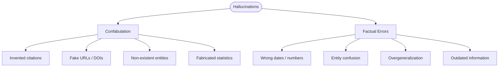
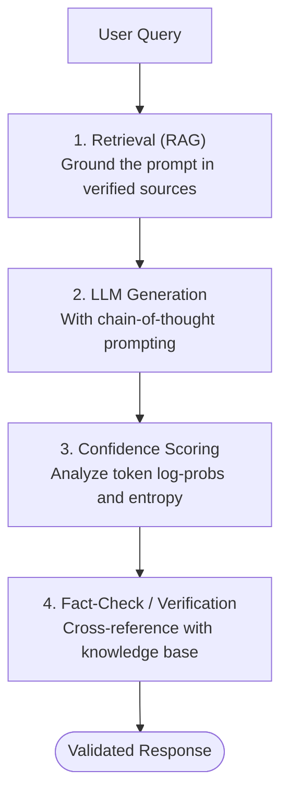

# LLM Limitations and Hallucinations

## Overview

Large language models produce fluent, confident-sounding text, but they routinely generate claims that are factually wrong, internally inconsistent, or entirely fabricated. These failures are collectively called **hallucinations**, and understanding why they happen is essential for anyone building on top of LLMs.

A useful taxonomy splits hallucinations into two categories. **Confabulation** occurs when the model invents plausible-sounding details that have no basis in its training data -- fabricating citations, generating fake URLs, or attributing quotes to the wrong person. The model is not "lying"; it is pattern-completing in a way that produces grammatically and stylistically correct text that happens to be factually empty. **Factual errors** occur when the model reproduces or misremembers something it did encounter during training -- getting a date wrong, confusing two similar entities, or overgeneralizing a statistical pattern. The distinction matters because confabulation is harder to detect (the "fact" may not exist anywhere to verify against), while factual errors can at least be caught with reference checking.

Why do LLMs hallucinate? Several factors converge. First, **training data quality**: models learn from internet text that contains errors, contradictions, outdated information, and satire presented without context. The model has no ground-truth oracle -- it learns statistical associations, not verified facts. Second, **distributional generalization**: when prompted about topics at the edge of or outside the training distribution, the model has no mechanism to say "I don't know." It will extrapolate from the nearest patterns it has, often confidently. Third, **lossy compression**: a model with billions of parameters is still a compressed representation of terabytes of text. Rare facts, precise numbers, and niche details are stored with lower fidelity, making retrieval unreliable. Fourth, **the autoregressive objective**: the model is trained to predict the next token, not to be truthful. A plausible-sounding completion is rewarded equally whether it is true or false, because the training loss (cross-entropy) measures probability, not factual accuracy.

The distinction between **known-unknowns** and **unknown-unknowns** is critical for reliability engineering. Known-unknowns are cases where the model can be prompted or fine-tuned to express uncertainty ("I'm not sure about this date"). Unknown-unknowns are cases where the model is confidently wrong and has no internal signal that it is wrong. Calibration research shows that LLMs are often poorly calibrated -- they assign high probability to incorrect completions and do not reliably distinguish between what they "know" and what they are guessing.

**Mitigation strategies** fall into several categories. **Retrieval-Augmented Generation (RAG)** provides the model with verified source documents at inference time, grounding its output in real data. **Confidence scoring** examines token-level probabilities to flag low-confidence generations. **Chain-of-thought prompting** encourages the model to show its reasoning, making errors easier to spot. **Fine-tuning on refusals** teaches the model to say "I don't know" rather than confabulate. **Fact-checking pipelines** use a second model or external tool to verify claims. No single technique eliminates hallucinations, but layering multiple approaches substantially reduces them.

It is also worth noting broader limitations beyond hallucinations. LLMs struggle with **multi-step arithmetic**, **precise date reasoning**, **spatial reasoning**, and **counting**. They cannot access real-time information unless given tools. They have no persistent memory across conversations unless explicitly provided. And they are susceptible to **prompt injection**, where adversarial inputs override system instructions. Building robust LLM applications requires treating the model as a powerful but fallible component within a larger system that includes retrieval, validation, and human oversight.

## Key Concepts

- **Confabulation**: Generating information that sounds plausible but was never in the training data (e.g., invented paper citations).
- **Factual error**: Misremembering or misrepresenting information that does exist in the training data.
- **Calibration**: How well a model's expressed confidence matches its actual accuracy. Poorly calibrated models say "definitely" when they should say "maybe."
- **Known-unknowns**: The model can recognize its uncertainty if properly prompted.
- **Unknown-unknowns**: The model is wrong and has no internal signal of its wrongness.
- **Autoregressive bias**: Next-token prediction rewards plausibility over truthfulness.
- **Lossy compression**: Billions of parameters cannot perfectly store terabytes of training data; rare facts degrade first.

## Code Examples

### Detecting uncertainty via token probabilities

```python
import openai

client = openai.OpenAI()

def get_completion_with_logprobs(prompt, model="gpt-4o"):
    """Get a completion along with token-level log probabilities."""
    response = client.chat.completions.create(
        model=model,
        messages=[{"role": "user", "content": prompt}],
        max_tokens=150,
        logprobs=True,
        top_logprobs=5,  # return top 5 alternatives per token
    )
    return response.choices[0]

def analyze_confidence(choice):
    """Flag tokens where the model is uncertain."""
    import math
    results = []
    for token_info in choice.logprobs.content:
        token = token_info.token
        logprob = token_info.logprob
        prob = math.exp(logprob)  # convert log-prob to probability

        # Check entropy across top alternatives
        top_probs = [math.exp(tp.logprob) for tp in token_info.top_logprobs]
        entropy = -sum(p * math.log(p + 1e-10) for p in top_probs)

        results.append({
            "token": token,
            "probability": round(prob, 4),
            "entropy": round(entropy, 4),
            "uncertain": prob < 0.5 or entropy > 1.0,
        })
    return results

# Test with a factual question
prompt = "Who was the third person to walk on the moon?"
choice = get_completion_with_logprobs(prompt)

print(f"Response: {choice.message.content}\n")
print("Token-level confidence analysis:")
for r in analyze_confidence(choice):
    flag = " << UNCERTAIN" if r["uncertain"] else ""
    print(f"  '{r['token']}' p={r['probability']} H={r['entropy']}{flag}")
```

Line 12 requests `logprobs=True`, which returns the log-probability assigned to each generated token. Line 22 converts log-probability to probability via $p = e^{\log p}$. Lines 25-26 compute the entropy across the top-5 token alternatives -- high entropy means the model was torn between multiple options, a signal of uncertainty. Line 31 flags tokens where probability falls below 0.5 or entropy exceeds 1.0 as uncertain.

### Simple hallucination detector

```python
def hallucination_risk_score(token_analysis):
    """
    Compute an overall hallucination risk score (0 to 1).
    Higher = more likely hallucinated.
    """
    if not token_analysis:
        return 0.0

    uncertain_count = sum(1 for t in token_analysis if t["uncertain"])
    avg_entropy = sum(t["entropy"] for t in token_analysis) / len(token_analysis)
    avg_prob = sum(t["probability"] for t in token_analysis) / len(token_analysis)

    # Weighted combination
    risk = (
        0.4 * (uncertain_count / len(token_analysis))  # fraction uncertain
        + 0.3 * min(avg_entropy / 2.0, 1.0)            # normalized entropy
        + 0.3 * (1.0 - avg_prob)                        # inverse confidence
    )
    return round(risk, 4)

# Compare a well-known fact vs an obscure question
for q in [
    "What is the capital of France?",
    "What was the population of Tuvalu in 1987?",
]:
    choice = get_completion_with_logprobs(q)
    analysis = analyze_confidence(choice)
    risk = hallucination_risk_score(analysis)
    print(f"Q: {q}")
    print(f"A: {choice.message.content}")
    print(f"Hallucination risk: {risk:.2%}\n")
```

This compares a common-knowledge question (low risk) against an obscure factual question (higher risk). The risk score combines three signals: the fraction of uncertain tokens, average entropy, and average probability.

## Math/Formulas (KaTeX)

Token-level probability from log-probability:

$$p_i = e^{\log p_i}$$

Shannon entropy over the top-$k$ token alternatives at position $i$:

$$H_i = -\sum_{j=1}^{k} p_{ij} \log p_{ij}$$

A simple hallucination risk score combining three signals:

$$\text{risk} = \alpha \cdot \frac{|\{t : t \text{ uncertain}\}|}{n} + \beta \cdot \frac{\bar{H}}{H_{\max}} + \gamma \cdot (1 - \bar{p})$$

where $\alpha + \beta + \gamma = 1$, $\bar{H}$ is mean entropy, and $\bar{p}$ is mean token probability.

The cross-entropy training loss (which does not distinguish truth from plausible fiction):

$$\mathcal{L} = -\frac{1}{N} \sum_{i=1}^{N} \log P_\theta(x_i \mid x_{<i})$$

## Diagrams

**Hallucination Taxonomy**



**Confidence vs Accuracy**

|                    | High Confidence                | Low Confidence                       |
|--------------------|--------------------------------|--------------------------------------|
| **Actually Correct** | True Positive (reliable)       | Known-Unknown (under-confident)      |
| **Actually Wrong**   | Unknown-Unknown (DANGEROUS)    | Flagged Uncertainty (catchable)      |

**Mitigation Stack**



## Exercises

1. **Hallucination detection**: Ask an LLM to list five academic papers on a niche topic. Verify each citation using Google Scholar. What fraction were real vs. fabricated?

2. **Confidence analysis**: Using the logprobs code above, compare the model's confidence when answering "What is 2+2?" vs. "What is the GDP of Liechtenstein in 2019?" Graph the per-token entropy distributions.

3. **RAG vs. raw generation**: Pick a 10-page document. Ask five factual questions. Compare answers from (a) the LLM alone and (b) the LLM with relevant passages retrieved and included in the prompt. Score accuracy for each.

4. **Calibration test**: Generate 50 true/false factual questions with known answers. Ask the model each question and request a confidence percentage. Plot predicted confidence vs. actual accuracy (a calibration curve).

5. **Prompt engineering for honesty**: Experiment with system prompts like "If you are not certain, say so" vs. no system prompt. Measure how often the model hedges on questions it should be uncertain about.

## Further Reading

- [Survey of Hallucination in Natural Language Generation (Ji et al., 2023)](https://arxiv.org/abs/2202.03629)
- [TruthfulQA: Measuring How Models Mimic Human Falsehoods (Lin et al., 2022)](https://arxiv.org/abs/2109.07958)
- [Retrieval-Augmented Generation (Lewis et al., 2020)](https://arxiv.org/abs/2005.11401)
- [Language Models (Mostly) Know What They Know (Kadavath et al., 2022)](https://arxiv.org/abs/2207.05221)
- [Chain-of-Thought Prompting (Wei et al., 2022)](https://arxiv.org/abs/2201.11903)
- [Anthropic's Research on AI Safety and Honesty](https://www.anthropic.com/research)
